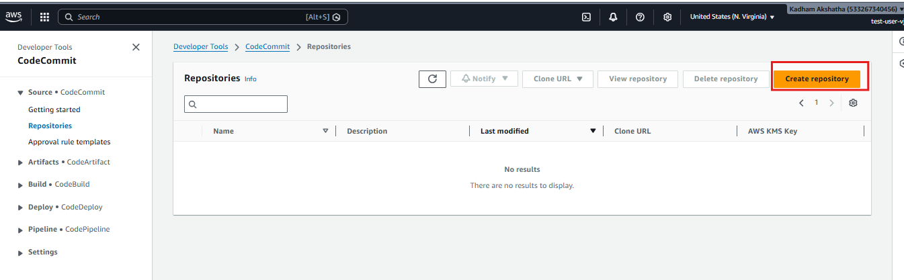
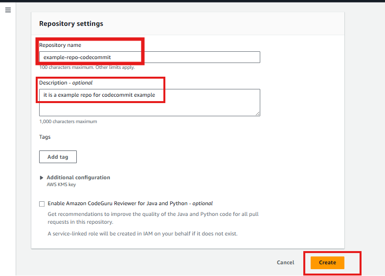

# AWS CI/CD Explained for Beginners | Understanding AWS CodeCommit, CodePipeline, CodeBuild & CodeDeploy

## Introduction

Over the past few articles, we have learned how to create AWS infrastructure manually using services like:

- Amazon EC2
- Amazon S3
- VPC
- Route 53
- CloudFormation

But once an application is developed, another question arises.

**How do we automatically deploy a new version of our application whenever developers make changes?**

Imagine a company with 100 developers.

Every day developers:

- Fix bugs
- Add new features
- Improve the application

If an operations engineer had to manually deploy every change, it would:

- Take a lot of time
- Be error-prone
- Slow down software delivery

This is where **CI/CD** comes into the picture.

---

# What We Will Learn

In this article, we will cover:

- What is CI/CD
- Why CI/CD is so important
- Common CI/CD tools used in the industry
- AWS Developer Tools
- What is AWS CodeCommit
- Advantages and Disadvantages of CodeCommit
- Hands-on: Creating your first CodeCommit repository

---

# What is CI/CD?

CI/CD stands for:

- **Continuous Integration (CI)**
- **Continuous Delivery / Continuous Deployment (CD)**

These practices help development teams deliver software faster, more reliably, and with fewer manual steps.

Instead of manually copying application files to servers every time there is a change, CI/CD automates the entire process.

Think of it like an assembly line in a factory.

As soon as one step is completed, the product automatically moves to the next step until it's ready for the customer.

Software delivery works in a similar way.

---

# Why Do We Need CI/CD?

Imagine you are developing an online shopping application.

Every day, developers:

- Fix bugs
- Add new features
- Improve performance

If every update had to be deployed manually, someone would need to:

- Copy the latest code
- Build the application
- Test it
- Deploy it to servers

Doing this manually every day becomes repetitive and increases the chances of mistakes.

CI/CD automates these repetitive tasks so that software can be delivered quickly and consistently.

---

# Common CI/CD Tools Used in the Industry

Before AWS introduced its own developer tools, companies were already using several popular CI/CD platforms.

Some of the most common ones are:

- GitHub Actions
- Jenkins
- GitLab CI/CD
- Azure DevOps

These tools work with almost every cloud provider and are widely used in the industry.

For example:

- GitHub Actions integrates directly with GitHub repositories.
- Jenkins is highly customizable using plugins.
- GitLab CI/CD is built into GitLab.
- Azure DevOps provides a complete DevOps platform.

Many organizations continue to use these tools even when deploying applications to AWS.

---

# Then Why Does AWS Provide Its Own CI/CD Services?

AWS wanted to provide a fully managed CI/CD solution that integrates seamlessly with other AWS services.

Instead of installing, configuring, updating, and maintaining your own CI/CD tools, AWS manages everything for you.

This reduces operational overhead and allows you to focus on building applications rather than managing infrastructure.

AWS provides four main services for building CI/CD pipelines:

- AWS CodeCommit
- AWS CodeBuild
- AWS CodeDeploy
- AWS CodePipeline

Together these services can automate the complete software delivery process.

---

# Understanding AWS CI/CD Workflow

A typical AWS CI/CD pipeline looks like this:

```text
Developer
   ⬇️
AWS CodeCommit
(Source Code)
   ⬇️
AWS CodeBuild
(Build & Test)
   ⬇️
AWS CodeDeploy
(Deploy Application)
   ⬇️
EC2 / ECS / Lambda
```

AWS CodePipeline sits on top of these services and automates the entire workflow.

---

# Overview of AWS Developer Tools

## AWS CodeCommit

AWS CodeCommit is a fully managed Git repository service.

It provides a secure place to store source code, similar to GitHub or GitLab.

Developers can:

- Push code
- Pull code
- Create branches
- Merge changes
- Track commit history

without managing their own Git servers.

---

## AWS CodeBuild

CodeBuild automatically compiles source code, installs dependencies, runs tests, and prepares application artifacts.

Instead of building applications on your machine, AWS performs the build process for you.

---

## AWS CodeDeploy

CodeDeploy automates application deployments.

It can deploy applications to:

- Amazon EC2
- AWS Lambda
- Amazon ECS
- On-premises servers

This helps reduce manual deployment effort.

---

## AWS CodePipeline

CodePipeline connects all the services together.

Whenever developers push code, CodePipeline automatically triggers the next stage such as building, testing, and deployment.

It acts as the automation engine for the entire CI/CD process.

---

# Today's Focus: AWS CodeCommit

In today's article, we will focus on the first service in the pipeline: **AWS CodeCommit**.

Think of CodeCommit as AWS's version of GitHub.

Just like GitHub stores Git repositories, CodeCommit stores Git repositories inside your AWS account.

---

# Why Did AWS Create CodeCommit?

Many organizations prefer to keep their code inside AWS rather than using third-party platforms.

AWS created CodeCommit so customers could have:

- Fully managed Git repositories
- High availability
- Automatic scaling
- Tight integration with AWS services
- No Git server maintenance

Instead of installing and managing your own Git server, AWS takes care of everything behind the scenes.

---

# Advantages of AWS CodeCommit

Some benefits include:

- Fully managed by AWS
- No Git server administration
- Highly available
- Automatically scalable
- Secure integration with AWS IAM
- Data encrypted at rest and in transit

---

# Limitations of AWS CodeCommit

Although CodeCommit is a good managed Git service, it has some limitations.

Compared to GitHub, it offers:

- Fewer collaboration features
- Smaller ecosystem
- Fewer third-party integrations
- Less community adoption

Because of this, many organizations prefer GitHub or GitLab as their source code repositories while still using AWS CodeBuild, CodeDeploy, and CodePipeline.

---

# Important Note

> We are learning CodeCommit to understand the AWS Developer Tools ecosystem and how it fits into a CI/CD pipeline.

In future articles, we will use GitHub as the source repository because it's the most commonly used platform in the industry.

---

# Hands-on: Create Your First CodeCommit Repository

1. Open the AWS Console.
2. Search for **CodeCommit**.
3. Click **Create Repository**.



4. Enter a repository name.
5. *(Optional)* Add a description.
6. Click **Create Repository**.



7. Explore the repository dashboard, including:
   - Commits
   - Branches
   - Pull Requests
   - Settings
8. Upload a file through the AWS Console.
9. Later, clone the repository using Git and push files from your local machine.

---

# Why We Will Use GitHub in Future Articles

Although AWS provides CodeCommit, most organizations today use GitHub or GitLab as their source code repositories because they offer richer collaboration features, better integrations, and a larger ecosystem.

For that reason, our upcoming CI/CD articles will continue using:

- GitHub
- AWS CodeBuild
- AWS CodeDeploy
- AWS CodePipeline

This reflects a common real-world setup used by many development teams.

---

# Conclusion

In this article, we learned the fundamentals of CI/CD and explored the AWS Developer Tools ecosystem.

We also understood where AWS CodeCommit fits into the CI/CD pipeline, its advantages, and its limitations compared to modern Git hosting platforms.

In the next article, we will move beyond source code management and learn how AWS CodePipeline automates the entire software delivery process by connecting source code, build, testing, and deployment into a single workflow.