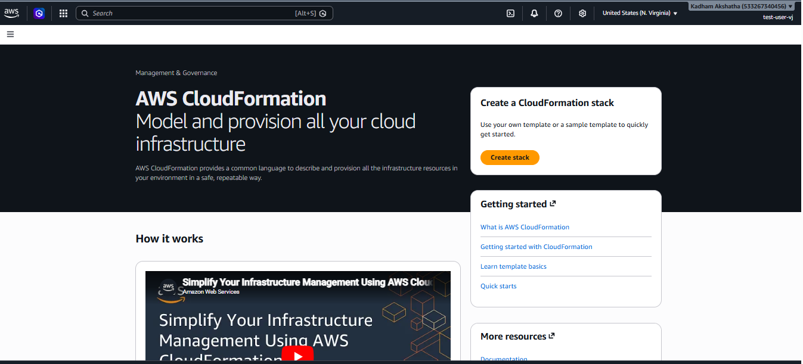
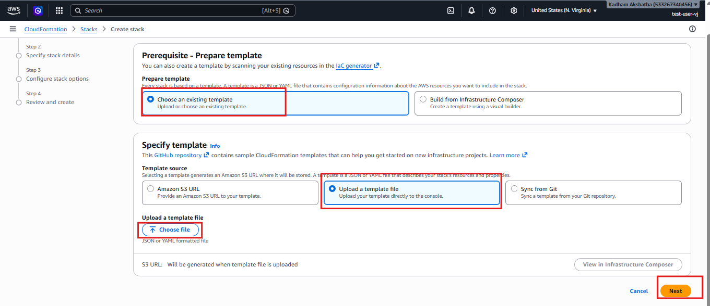
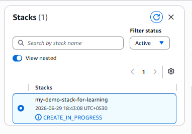
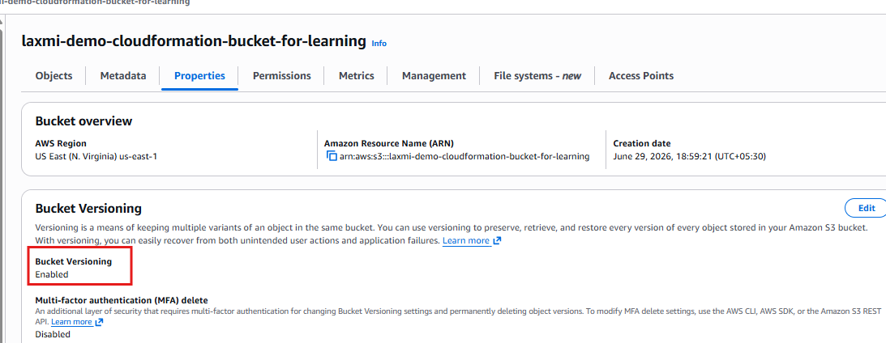

# AWS CloudFormation Hands-on | Build Your First Infrastructure Using YAML

## Introduction

In the previous article, we learned what Infrastructure as Code (IaC) is and why AWS CloudFormation is used to automate infrastructure creation.

Instead of manually creating AWS resources through the AWS Management Console every time, CloudFormation allows us to define our infrastructure in a template and let AWS create everything for us.

Now it's time to put those concepts into practice.

In this hands-on guide, we will write our first CloudFormation template, deploy it as a CloudFormation Stack, verify that AWS creates the resources automatically, update the infrastructure, and finally clean everything up.

By the end of this article, you will have a solid understanding of the basic CloudFormation workflow.

---

## What We will Build

In this lab, we will create:

- One Amazon S3 Bucket
- A CloudFormation Stack
- Update the Stack
- Delete the Stack

Although we are creating only an S3 bucket, the same process is used to create much larger infrastructure such as VPCs, EC2 instances, Load Balancers and Auto Scaling Groups.

---

## Prerequisites

Before starting, make sure you have:

- An AWS account
- IAM User with Administrator Access
- Basic understanding of S3
- Basic understanding of CloudFormation (covered in the previous article)

---

### Step 1: Open CloudFormation

Login to the AWS Management Console.

In the search bar, search for:

```text
CloudFormation
```

Open the CloudFormation service.

You will see the CloudFormation dashboard.



---

### Step 2: Understand What We Need

Before creating anything, let's understand how CloudFormation works.

CloudFormation doesn't create resources directly from button clicks.

Instead, it reads a Template.

Think of the template as a blueprint.

```text
You Write Template
        ↓
CloudFormation Reads It
        ↓
AWS Creates Resources
```

Our first task is to create this template.

---

### Step 3: Create a YAML Template

Open any text editor.

Examples:

- VS Code
- Notepad++
- Sublime Text

Create a new file named:

```text
s3-bucket.yaml
```

Paste the following template:

```yaml
AWSTemplateFormatVersion: '2010-09-09'

Description: Creates an S3 Bucket using AWS CloudFormation

Resources:

  MyS3Bucket:

    Type: AWS::S3::Bucket

    Properties:

      BucketName: my-demo-cloudformation-bucket
```

> **Note:** S3 bucket names must be globally unique. Replace `my-demo-cloudformation-bucket` with your own unique bucket name.

Save the file.

---

### Step 4: Understanding the Template

Let's understand every part of this template.

### 1. AWSTemplateFormatVersion

```yaml
AWSTemplateFormatVersion: '2010-09-09'
```

This specifies the version of the CloudFormation template format.

You don't usually need to change this value.

---

### 2. Description

```yaml
Description:
```

This simply describes what the template does.

Think of it like comments for humans.

---

### 3. Resources

```yaml
Resources:
```

This is the most important section.

Everything AWS creates is defined under **Resources**.

For example:

- EC2
- VPC
- IAM
- S3
- Lambda

All are created inside this section.

---

### 4. Logical Resource Name

```yaml
MyS3Bucket
```

This is the logical name inside CloudFormation.

AWS uses this name internally.

It doesn't become the actual bucket name.

---

### 5. Resource Type

```yaml
Type: AWS::S3::Bucket
```

This tells AWS what service to create.

Different services have different resource types.

Examples:

| AWS Service | Resource Type |
|-------------|---------------|
| S3 | AWS::S3::Bucket |
| EC2 | AWS::EC2::Instance |
| VPC | AWS::EC2::VPC |

---

### 6. Properties

Properties define how the resource should be configured.

Example:

```yaml
BucketName:
```

Here we provide the actual bucket name.

---

### Step 5: Create the Stack

Return to AWS CloudFormation.

Click on **Create Stack** → Select **Choose an existing template**.

Click on **Choose file** and upload:

```text
s3-bucket.yaml
```

Click on **Next**.



---

### Step 6: Stack Details

Provide a Stack Name, for example:

```text
demo-s3-stack
```

Click on **Next**.

You can leave all the options as default for this lab.

Click **Next**.

---

### Step 7: Review

Review the Configuration.

Click on **Submit**.

CloudFormation now starts creating the resources.

---

### Step 8: Watch the Events

This is one of the most useful tabs.

Open **Events**.

You will notice CloudFormation showing each action.

Example:

```text
CREATE_IN_PROGRESS

CREATE_COMPLETE
```

Instead of guessing what AWS is doing, you can monitor every step here.



---

### Step 9: Verify the Resource

Open:

```text
AWS S3
    ↓
Buckets
```

You should now see the bucket that CloudFormation created.

Notice something interesting.

We never manually clicked **Create Bucket**.

CloudFormation created it automatically.

This is the power of **Infrastructure as Code (IaC).**

---

### Step 10: Update the Stack

Infrastructure changes over time.

Instead of deleting everything and recreating it, CloudFormation allows us to update existing resources.

Let's update our bucket by enabling versioning.

Modify the template.

```yaml
AWSTemplateFormatVersion: '2010-09-09'

Description: Creates an S3 Bucket using AWS CloudFormation

Resources:

  MyS3Bucket:

    Type: AWS::S3::Bucket

    Properties:

      BucketName: my-demo-cloudformation-bucket-12345

      VersioningConfiguration:

        Status: Enabled
```

Save the file.

---

### Step 11: Update CloudFormation

Go back to CloudFormation.

Select your Stack.

Click **Update**, choose:

```text
Replace Current Template
```

Upload the modified YAML file.

Click:

**Next → Next → Submit**

---

### Step 12: Verify Versioning

Go back to the S3 Bucket.

Open **Properties** and scroll down.

You should now see **Bucket Versioning** enabled.



Notice that CloudFormation updated the existing resource rather than creating a new bucket.

---

### Step 13: Delete the Stack

CloudFormation also makes cleanup easy.

Instead of deleting every resource manually,

simply select the stack.

Click **Delete**.

CloudFormation automatically deletes all the resources that belong to that Stack.

This is one of the biggest advantages of **Infrastructure as Code**.

---

# Understanding the CloudFormation Workflow

```text
Write YAML Template
        ↓
Upload Template
        ↓
Create Stack
        ↓
AWS Creates Resources
        ↓
Update Template
        ↓
Update Stack
        ↓
Delete Stack
```

---

# Why This is Better than Manual Creation

Imagine creating:

- 3 VPCs
- 8 EC2 instances
- 6 Security Groups
- 2 NAT gateways
- 4 Subnets
- 2 Load Balancers

Doing this manually every time would take a lot of time.

With CloudFormation, you simply apply the template you have already defined.

This makes deployments faster, more consistent and less prone to human error.

---

## Best Practices

- Store your CloudFormation templates in Git.
- Use meaningful stack names.
- Add descriptions to templates.
- Start with small templates before building large infrastructures.
- Delete unused stacks to avoid unnecessary AWS charges.

---

## Key Takeaways

- CloudFormation uses templates to define infrastructure.
- A Stack is a collection of AWS resources created from a template.
- You can create, update and delete infrastructure using the same template.
- CloudFormation reduces manual work and helps maintain consistency across environments.
- Infrastructure as Code is a fundamental skill for DevOps and Cloud Engineers.

---

## Conclusion

In this hands-on lab, we created our first AWS CloudFormation template using YAML and used it to deploy an S3 bucket without manually creating resources through the AWS Console.

We also learned how CloudFormation manages infrastructure through Stacks, how to update existing resources by modifying the template and how to clean up everything by deleting the stack.

Although this example used a simple S3 bucket, the same workflow is used in real-world environments to provision complex infrastructure consisting of VPCs, EC2 instances, Load Balancers, Auto Scaling Groups, RDS databases, and much more.

---

🎉 **Congratulations!** You have successfully:

- Written your first CloudFormation template
- Created an AWS resource using Infrastructure as Code
- Updated an existing CloudFormation Stack
- Deleted a Stack and cleaned up resources

You now understand the complete CloudFormation workflow:

```text
Write Template
      ↓
Create Stack
      ↓
AWS Creates Resources
      ↓
Update Template
      ↓
Update Stack
      ↓
Delete Stack
```

This workflow is the foundation for deploying production infrastructure on AWS using Infrastructure as Code.

---