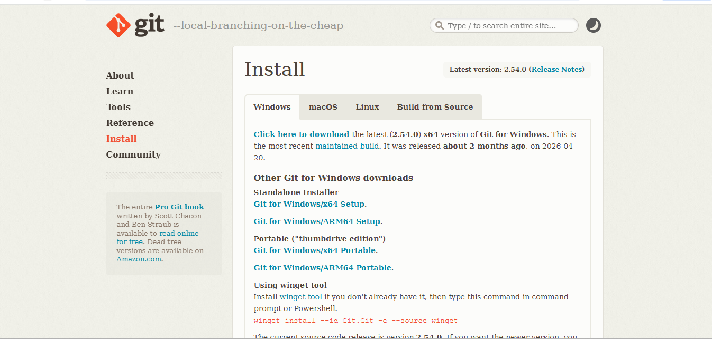
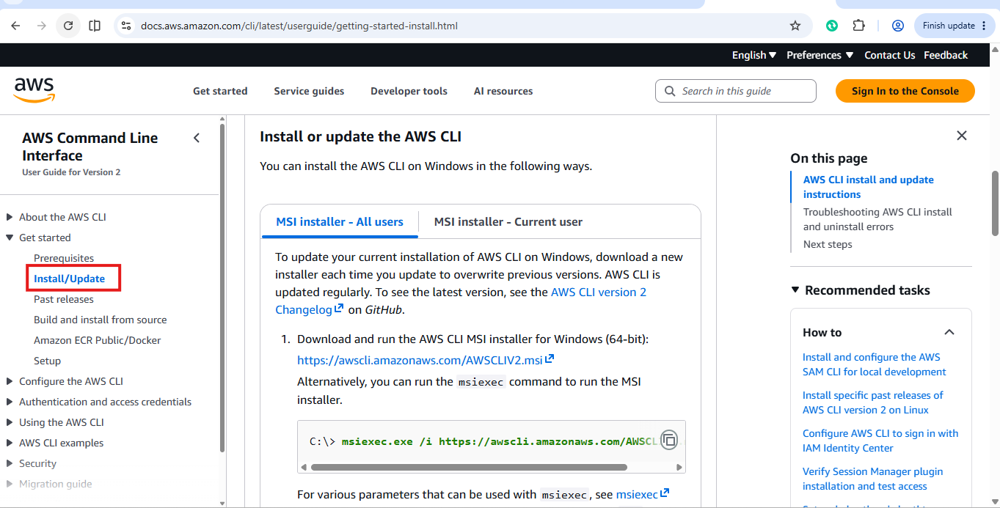
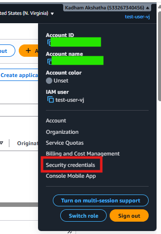
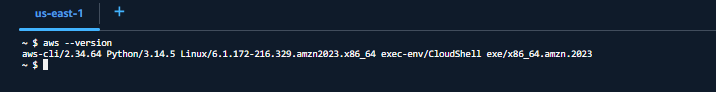
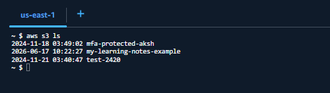
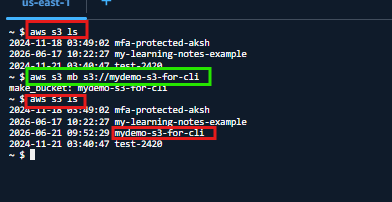

# AWS CLI for Beginners | Automating AWS without using the Console

## Introduction

Until now, we have been creating resources such as:

- VPCs
- EC2 Instances
- S3 Buckets

using AWS Console.

While the AWS Console is easy for beginners, it becomes difficult when we need to create many resources repeatedly.

Imagine manually creating:

- 20 VPCs
- 20 S3 buckets
- 15 EC2 Instances

Doing this from the UI every time would be slow and inefficient.

This is where AWS CLI becomes useful.

---

### What we will Learn

In this article, we will learn:

- What AWS CLI is
- Why AWS CLI is useful
- How AWS CLI communicates with AWS
- Installing AWS CLI
- Configuring AWS CLI
- Running our first AWS CLI command
- Finding AWS CLI documentation

---

## Why Do We Need AWS CLI?

AWS provides APIs(Application Programming Interfaces) for all its services.

These APIs allow us to:

- Create resources
- Update resources
- Delete resources
- Manage infrastructure programmatically

Instead of clicking on buttons in AWS Console, we can send commands directly to AWS.

Think of it like this:

```text
AWS Console
    ↓
Manual Operations

AWS CLI
    ↓
Command Based Operations
```

---

## Real Life Example

Suppose your company asks you to create:

- 50 S3 buckets
- 20 EC2 Instances
- Multiple VPCs

Doing this manually from the AWS Console would take time.

Using AWS CLI we can automate these operations through commands and scripts.

---

## What is AWS CLI?

AWS CLI stands for:

```text
AWS Command Line Interface
```

It is tool that allows us to manage AWS services directly from terminal.

AWS CLI acts as a bridge between users and AWS APIs.

```text
User
  ↓
AWS CLI
  ↓
AWS API
  ↓
AWS Services
```

The AWS CLI itself is developed by AWS and internally sends API requests to AWS services.

The good part is:

- We don't need programming knowledge to start using AWS CLI
- We only need to understand commands and documentation.

---

## AWS CLI vs AWS Console

| AWS Console | AWS CLI |
|-------------|----------|
| Manual | Command Line Interface |
| Beginner fridenly | Automation friendly |
| Slower for repetitive tasks | Faster |
| Requires clicking | Requires commands |
| Suitable for learning | Suitable for automation |

---

## AWS CLI vs Terraform vs Cloud Formation

Many beginners ask:

> If AWS CLI can create resources, why do we need Terraform or CloudFormation?

The answer is simple.

AWS CLI is best for:

- Quick actions
- testing
- Small automation tasks
- Learning AWS services

CloudFormation is best for:

- Reusable infrastructure
- AWs native infrastructure as a Code

Terraform is best for:

- Large production environments
- Multi-cloud infrastructure
- Infrastructure as Code

AWS CDK is best for:

- Developers who prefer programming languages.

---

## Hands-On: Installing AWS CLI

## Method 1: Install AWS CLI using Git Bash

### Step 1: Install Git Bash

Open your browser and search:

```text
Git Bash Download
```

Download and install Git Bash.



After installation, open:

```text
Git Bash
```

---

### Step 2: Install AWS CLI

In your browser search for:

```text
AWS CLI
```

Open the official AWS Documentation.

Navigate to:

```text
User Guide → Get Started → Install/Update
```



Select the Linux CLI installer and copy the path and paste it in the Git Bash terminal.

Then you will see AWS CLI is installing.


After installation, verify:

```bash
aws --version
```

You will see something like this in the terminal:

```text
aws-cli/2.x Python/3.x Windows
```

---

### Step 3: Configure AWS CLI

## Why Does AWS CLI Need Configuration?

AWS CLI needs to know:

- Which AWS account to use
- Which region to use
- Which credentials belong to us

This is done using:

```bash
aws configure
```

Provide:

- AWS Access Key ID
- AWS Secret Access Key
- Default Region
- Output Format (json)

You will get the Access Key ID from your AWS account.

Go to your AWS Console.

Click on the account name on the right-side corner → Select **Security Credentials**.



Scroll to **Access Keys** → Click on **Create Access Key**.

AWS generates:

- Access Key ID
- Secret Access Key

Save these credentials securely.

> **NEVER SHARE YOUR SECRET ACCESS KEY**

Example:

```text
AWS Access Key ID: AKIAxxxxxxxx
AWS Secret Access Key: ********
Default Region Name: ap-south-1
Default Output Format: json
```

## Why JSON?

AWS returns responses in JSON format because it is easy for applications and scripts to process.

---

## Method 2: Using AWS CloudShell (What I Used)

Since I was using a managed laptop where installing software was restricted, I used AWS CloudShell.

CloudShell already comes with AWS CLI pre-installed, making it convenient for learning and experimentation.

### Step 1: Open AWS Console

In the search bar type:

```text
CloudShell
```

and wait for the terminal to open.

---

### Step 2: Verify AWS CLI

```bash
aws --version
```

You will get an output like this:

```text
aws-cli/2.x
```



> **Note:** CloudShell automatically uses the credentials of the currently logged-in IAM user.

Therefore, unlike local installation, there is no need to run:

```bash
aws configure
```

---

## Running our First AWS CLI Command

Now let's check whether AWS CLI can access our resources.

Run:

```bash
aws s3 ls
```

means:

```text
List all S3 buckets available in my AWS account
```

Example output will be like this:

```text
2025-11-02  my-learning-notes-example
2025-11-03  demo-cli-bucket
```



---

## Exploring AWS CLI Documentation

AWS provides documentation for every service.

For example, search:

```text
AWS CLI S3 reference
```

Here you will see a bunch of available commands and how to use them in detail.

For example:

### List Buckets

```bash
aws s3 ls
```

### Create Bucket

```bash
aws s3 mb s3://mydemo-s3-bucket-for-cli
```



One of the best ways to become comfortable with AWS CLI is by exploring the official documentation and trying commands on your own.

AWS provides CLI references for almost every service.

For example, if you want to learn EC2 commands, search:

```text
AWS CLI EC2 Reference
```

Spend some time browsing the documentation and try commands in your environment.

---

## Key Takeaways

In this article, we learned:

- ✅ What AWS CLI is
- ✅ Why AWS CLI is useful
- ✅ How AWS APIs work
- ✅ Installing AWS CLI
- ✅ Creating Access Keys
- ✅ Configuring AWS CLI
- ✅ Running our first commands
- ✅ Exploring AWS CLI documentation

---

## Conclusion

AWS CLI makes managing AWS resources faster and easier.

Instead of repeatedly performing manual tasks through the AWS Console, we can interact with AWS services directly from the terminal.

AWS CLI is excellent for quick actions and small automation tasks.

However, as infrastructure grows larger, managing resources using individual commands becomes difficult.

This is where Infrastructure as Code (IaC) tools become extremely useful.

---

## What's Next?

In the next article, we will begin exploring Infrastructure as Code (IaC) and understand:

- What is AWS CloudFormation (CFT)?
- CloudFormation vs Terraform
- Tips and Tricks for Writing CloudFormation Templates
- Why production teams prefer Infrastructure as Code

From this point onward, we will start moving from individual commands to managing complete infrastructure using code. 🚀