# AWS S3 Hands-On Project | Buckets, Versioning, Permissions and Static Website Hosting

## Introduction

In the previous article, we learned the theory behind Amazon S3.

Now it is time to see Amazon S3 in action.

In this hands-on project, we will:

- Create an S3 bucket
- Upload files
- Understand Objects inside S3
- Enable Bucket Versioning
- Create IAM User
- Control access using Bucket Policies
- Host a Static Website using S3

By the end of this article, we will understand some of the most commonly used Amazon S3 features.

---

## Step 1: Create an S3 Bucket

Login to AWS Console.

Search for **S3**.

Open the dashboard.

Click on **Create Bucket**.

Provide:

### Bucket Name

Give your bucket a name, for example:

```text
my-learning-notes-example
```

> Bucket names must be globally unique.

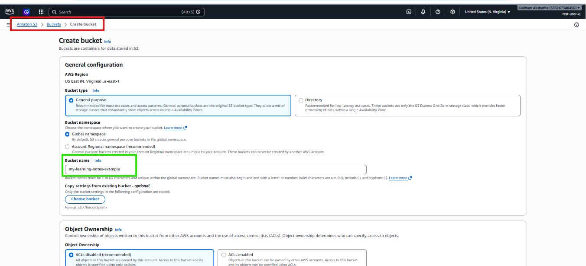

For now, leave all the remaining settings as default.

Click on **Create Bucket**.

---

## Step 2: Explore the Bucket

Open the bucket you just created.

Initially, you will notice:

```text
Objects (0)
```

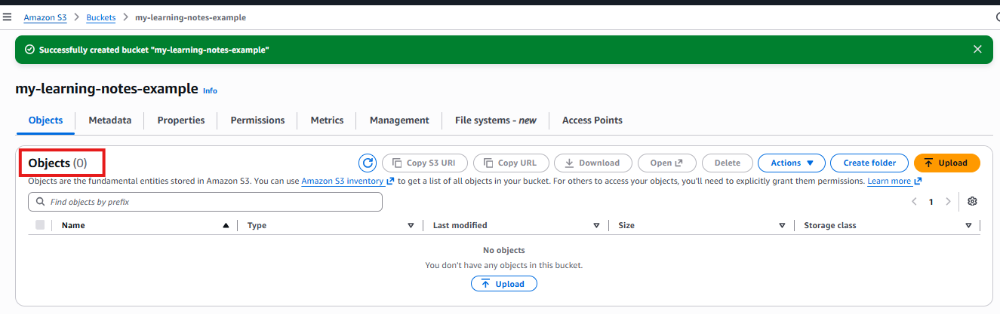

because the bucket is empty.

Think of a bucket as a folder that stores files.

---

## Step 3: Upload Your First Object

Click on:

```text
Upload
```

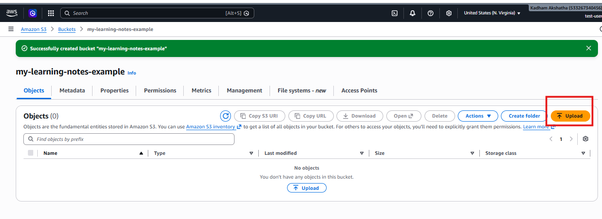

Then click:

```text
Add files
```

Choose any file.

Click:

```text
Upload
```

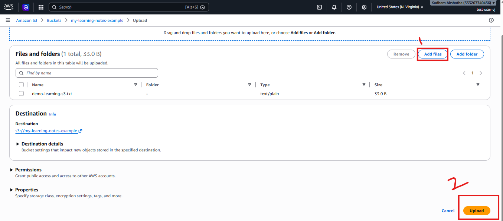

After the upload finishes, you will see the file inside the bucket.

In Amazon S3, every uploaded file is called an **Object**.

Now if you look inside the bucket, you will notice that Objects are no longer zero because we have uploaded a file.

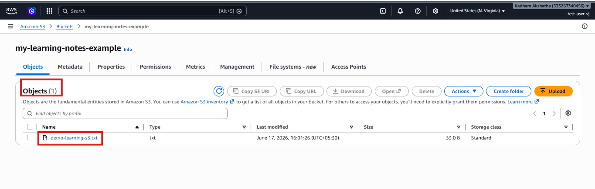

---

## Step 4: Explore Object Options

Click on the uploaded Object.

Explore the options:

### Open

Select the file and click **Open**.

It will display the contents of the file.


### Download

Select the file and click **Download**.

The file will be downloaded to your system.

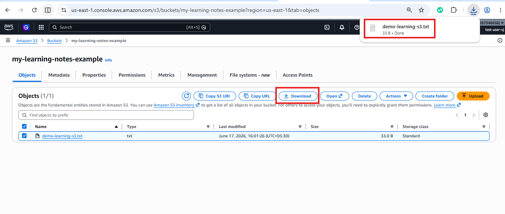

### Delete

If you select **Delete**, AWS will ask for confirmation before deleting the object.

This helps you understand how S3 manages objects.

---

## Step 5: Enable Bucket Versioning

Suppose you upload:

```text
demo-learning-s3.txt
```

Later, you modify the file and upload it again.

Without versioning, the old file gets overwritten.

Versioning allows you to preserve previous versions.

Go to:

```text
Bucket → Properties
```

Scroll to:

```text
Bucket Versioning
```

Click:

```text
Edit
```

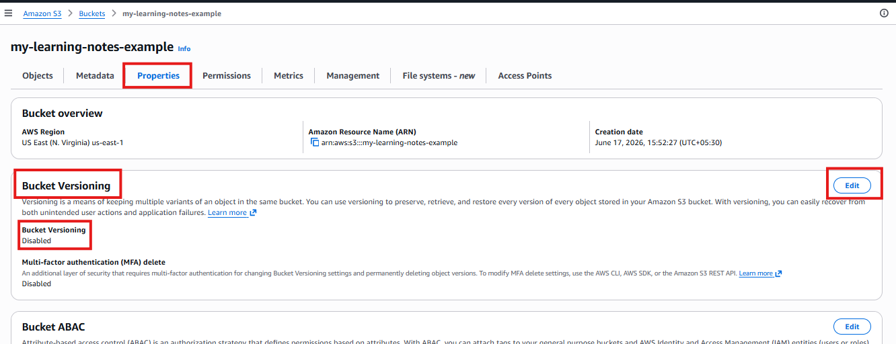

Choose:

```text
Enable
```

Click:

```text
Save Changes
```

Now if you check the bucket properties, you can see that versioning is enabled.

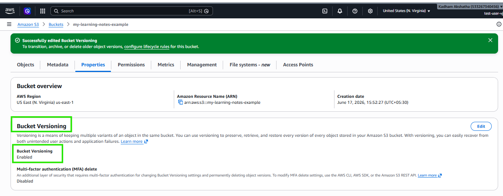

---

## Step 6: Upload a New Version

Modify your file.

### Before

```text
AWS S3 Notes version 1
```

### After

```text
AWS S3 Notes version 2
```

Upload the file again using the same filename.

Now open the Object.

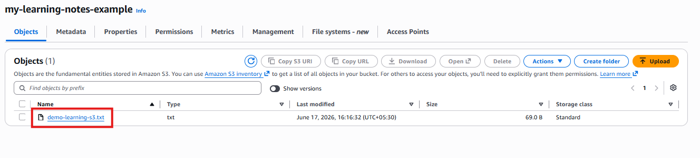

Click:

```text
Versions
```

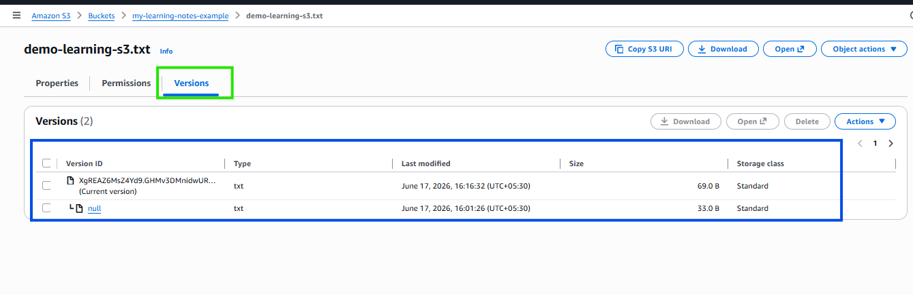

You will see multiple versions.

This is similar to maintaining history in Git.

---

## Step 7: Create an IAM User

In AWS Console, search for:

```text
IAM
```

Go to:

```text
IAM → Users → Create User
```

Give a name:

```text
demo-s3-user
```

Assign a password.

Click:

```text
Create User
```

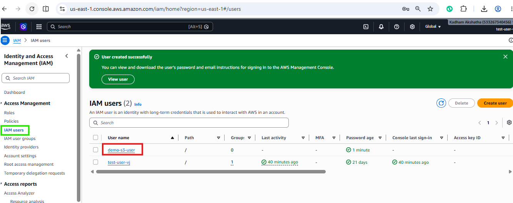

---

## Step 8: Verify Permissions

Open an Incognito browser.

Login using the IAM user credentials.

Try accessing the Amazon S3 bucket.

Also try creating a bucket.

Initially, you will receive permission errors.

This happens because the user has no S3 permissions.

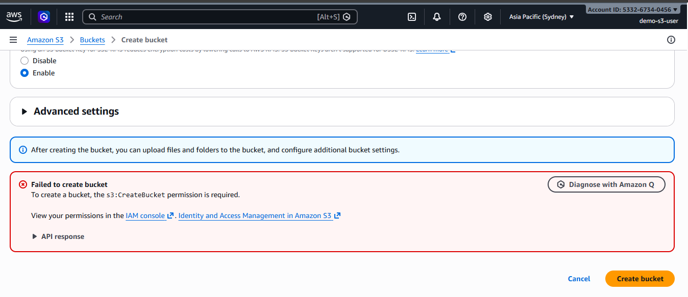

---

## Step 9: Grant S3 Permissions

Login as the root/Admin user.

Open:

```text
IAM → Users → demo-s3-user
```

Click:

```text
Add Permissions
```

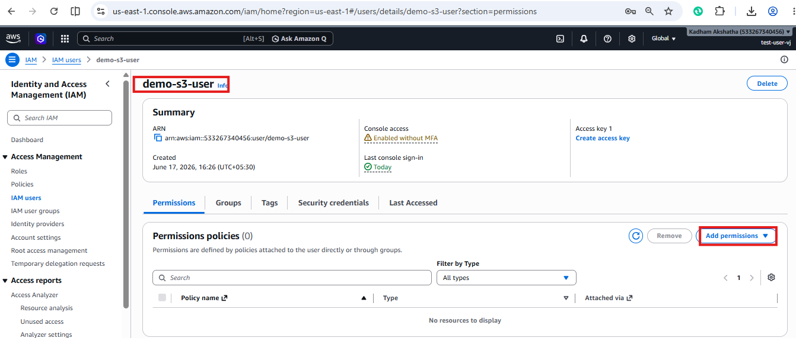

Attach:

```text
AmazonS3FullAccess
```

Click:

```text
Save
```

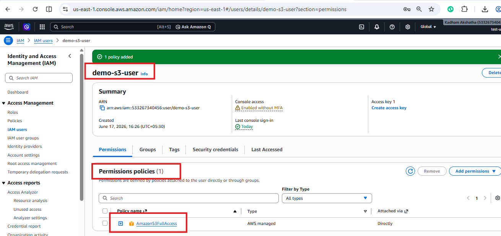

Now refresh the IAM user session.

The `demo-s3-user` can now access S3.

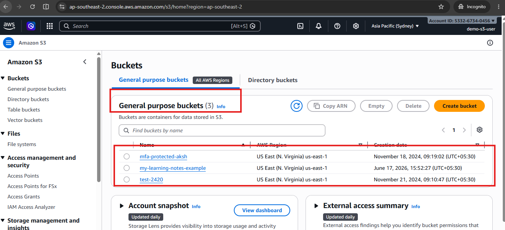

---

## Step 10: Explore Bucket Permissions

Open:

```text
S3 → Bucket → Permissions
```

You will notice:

- Bucket Policies
- Block Public Access
- Access Control

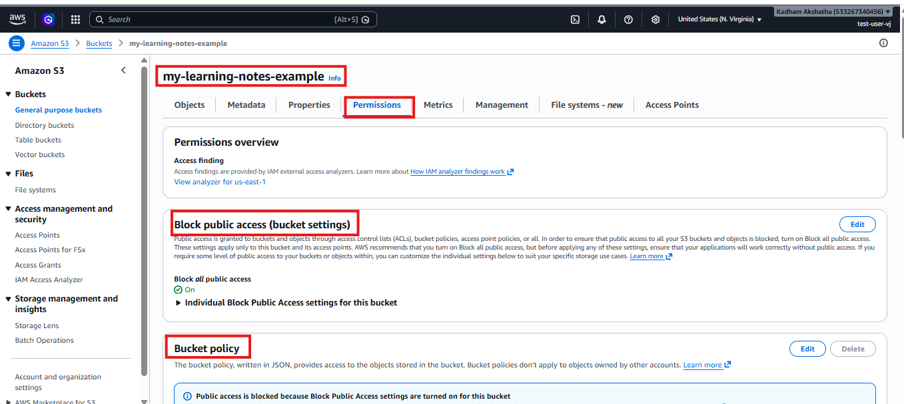

These settings provide an additional security layer.

Even if IAM permissions are accidentally misconfigured, Bucket Policies can still protect your bucket.

---

## Step 11: Enable Static Website Hosting

Create a simple `index.html` file.

Upload this file to your bucket.

Now go to:

```text
Bucket → Properties
```

Scroll to:

```text
Static Website Hosting
```

Click:

```text
Edit
```

Enable:

```text
Static Website Hosting
```

Set:

```text
Index Document: index.html
```

Click:

```text
Save Changes
```

AWS will generate a website endpoint.

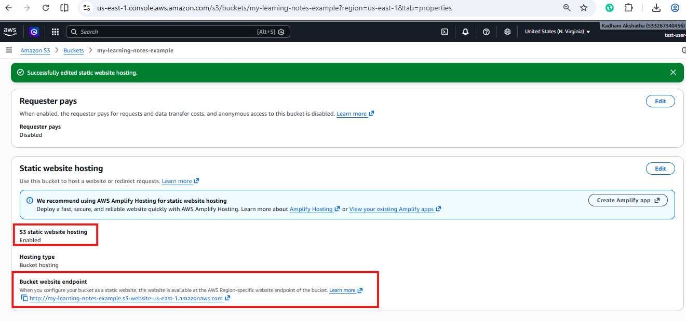

Try accessing the website endpoint URL.

You will notice that you still cannot access it even if you have S3 Full Access.

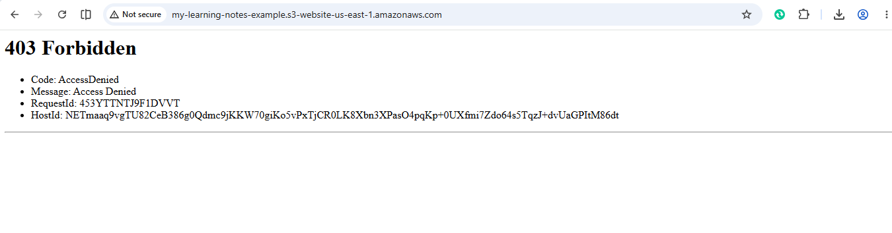

This happens because there are still S3 permissions blocking public access.

---

## Step 12: Remove Public Access Block

Go to:

```text
Permissions
```

Locate:

```text
Block Public Access
```

Click:

```text
Edit
```

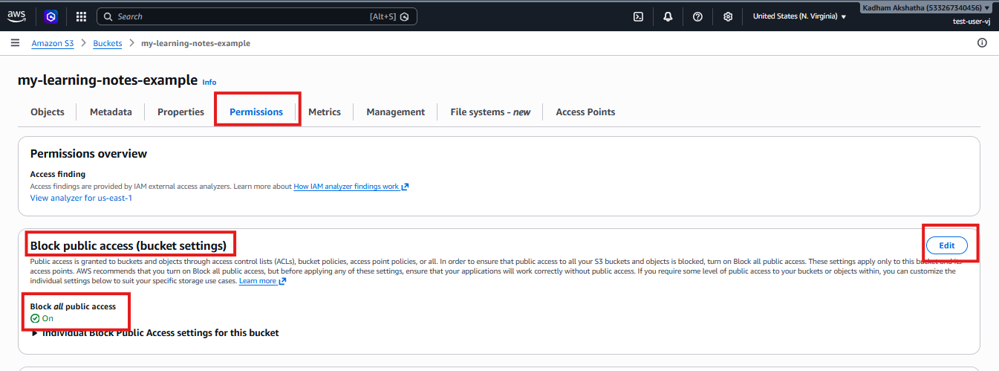

Disable public access.

Confirm the warning.

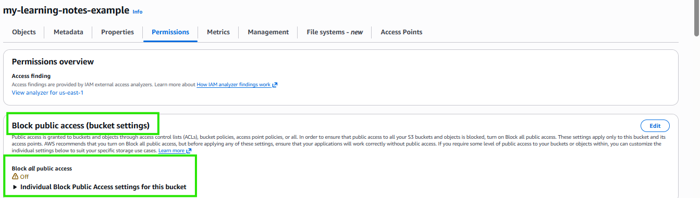

When you try to access the URL again, you may still receive:

```text
403 Forbidden
```

Although Static Website Hosting is enabled, the files inside the bucket are still private.

AWS requires explicit permission before users on the internet can read objects inside an S3 bucket.

To solve this, we need to create a Bucket Policy.

---

## Step 13: Add Bucket Policy for Public Read

Go to:

```text
Permissions → Bucket Policy → Edit
```

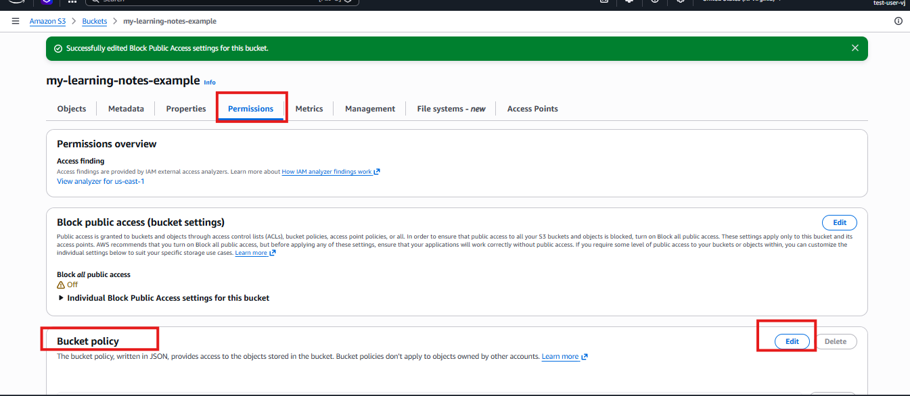

Click:

```text
Add New Statement
```

Initially, AWS provides a template similar to:

```json
{
  "Version": "2012-10-17",
  "Statement": [
    {
      "Sid": "Statement1",
      "Principal": {},
      "Effect": "Allow",
      "Action": [],
      "Resource": []
    }
  ]
}
```

We need to fill these values.

## Understanding the Fields

### Sid

Used to identify the policy statement.

```json
"Sid": "PublicReadGetObject"
```

### Principal

Defines who the rule applies to.

```json
"Principal": "*"
```

The `*` means anyone on the internet.

### Effect

Specifies whether AWS should allow or deny the action.

```json
"Effect": "Allow"
```

### Action

Defines which permission we are granting.

```json
"Action": "s3:GetObject"
```

This allows users to read objects inside the bucket.

### Resource

Specifies which bucket objects the rule applies to.

Example:

```json
"Resource": "arn:aws:s3:::YOUR_BUCKET_NAME/*"
```

Replace `YOUR_BUCKET_NAME` with your actual bucket name.

The `/*` means apply the rule to all objects inside the bucket.

---

My bucket name is:

```text
my-learning-notes-example
```

Therefore, the policy becomes:

```json
{
  "Version": "2012-10-17",
  "Statement": [
    {
      "Sid": "Statement1",
      "Principal": "*",
      "Effect": "Allow",
      "Action": "s3:GetObject",
      "Resource": "arn:aws:s3:::my-learning-notes-example/*"
    }
  ]
}
```

Click:

```text
Save Changes
```

> **Note:** Replace `my-learning-notes-example` with your own bucket name.

---

## Step 14: Access the Website

Go back to:

```text
Bucket → Properties
```

Scroll down to:

```text
Static Website Hosting
```

Copy the:

```text
Bucket Website Endpoint URL
```

Paste it into your browser.

Now, instead of receiving the `403 Forbidden` error, your webpage should load successfully.

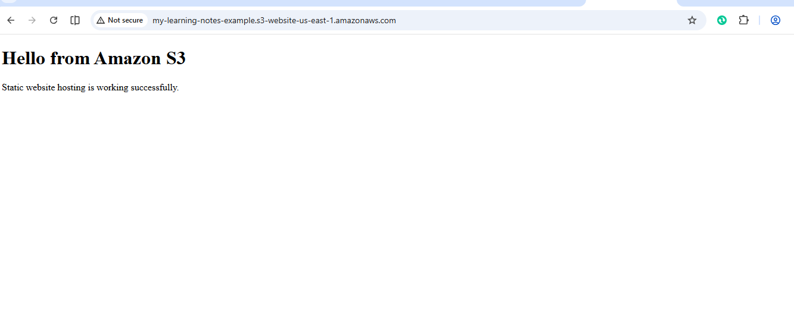

---

Congratulations 🎉

You have successfully hosted your first static website using Amazon S3.

---

## Key Takeaways

In this hands-on project, we learned how to:

- ✅ Create an S3 bucket
- ✅ Upload objects
- ✅ Understand bucket and object concepts
- ✅ Enable versioning
- ✅ Create IAM users
- ✅ Understand permissions
- ✅ Explore bucket policies
- ✅ Host a static website

---

## What's Next?

In the next article, we will explore another important AWS service and continue building our cloud learning journey.