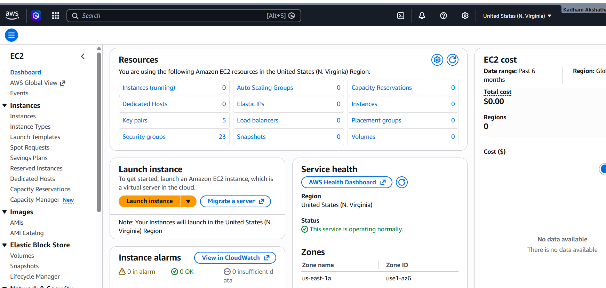
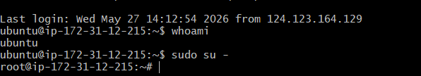
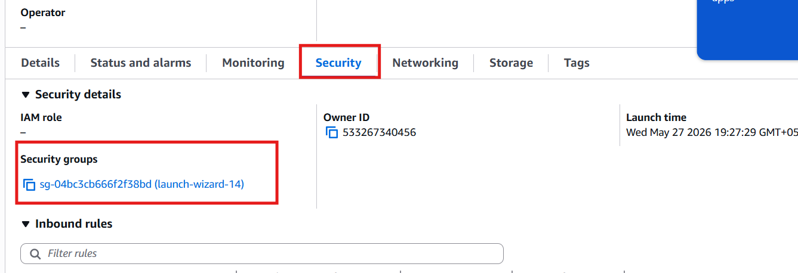
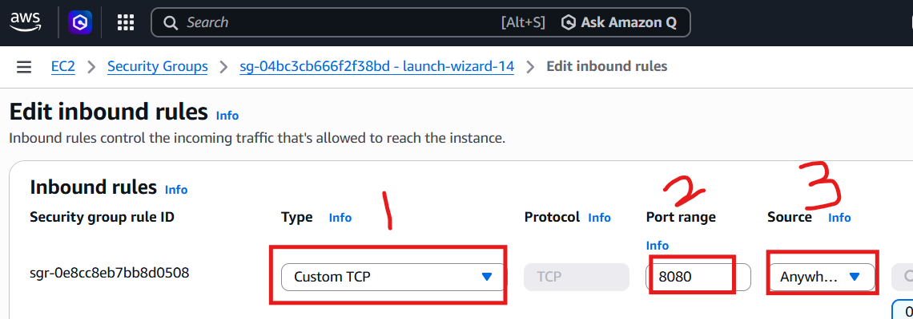
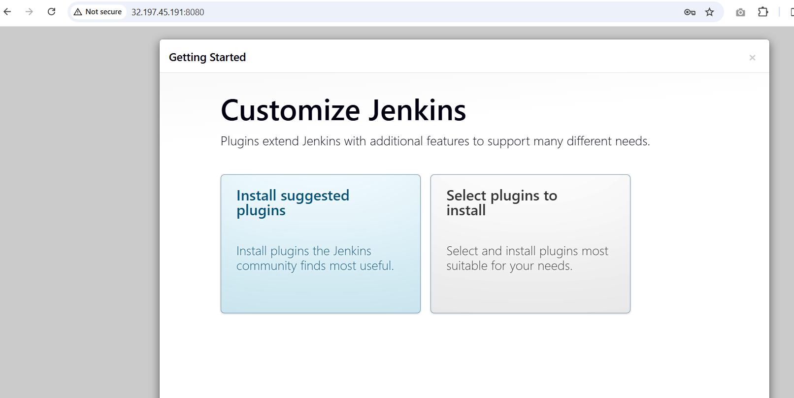

# AWS EC2 (Elastic Cloud Compute)

# Introduction

After setting up secure access to our AWS account using IAM, the next question we mostly have is:

> Where do we actually run our applications?

The answer is **Amazon EC2 — Elastic Cloud Compute**.

EC2 is one of the most widely used AWS services, and understanding it well is essential for anyone starting their cloud journey.

In this article, we will cover:

- What EC2 is
- Why EC2 exists
- Types of EC2 instances
- EC2 pricing models
- Regions & Availability Zones
- Hands-on walkthrough of launching an EC2 instance
- Deploying Jenkins on EC2

---

# Breaking Down the Name — EC2

Let us understand what each word in the name actually means.

| Term | Meaning |
|---|---|
| **Elastic** | Resources can scale up or down anytime based on demand |
| **Cloud** | Runs on AWS cloud infrastructure managed by Amazon |
| **Compute** | Provides CPU, RAM, Disk — basically a virtual server |

---

# What Does Elastic Mean?

In AWS, many services use the prefix **Elastic**.

This means the service can:

- Scale up when traffic increases
- Scale down when traffic decreases

With EC2:

- You can increase resources during high traffic
- Reduce resources when traffic is low

---

# Simple Definition of EC2

```text
EC2 = A virtual server in the cloud
      that you can resize anytime
```

---

# How Does EC2 Actually Work?

When you request a virtual server from AWS, here is what happens behind the scenes:

```text
You request a Virtual Machine on AWS
                    ⬇️
Request goes to Hypervisor
(Software managing VMs on physical servers)
                    ⬇️
Hypervisor creates your VM
                    ⬇️
You get access to your EC2 Instance
```

You never interact with physical hardware.

AWS manages everything for you.

---

# Why Use EC2?

Imagine your company wants to host an application.

## Traditional Approach

You would need to:

- Buy physical servers
- Install hypervisors
- Create virtual machines
- Manage upgrades
- Handle hardware failures
- Apply security patches

This becomes extremely difficult at scale.

Imagine managing:

```text
10 Servers  ✅ Manageable

1000 Servers ❌ Very Difficult
```

Your entire day would go into maintenance instead of innovation.

---

# How AWS EC2 Solves This

Instead of managing hardware manually:

1. Open AWS Console
2. Launch EC2 instance
3. Pay only for usage (PAYG)
4. AWS handles infrastructure maintenance

AWS takes care of:

- Hardware
- Networking
- Physical security
- Maintenance
- Failures

You focus only on your application.

---

# Important EC2 Concepts

---

# 1. AMI (Amazon Machine Image)

Before launching an EC2 instance, you must choose an AMI.

An AMI is basically an OS template for your server.

## Examples

- Ubuntu
- Amazon Linux
- Windows Server
- Red Hat Linux

---

# 2. Key Pair

When creating an EC2 instance, AWS generates a **Key Pair**.

It contains:

| Key Type | Stored By |
|---|---|
| Public Key | AWS |
| Private Key (.pem) | You |

Without the `.pem` file, you cannot SSH into your server.

## Simple Analogy

```text
AWS puts a lock on the server
and gives you the only key
```

---

# 3. Security Groups

A Security Group acts as a virtual firewall for your EC2 instance.

It controls:

- Incoming traffic
- Outgoing traffic

Example:

| Port | Purpose |
|---|---|
| 22 | SSH |
| 80 | HTTP |
| 443 | HTTPS |
| 8080 | Jenkins |

---

# 4. EBS (Elastic Block Storage)

Every EC2 instance requires storage.

EBS acts as the hard disk attached to your EC2 server.

It stores:

- Operating System files
- Application files
- User data

## Key Feature

EBS is also elastic.

You can increase storage size anytime without stopping the server.

---

# Types of EC2 Instances

AWS provides multiple EC2 categories based on workload requirements.

| Instance Type | Best For |
|---|---|
| General Purpose | Balanced CPU, RAM & Storage |
| Compute Optimized | High CPU workloads |
| Memory Optimized | Large RAM workloads |
| Storage Optimized | High-speed disk operations |
| Accelerated Computing | GPU & Machine Learning |

---

# EC2 Instance Categories Explained

## 1. General Purpose

Best for:

- Web servers
- Small applications
- Development environments

---

## 2. Compute Optimized

Best for:

- Gaming servers
- CPU intensive applications
- Scientific computations

---

## 3. Memory Optimized

Best for:

- Large databases
- Analytics
- In-memory applications

---

## 4. Storage Optimized

Best for:

- Data Warehouses
- Log Processing
- Big data workloads

---

## 5. Accelerated Computing

Best for:

- AI/ML
- GPU workloads
- Video rendering

---

# EC2 Pricing Models

This section is very important for AWS certifications.

---

# 1. On-Demand Instances

| Feature | Description |
|---|---|
| Billing | Pay per hour/second |
| Commitment | None |
| Flexibility | High |
| Cost | Most expensive |

## Best For

- Testing
- Short-term projects
- Unpredictable workloads

---

# 2. Reserved Instances

| Feature | Description |
|---|---|
| Commitment | 1 or 3 Years |
| Discount | Up to 75% |
| Best For | Steady workloads |

---

# 3. Spot Instances

AWS provides unused capacity at very cheap prices.

| Feature | Description |
|---|---|
| Savings | Up to 90% |
| Risk | Can terminate anytime |
| Best For | Batch jobs & testing |

---

# 4. Savings Plans

Flexible pricing model.

Commit to a certain amount of usage per hour.

Applies across:

- EC2
- Lambda
- Other AWS services

---

# AWS Regions & Availability Zones

AWS infrastructure is globally distributed.

---

# Regions

A Region is a geographical location.

## Examples

- Mumbai
- Singapore
- US-East-1

Choose regions closer to users for low latency.

---

# Availability Zones (AZs)

Each region contains multiple Availability Zones.

Each AZ is:

- A separate data center
- Independent power supply
- Independent cooling
- Independent networking

---

# Region & AZ Architecture

```text
AWS Region (Mumbai)
│
├── Availability Zone A
├── Availability Zone B
└── Availability Zone C
```

If one AZ fails, applications can still run from another AZ.

---

# EC2 Best Practices

## Important Best Practices

- Always attach Security Groups
- Never expose all ports publicly
- Never lose your `.pem` file
- Choose nearest AWS region
- Stop unused instances to save cost

---

# Hands-On: Launch EC2 Instance & Deploy Jenkins

By the end of this practical:

✅ Launch EC2 Instance  
✅ Connect using SSH  
✅ Install Jenkins  
✅ Configure Security Groups  
✅ Access Jenkins from browser

---

# Step 1: Login to AWS Console

1. Open AWS Console
2. Search for **EC2**
3. Open EC2 Dashboard



---

# Step 2: Launch a New EC2 Instance

1. Click **Instances**
2. Click **Launch Instance**

You will enter the EC2 configuration page.

---

# Step 3: Configure EC2 Instance

---

## Give Your Instance a Name

Example:

```text
My-First-Instance
```

---

## Choose Operating System

Select:

```text
Ubuntu
```

---

## Create Key Pair

1. Click **Create New Key Pair**
2. Enter Key Pair Name
3. Download `.pem` file

⚠️ Important:

```text
You cannot download the .pem file again.
Keep it safe.
```

Then click:

```text
Launch Instance
```

---

# Step 4: Verify Instance is Running

Check:

```text
Instance State = Running
```

Copy:

```text
Public IPv4 Address
```

Example:

```text
32.197.45.191
```

---

# Step 5: Connect to EC2 Using SSH

## Open Terminal

Use:

- Git Bash (Windows)
- Terminal (Linux/Mac)
- MobaXterm
- PuTTY


---

## SSH Command

```bash
ssh -i test-user1.pem ubuntu@32.197.45.191
```

---

# Step 6: Fix Permission Error

If you get:

```text
Permissions for 'test-user1.pem' are too open
```

Run:

```bash
chmod 600 test-user1.pem
```

Reconnect:

```bash
ssh -i test-user1.pem ubuntu@32.197.45.191
```

---

# Step 7: Verify Current User

```bash
whoami
```

Output:

```text
ubuntu
```

---

# Step 8: Switch to Root User (Optional)
To become the root user:
```bash
sudo su -
```



---

# Step 9: Update Packages

## Ubuntu User

```bash
sudo apt update
```

## Root User

```bash
apt update
```

---

# Step 10: Install Jenkins

Visit the official Jenkins website.

Copy Ubuntu installation commands and execute them.

---

# Jenkins Installation Flow

```text
EC2 Instance
      ⬇️
Install Java
      ⬇️
Install Jenkins
      ⬇️
Start Jenkins Service
      ⬇️
Access Jenkins on Browser
```

---

# Step 11: Verify Jenkins Service Status

```bash
systemctl status jenkins
```

If inactive:

```bash
systemctl restart jenkins
```

---

# Step 12: Access Jenkins from Browser

Open:

```text
http://<Public-IP>:8080
```

Example:

```text
http://32.197.45.191:8080
```

---

# Step 13: Configure Security Group for Jenkins

To allow access to Jenkins:

- Open the EC2 Instance
- Scroll down to the Security section
- Click on the attached Security Group



Add inbound rule:

| Type | Port | Source |
|---|---|---|
| Custom TCP | 8080 | Anywhere IPv4 |

Save rules.



---

# Step 14: Open Jenkins Again

Refresh browser:

```text
http://<Public-IP>:8080
```

---

# Step 15: Retrieve Jenkins Initial Password

Run:

```bash
cat /var/lib/jenkins/secrets/initialAdminPassword
```

Copy the password and paste it into Jenkins UI.
You will now enter the Jenkins dashboard.


---

# Final Architecture Diagram

```text
Internet
    ⬇️
Security Group (Port 8080 Allowed)
    ⬇️
EC2 Instance (Ubuntu)
    ⬇️
Jenkins Installed
```

---

# Congratulations 🎉

You have successfully:

- Launched your first EC2 instance
- Connected using SSH
- Used Key Pairs securely
- Installed Jenkins
- Configured Security Groups
- Accessed Jenkins from browser

---

# Conclusion

In this article, we learned:

- What EC2 is
- Why EC2 exists
- EC2 architecture
- AMI
- Key Pairs
- Security Groups
- EBS
- EC2 instance types
- Pricing models
- Regions & AZs
- Launching EC2
- Deploying Jenkins

EC2 is one of the foundational AWS services and mastering it is essential for cloud engineers and DevOps engineers.

See you in the next AWS article 🚀