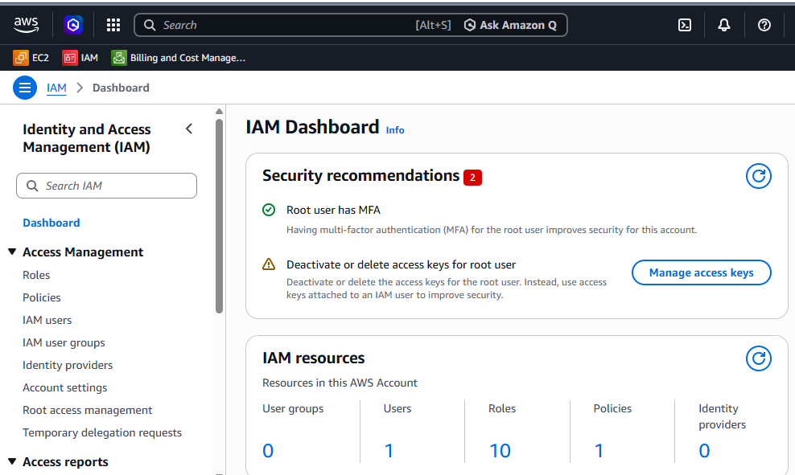
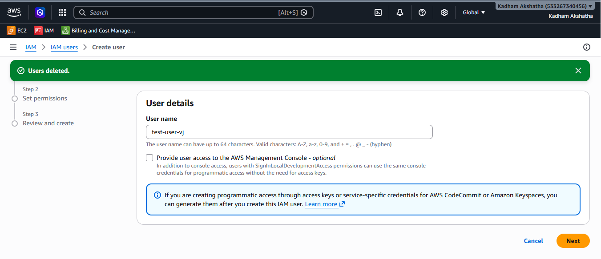
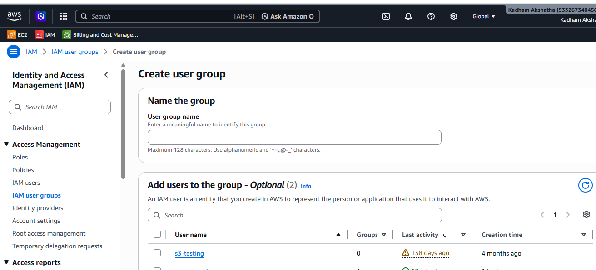
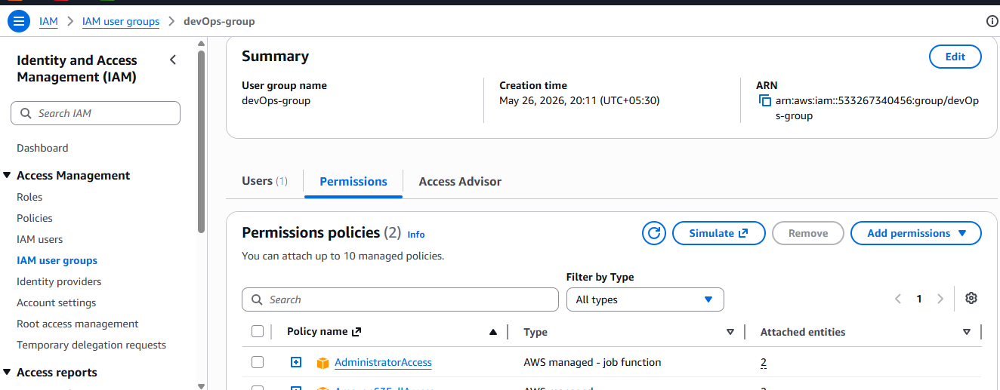
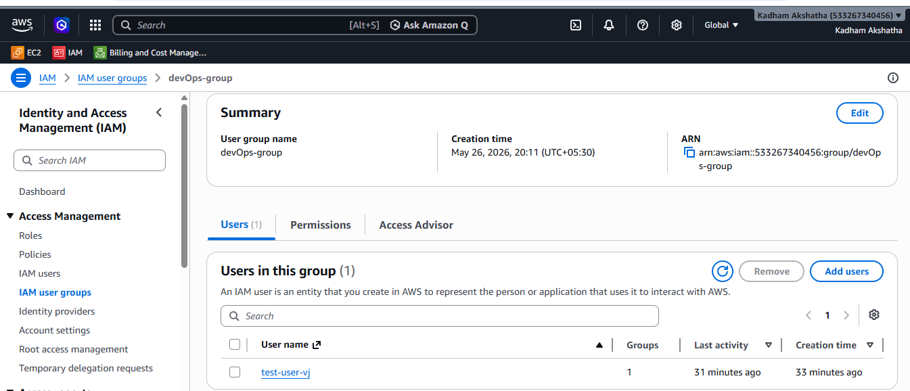

````md
# AWS IAM (Identity and Access Management)

## Introduction

When you start your AWS journey, one of the first important services you will encounter is **IAM - Identity and Access Management**.

It may sound complex at first, but by the end of this article, you will understand:

- What IAM is
- Why IAM exists
- How IAM works using a simple real-world example

---

## Why Do We Need IAM? — A Real World Example

Imagine you work at a hospital.

This hospital has many different areas like:

- General Ward
- ICU
- Pharmacy
- Operation Theatre
- Record Rooms (where patient files are stored)

Now, not everyone in the hospital can walk into every area.

### Example Access Control

- A receptionist can access the front desk but not the operation theatre.
- A nurse can access the ward pharmacy but not record rooms.
- A doctor can access most areas but still not the hospital's financial vault.
- Only the hospital director has access to everything.

This is done for **security and safety**.

If everyone had access to everything, someone could accidentally or intentionally misuse sensitive information.

AWS IAM works exactly the same way — but for your **cloud resources** instead of a hospital.

---

## What is AWS IAM?

**IAM** stands for **Identity and Access Management**.

It is a **free AWS service** that helps you control:

- Who can access your AWS account
- What they can do inside it

When you first create an AWS account, you get a **Root User**.

Think of the root user like the **hospital director** who has access to everything.

But giving everyone root access is extremely dangerous.

IAM allows you to create separate identities with only the permissions they need — nothing more, nothing less.

---

## The 4 Core Components of IAM

IAM is built on **4 main building blocks**:

---

### 1. Users

A **User** represents a single person who needs access to your AWS account.

### Example

A developer named **Ravi** joins your company and needs AWS access.

You create an IAM User for Ravi, set a password, and now he can log in.

---

### 2. Policies

Creating a user alone is not enough.

You must also define what that user is allowed to do.

This is handled by **Policies**.

Policies are **JSON documents** that define permissions.

### Example Policy Permissions

- ✅ Ravi can read files from S3
- ❌ Ravi cannot delete EC2 instances
- ❌ Ravi cannot access billing

You then attach this policy to the user.

### Simple Analogy

Think of a policy as an **access card rule**.

It defines which doors you can open.

---

### 3. Groups

Now imagine your company is growing fast.

Every week new developers, testers, and admins are joining.

Creating individual policies for each person manually becomes:

- Time consuming
- Error prone

This is where **Groups** come in.

A **Group** is a collection of users that share the same permissions.

---

### Real Example

You create:

- A group called **Developers**
- A group called **QA-Testers**
- A group called **DBAdmins**

Then attach the required policies to each group.

### Workflow

Whenever a new employee joins:

1. Create their IAM user
2. Add them to the correct group

They automatically get all the right permissions.

No need to attach policies manually every time.

---

### 4. Roles

Roles are similar to users, but with one key difference:

> Roles are not assigned permanently to a specific person.

Roles are mostly used for:

- Temporary access
- Allowing AWS services to interact with each other

### Example

Your application running on an EC2 instance needs to read files from S3.

Instead of:

- Creating a user
- Hardcoding credentials

You can:

- Create an IAM Role with S3 read permissions
- Attach the role to the EC2 instance

### Simple Analogy

Think of a **Role** as a **temporary visitor pass** given for a specific purpose and time.

---

## How It All Works Together — Real Workflow

Here is how a real company uses IAM when a new employee joins:

```text
New Employee joins the company
              ⬇️
Raises a request mentioning:
- Name
- Team
              ⬇️
DevOps Engineer creates an IAM User
              ⬇️
Adds the user to the correct Group
              ⬇️
User automatically gets the required Policies
              ⬇️
DevOps Engineer shares login credentials
              ⬇️
Employee logs in with limited required access
````

This process keeps the AWS environment:

* Secure
* Organized
* Scalable

---

## IAM Best Practices

Before moving further, here are some important IAM best practices every AWS user should follow:

### ✅ Best Practices

### 1. Never Use Root Account for Daily Tasks

Create an IAM Admin User instead.

### 2. Enable MFA (Multi-Factor Authentication)

Enable MFA for:

* Root User
* All IAM Users

### 3. Follow Least Privilege Principle

Give users only the permissions they absolutely need.

### 4. Use Groups Instead of Individual Policies

Managing permissions through groups is cleaner and scalable.

### 5. Review Permissions Regularly

Remove unused access and old permissions periodically.

---

## Hands-On Practical

Now that we understand the theory, here is the practical implementation in AWS Console.

---

### Step 1: Accessing IAM Dashboard

After logging into AWS using the Root User credentials:

1. Search for **IAM** in the AWS search bar
2. Open the **IAM Dashboard**

From here you can manage:

* Users
* Groups
* Policies
* Roles


---

### Step 2: Creating an IAM User

Steps followed:

1. Open **IAM Users**
2. Click **Create User**

### Details Entered

| Field       | Value                         |
| ----------- | ----------------------------- |
| Username    | `test-user`                   |
| Access Type | AWS Management Console Access |
| Password    | Auto-generated password       |

Now the user can log in to the AWS Console.



---

### Step 3: Creating a Group & Attaching Policies

### Creating Group

1. Go to **IAM → User Groups**
2. Click **Create Group**
3. Create a group named:

```text
DevOps
```



### Attaching Policies

After creating the group:

1. Open the newly created group
2. Go to the **Permissions** tab
3. Attach required policies



---

# Step 4: Adding User to the Group

Finally:

1. Open the user `test-user`
2. Add the user to the `DevOps` group

As soon as the user is added to the group, they automatically receive all permissions attached to that group.

No need to attach policies manually.



---

# Conclusion

This was a beginner-friendly overview of the **AWS IAM Service**.

By now you should understand:

* What IAM is
* Why IAM is important
* IAM Users
* Policies
* Groups
* Roles
* IAM Best Practices
* Basic Hands-on Workflow

IAM is one of the most important AWS services because it controls security and access management across your cloud environment.

Hope this article helped you understand IAM clearly.

See you in the next AWS service article! 🥳

```
```
