# AWS EBS Snapshot Cost Optimization Automation

## Project Overview

Cloud platforms such as AWS make it easy to create infrastructure whenever it is needed. However, resources that are created temporarily for development, testing, troubleshooting, or experiments are often forgotten after the work is completed.

This can lead to unnecessary cloud costs.

One example is **Amazon EBS snapshots.**

A developer may create an EC2 instance, attach an EBS volume and create snapshots of that volumes as backups. After completing the work, the developer may delete the EC2 instance and volume but forget about the snapshots.

The snapshots can continue to exist independently and consume snapshot storage.

Therefore, simply deleting an EC2 instance doesn't necessarily remove all related resources.

This project demonstrates how to automate the identification and clean-up of **stale EBS snapshots** using AWS Lambda, Python, Boto3 and Amazon EventBridge.

---

## Why Cost Optimization Matters

Moving applications to the cloud doesn't automatically guarantee lower costs.

Cloud providers make it very easy to provision resources, but organizations are responsible for using those resources efficiently.

For example:

```text
Developer
   |
   | Creates EC2
   ↓
EC2 Instance
   |
   | Creates EBS Volume
   ↓
EBS Volume
   |
   | Creates daily snapshots
   ↓
EBS Snapshots
   |
   | Work Completed
   ↓
EC2 + Volume deleted
   |
   | Snapshot forgotten
   ↓
Snapshot continues to exist
   | 
   ↓
Unnecessary storage cost
```

The problem becomes more significant in large organizations where hundereds or thousands of resources may be created by different teams.

Manually checking resources and informing teams about unused resources doesn't scale well.

In a large organization with hundreds or thousands of snapshots, these unused resources can accumulate and contribute to unnecessary cloud spending.

Automatically can help identify resources that are candidates for cleanup.

---

## Problem Statement

Consider a developer who is working on an application using an EC2 instance.

The developer creates:
- An EC2 instance
- An EBS volume
- EBS snapshots for backup

However, the snapshots remain.

The developer may no longer need those snapshots, but AWS continues to retain them until they are explictly deleted.

This creates a potential source of unnecessary cloud spending.

The goal is of this project is to automate the identification of such stale snapshots and safely remove the ones that meet our clean-up criteria.

---

## What is an EBS Snapshots

An **Amazon EBS snapshot** is a point-in-time backup of an Amazon EBS volume.

Snapshots are usful because they allow us to preserve the data on EBS volume and later use the snapshot to create a new EBS volume.

For example:

```text
EBS Volume
   |
   | Snapshot
   ↓
EBS Snapshot
   |
   | Later
   ↓
New EBS Volume
```

An important point is that an EBS snapshot is **independent of the EC2 instance**

Therefore:
```text
EC2 deleted
    ↓
EBS volume deleted
    ↓
Snapshot may still exist
```

This is why simply deleting an EC2 instance doesn't guarntee that all realted snapshots sotrage has disappeared.

---

## Project Goal

The goal of this project is to create an automated workflow that:

1. Find EBS snapshots
2. Examine their metadata
3. Identifies snapshots that meet our stale-resource criteria.
4. Protects snapshots that should not be deleted.
5. Supports a dry-run mode before deletion.
6. Deletes eligible stale snapshots.
7. Runs automatically using Amazon EventBridge.
8. Records the activity in Amazon CloudWatch Logs.

The important part is that we will **not blindly delete snapshots.**

The Lambda function will apply safety checks before deleting anything.

---

## 🏗️ Project Architecture

The final architecture will look like this:

```text
                         Amazon EventBridge
                                |
                                |
                         Scheduled Trigger
                                |
                                ↓
                     ┌────────────────────┐
                     │    AWS Lambda      │
                     │   Python + Boto3   │
                     └─────────┬──────────┘
                               |
                               ↓
                     ┌────────────────────┐
                     │   AWS APIs / EBS   │
                     └─────────┬──────────┘
                               |
                               ↓
                      Find EBS Snapshots
                               |
                               ↓
                       Analyze Snapshots
                               |
                    ┌──────────┴──────────┐
                    ↓                     ↓
                  Keep                  Delete
                    |                     |
                    └──────────┬──────────┘
                               ↓
                      CloudWatch Logs
```

---

## How the Solution Works

The Lambda function will perform the following workflow.

### Step 1 - Discover Snapshots

Lambda uses **Boto3** to communicate with the AWS APIs and retrieve EBS snapshots.

```text
Lambda
   ↓
Boto3
   ↓
EC2 API
   ↓
EBS Snapshots
```

### Step 2 - Analyze Snapshots

The function examines information such as:
- Snapshot creation time
- Snapshot ID
- Source volume
- Tags
- Age of the snapshot

### Step 3 - Apply Cleanup Rules

The function determines whether a snapshot is eligible for cleanup.

For example:

| Condition | Action |
| --------------------------------------- | --------- |
| Snapshot is recent | Keep |
| Snapshot has protection tag | Keep |
| Snapshot is still required | Keep |
| Snapshot is old and meets cleanup rules | Candidate |
| Candidate passes all checks | Delete |

### Srep 4 - Delete Elgiible Snapshots

Only snapshots that satisfy all our cleanup conditions will be deleted.

### Step 5 - Log the Result

THe Lambda function will write the resuts to **Amazon CloudWatch Logs.**

Example:
```text
Snapshots examined: 10 
Snapshots retained: 8 
Snapshots eligible for deletion: 2 
Snapshots deleted: 2
```

### 🛡️ Safety: Dry-Run Mode

Deleting cloud resources automaticlly can be dangerous.

Therefore, our Lambda function will first support **dry-run mode**

In dry-run mode, the function will identify snapshots that would be deleted without actually deleting them.

Example:
```text
Mode: DRY RUN 

Snapshots examined: 10 

Deletion candidates: 
- snap-xxxxxxxx 
- snap-yyyyyyyy

Snapshots deleted: 0
```

After verifying that logic works correctly, we can enable actual deletion.

This is an important and safer automation approach.

---

## 📋 Project Phases

We will complete the project in the following phases.

| Phase | Task                         | Status |
| ----- | ---------------------------- | ------ |
| 1     | Create test EC2 environment  | ⬜      |
| 2     | Create EBS snapshot          | ⬜      |
| 3     | Create Lambda function       | ⬜      |
| 4     | Create IAM permissions       | ⬜      |
| 5     | Write Boto3 cleanup logic    | ⬜      |
| 6     | Implement snapshot filtering | ⬜      |
| 7     | Implement dry-run mode       | ⬜      |
| 8     | Test Lambda                  | ⬜      |
| 9     | Enable deletion              | ⬜      |
| 10    | Create EventBridge schedule  | ⬜      |
| 11    | Verify CloudWatch logs       | ⬜      |
| 12    | Test complete automation     | ⬜      |
| 13    | Clean up AWS resources       | ⬜      |

Now we we understood how the project will be. Let's get start with the Hands-On Now.

---

# Hands-On Project

## 🚀 Step 1 - Create a Test EC2 Instance

Before creating the Lambda function, we need some EBS resources to work with.

We will create a small EC2 Instance that will automatically have an EBS root volume.

1. Go to AWS Console - Search for **EC2** -> Click on **Instances** -> Cick on **Launch Instance**

2. Give a name to your instance such as: **cost-optimization-demo**

3. Choose an appropriate Amazon machine Image. For example: **Ubuntu**

4. Click on **Launch Instance** and wait till it is created.

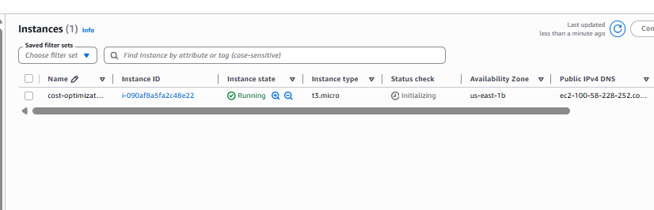

---

## 🚀 Step 2 — Verify the EBS Volume

After the instance has been created, open the EC2 dashboard.

Go to **Elastic Block Store -> Volumes**

You should see the volume associated with your EC2 instance.

You can also find the volume created here: EC2 -> Instances -> Click on instance created -> scroll down and click on Storage tab and you will see the **Volume** here.

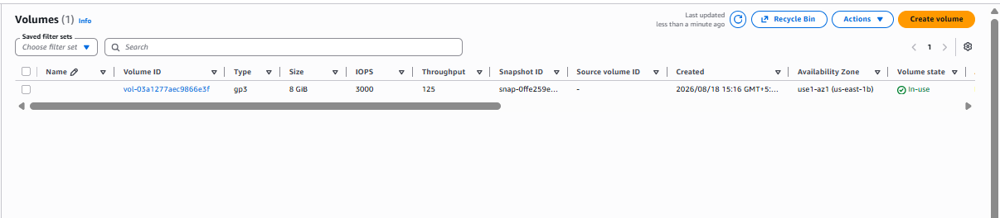

---

## 📸 Step 3 — Create an EBS Snapshot

Now we need to create a snapshot that our Lambda function can analyze later.

1. Go to **EC2 Dashboard -> Click on Snapshots -> Click on Create Snapshots**

2. For the **Resource Type** select **Volume**

3. For **Volume Id** select the volume associated with the EC2 instance.

4. For the Description, use: **Cost optimization demo snapshot** -> Click on **Create Snapshot**

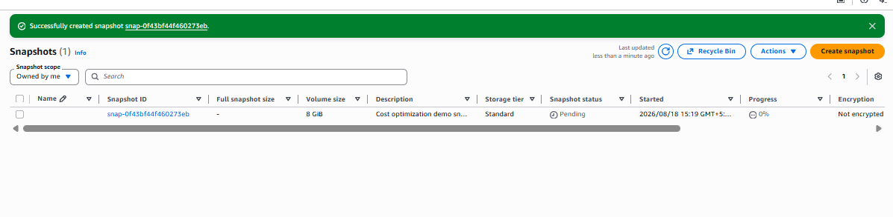

---

## 🧪 Step 4 — Create the Lambda Function

Now that we have an EBS snapshot, we can create the automation.

1. Go to **AWS Console** -> Search for **Lambda** -> Click **Create Lambda function**.

2. Select **Author from Scratch**

3. Give a name to the Lambda function **cost-optimization-ebs-snapshots**

4. For the runtime, select **Python**

5. Click on **Create Lambda Function**

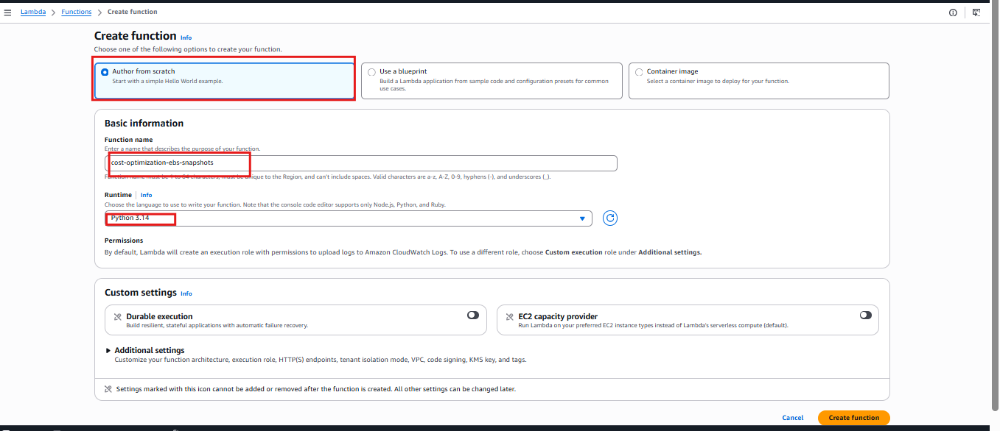

---

## 🔐 Step 5 — Configure IAM Permissions

### Why does Lambda needs permissions

Your Lambda function runs with an **IAM execution role.** Without permissions, it cannot communicate with AWS services like EC2 or EBS.

For this Project Lambda needs to:
- Read EBS snapshots
- Read EBS volumes
- Read EC2 instances
- Delete eligible snapshots

It does **not** need full EC2 admin access

1. Go to your Lambda Function -> Click on **Configuration** tab -> Select **permissions** -> Under **Execution Role**, click on the URL of the role -> It will open up the IAM role.

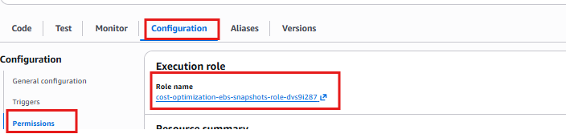


2. In the IAM: **Permissions -> Add Permisssions -> Create inline policy**

We will create our own policy as AWS doesn't have managed policy for this.

3. In **Service** select **EC2** -> Under **Allowed Actions** Select:

| Permission | Why it's needed |
| --- | --- |
| `ec2:DescribeSnapshots` | Read and inspect EBS snapshots |
| `ec2:DescribeVolumes` | Check source EBS volumes |
| `ec2:DescribeInstances` | Verify EC2 resources |
| `ec2:DeleteSnapshot` | Remove stale EBS snapshots |

4. Under the **Resources** for this demo project, select: **All Resources**

> **Real-world note: In production, organizations often scope these permissions to specific AWS accounts, regions, or tagged resources. For learning purposes, "All Resources" keeps the project simple.

5. Give a name to the policy such as `EBS-Snapshot-Cleanup-Policy` and a description like **Lambda least-privilege policy for EBS snapshot cleanup

6. Click on **Create Policy.**

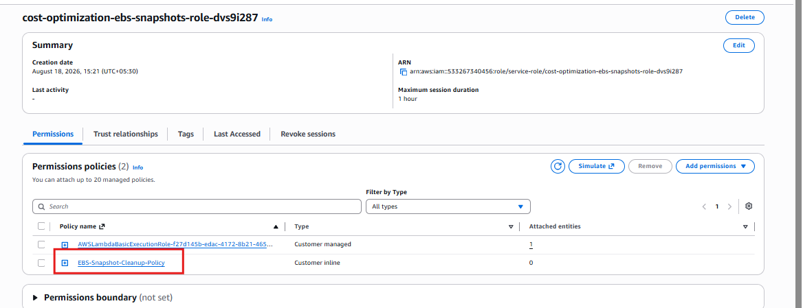

---

## 🐍 Step 6 — Create the Python Lambda Code

The first version of our Lambda will do only this:
```text
Lambda
↓
Boto3
↓
EC2 API
↓
Find EBS snapshots
↓
Display snapshot information
```

It will **not delete anything**.

1. Go to AWS Console -> Lambda -> `cost-optimization-ebs-snapshots`

2. You should see the code tab here. IN the code editor, you will see the default code in it. Delete the existing code and the following code.

```Python
import boto3


def lambda_handler(event, context):

    # Create an EC2 client
    ec2 = boto3.client("ec2")

    # Retrieve EBS snapshots owned by this AWS account
    response = ec2.describe_snapshots(
        OwnerIds=["self"]
    )

    snapshots = response["Snapshots"]

    print(f"Total snapshots found: {len(snapshots)}")

    for snapshot in snapshots:
        print(
            f"Snapshot ID: {snapshot['SnapshotId']}, "
            f"Volume ID: {snapshot.get('VolumeId', 'N/A')}, "
            f"State: {snapshot['State']}, "
            f"Start Time: {snapshot['StartTime']}"
        )

    return {
        "statusCode": 200,
        "body": f"Found {len(snapshots)} EBS snapshots"
    }
```

---
### Understanding the Code

Lets understand what each important part does.

### 1. Import Boto3
```Python
import boto3
```

**Boto3** is the AWS SDK for Python. It allows python program to communicate with AWS services.

for example:
```text
Python
   ↓
Boto3
   ↓
AWS API
   ↓
EC2
```

### 2. Lambda Handler
```python
def lambda_handler(event, context):
```

AWS Lambda looks for this function when it executes our python code.
`event` -> contains info passed to the lambda function.
`context` -> contains info about the Lambda execution environment.

For this project, we don't need either one yet.

### 3. Create the EC2 client
```python
ec2 = boto3.client("ec2")
```

This creates a Boto3 EC2 client. We can use it to communicate with EC2/EBS APIs.

### 4. Retrieve our Snapshots
```python
response = ec2.describe_snapshots(
    OwnerIds=["self"]
)
```

This is very important. We are asking AWS:
> Show me the EBS snapshots owned by this AWS account

`OwnerIds=["self"]` means the current AWS account.

This is safer than asking for snapshots from all possible ownners.

### 5. Get the Snapshot list
```python
snapshots = response["Snapshots"]
```

AWS returns information about the snapshots. We store that in `snapshots`

### 6. Count the Snapshots
```python
print(f"Total snapshots found: {len(snapshots)}")
```

This prints the number of snapshots Lambda discovered.

Because you created one snapshot during Steps 1-3, we should initially expect at least that snapshot to appear.

### 7. Display Snapshot Information
```python
for snapshot in snapshots:
```
This loops through each snapshot. Then:

```python
snapshot["SnapshotId"] # Gets the snapshot ID
snapshot.get("VolumeId", "N/A") # Gets the source volume ID
snapshot["State"]  # Gets the snapshot state
snapshot["StartTime"]  # Gets the snapshot creation/start time
```
---

3. After pasting the Code Click on **Deploy** -> Wait for the deployment to finish.

4. Click on **Test** -> AWS will ask you to configure a test event

5. Then click on **create new event**, give it a name: **snapshot-discovery-test** -> Keep the event **Private** -> Click on Save.

6. Then click on **Test** again.

7. Now when I tested it, I got an "timed out error". So lets fix this Now.

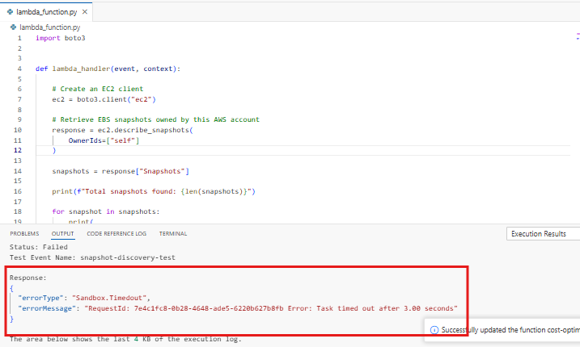


8. Go to **Configuration -> Under General click edit -> change the time out to 10 seconds" -> Click on save**

> NOTE: Please be careful while selecting the timeout since it will cost, so keep it as minimum as possible.

9. Test it again. Now my code got executed successfully and gave the result.

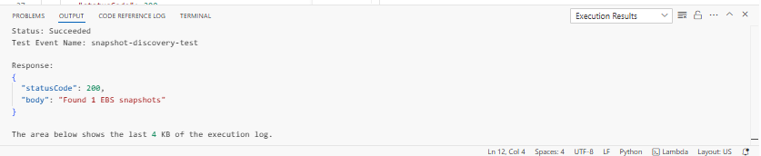

---

## Step 7 - Add Snapshot Age Filtering

Right now our Lmabda can answer:

> What snapshots exists?

But our cost-optmization project needs to answer:

> Which snapshots are old enough to be considered stale?

We will **still not delete anything.**

Our workflow becomes:
```text
Lambda
   ↓
Find snapshots
   ↓
Check snapshot creation date
   ↓
Calculate age
   ↓
Compare with retention period
   ↓
KEEP / DELETE CANDIDATE
```

We are doing this because we don't want our Lambda function to delete a snaptshot simply because it exists.

for example:

| Snapshot   |     Age | Decision  |
| ---------- | ------: | --------- |
| `snap-001` |  2 days | Keep      |
| `snap-002` | 10 days | Keep      |
| `snap-003` | 45 days | Candidate |
| `snap-004` | 90 days | Candidate |

For our demo, we will use a configurable retention period.

Go **Lambda** -> `cost-optimization-ebs-snapshots` -> **Code**

Replace the exiting code with: 

```python
import boto3
from datetime import datetime, timezone


# Number of days before a snapshot is considered stale
RETENTION_DAYS = 30


def lambda_handler(event, context):

    ec2 = boto3.client("ec2")

    response = ec2.describe_snapshots(
        OwnerIds=["self"]
    )

    snapshots = response["Snapshots"]

    print(f"Total snapshots found: {len(snapshots)}")
    print(f"Retention period: {RETENTION_DAYS} days")
    print("-" * 60)

    now = datetime.now(timezone.utc)

    for snapshot in snapshots:

        snapshot_id = snapshot["SnapshotId"]
        volume_id = snapshot.get("VolumeId", "N/A")
        start_time = snapshot["StartTime"]

        age = now - start_time
        age_days = age.days

        if age_days >= RETENTION_DAYS:
            decision = "DELETE CANDIDATE"
        else:
            decision = "KEEP"

        print(
            f"Snapshot ID: {snapshot_id}\n"
            f"Volume ID: {volume_id}\n"
            f"Age: {age_days} days\n"
            f"Decision: {decision}\n"
        )

    return {
        "statusCode": 200,
        "body": f"Analyzed {len(snapshots)} snapshots"
    }
```

We added:
```python
RETENTION_DAYS = 30
```

This means:
> A snapshot must be at least 30 days old before our program considers it a deletion candidate.

### Current Snapshot

Our snapshot was just created, so you will probably see something like this:
```text
Age: 0 days
Decision: KEEP
```

That's exactly what we want.

### Calculate the age

We use:

```Python
now = datetime.now(timezone.utc)
```
This gets the current time in UTC.
Then 
```python
age = now - start_time
```
calculates how long ago the snapshot was created.

Then 
```python
age_days = age.days
```
gives us the age in days.

### Applying the retention rule

This is the important part:
```python
if age_days >= RETENTION_DAYS:
    decision = "DELETE CANDIDATE"
else:
    decision = "KEEP"
```

Notice we are saying **DELETE CANDIDATE** not **DELETE**

That is intentional. We are still in the analysis stage.

Now click **Deploy** and then click on **Test**

You will see something like this:

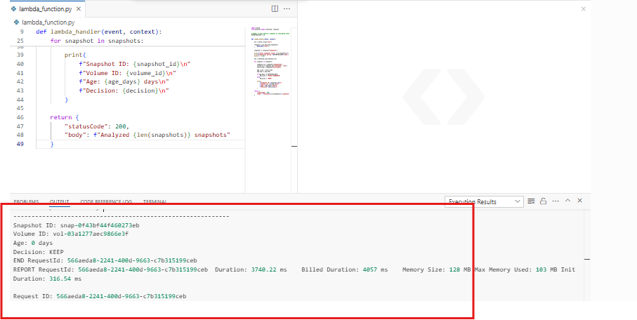

Now the architecture is something like this:

```text
Snapshot
    ↓
Calculate Age
    ↓
Age >= Retention Period?
    ↓
 ┌──┴──┐
Yes    No
 ↓      ↓
Candidate KEEP
```

---

## Step 8 - Add the Snapshot Protection using tags

Right now our Lambda knows:
- Which snapshot exist
- How old they are

But the age along is not enough to decide whether something should be deleted.

Imagine a company has 90 days old snapshot that is still required for work. 

We don't want our automation deleting it just because it is old.

So we will introduce a **protection tag**

Our rule will be:
 ```text
Snapshot
    ↓
Is it protected?
    ↓
 ┌──┴───┐
Yes     No
 ↓       ↓
KEEP   Continue
 ```

 We will use:
 ```text
Retention = Keep
 ```

 ### Step 8.1 - Add the Protection Tag to your snapshot

 1. Go to EC2 → Elastic Block Store → Snapshots
 2. Select the snapshot you created earlier.

 Look for **tags** click on **Manage tags/Add tag**

 Depending on the current AWS console, wording may vary

 Add:

 | Key         | Value  |
| ----------- | ------ |
| `Retention` | `Keep` |

So, it should look like this:
```text
Key:   Retention
Value: Keep
```

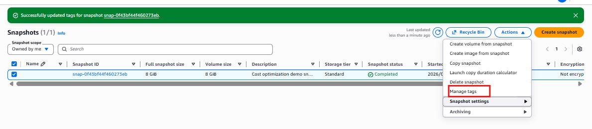

---

### Step 8.2 - Update the Lambda Code

Now we will tell Lambda to recognise this tag.

1. Go to Lambda → cost-optimization-ebs-snapshots → Code
2. Replace the entire code with:

```python
import boto3
from datetime import datetime, timezone


# Number of days before a snapshot is considered stale
RETENTION_DAYS = 30


def lambda_handler(event, context):

    ec2 = boto3.client("ec2")

    response = ec2.describe_snapshots(
        OwnerIds=["self"]
    )

    snapshots = response["Snapshots"]

    print(f"Total snapshots found: {len(snapshots)}")
    print(f"Retention period: {RETENTION_DAYS} days")
    print("-" * 60)

    now = datetime.now(timezone.utc)

    for snapshot in snapshots:

        snapshot_id = snapshot["SnapshotId"]
        volume_id = snapshot.get("VolumeId", "N/A")
        start_time = snapshot["StartTime"]

        age = now - start_time
        age_days = age.days

        # Get snapshot tags
        tags = {
            tag["Key"]: tag["Value"]
            for tag in snapshot.get("Tags", [])
        }

        retention_tag = tags.get("Retention", "")

        # Check whether snapshot is protected
        if retention_tag.lower() == "keep":
            decision = "KEEP - PROTECTED"
        
        elif age_days >= RETENTION_DAYS:
            decision = "DELETE CANDIDATE"
        
        else:
            decision = "KEEP"

        print(
            f"Snapshot ID: {snapshot_id}\n"
            f"Volume ID: {volume_id}\n"
            f"Age: {age_days} days\n"
            f"Retention Tag: {retention_tag or 'None'}\n"
            f"Decision: {decision}\n"
        )

    return {
        "statusCode": 200,
        "body": f"Analyzed {len(snapshots)} snapshots"
    }
```

### What we added?

Previously, our decision was based only on **Age**, now it is:
```text
Protection Tag
       ↓
      Age
       ↓
    Decision
```

The important section is:
```python
if retention_tag.lower() == "keep":
    decision = "KEEP - PROTECTED"
```

This means that even the snapshot is old enough to normally become deletion candidate, the protection tag takes priority.

3. Now **Deploy** the code and then click on **Test**.

4. The output should be something like this.

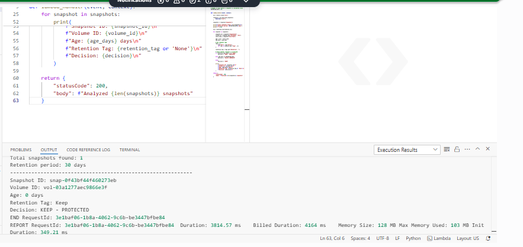

The decision clean will be like this:

```text
Snapshot
    ↓
Retention = Keep?
    ↓
 ┌──┴───┐
Yes     No
 ↓       ↓
KEEP   Check Age
         ↓
     Age >= 30?
       ↓     ↓
     Yes     No
      ↓       ↓
  Candidate  KEEP
```

---

## Step 9 - Implement Dry-Run Mode

The purpose of dry-run mode is:
> Identify what Lmabda would delete without actually deleting it.

This is a very common automation because we don't want to discover a bug pnly after production resources have been deleted.

Our workflow will become:

```text
Snapshot
   ↓
Check protection
   ↓
Check age
   ↓
Eligible?
   ↓
DRY RUN
   ↓
Report candidate
   ↓
DO NOT DELETE
```

### step 9.1 - Add a Dry-Run Setting

Go back to Lambda → cost-optimization-ebs-snapshots → Code

We will add this variable near the top:
```python
DRY_RUN = True
```

So the beginning of the code will become:
```python
import boto3
from datetime import datetime, timezone


# Number of days before a snapshot is considered stale
RETENTION_DAYS = 30

# Safety switch
# True  = identify candidates but do not delete
# False = allow deletion of eligible snapshots
DRY_RUN = True
```

Keep `DRY_RUN = True`

We are not ready to delete anything yet.

---

### Step 9.2 - Update the Decision logic

Replace your current code with this complete version:

```python
import boto3
from datetime import datetime, timezone


# Number of days before a snapshot is considered stale
RETENTION_DAYS = 30

# Safety switch
# True  = identify candidates but do not delete
# False = allow deletion of eligible snapshots
DRY_RUN = True


def lambda_handler(event, context):

    ec2 = boto3.client("ec2")

    response = ec2.describe_snapshots(
        OwnerIds=["self"]
    )

    snapshots = response["Snapshots"]

    print(f"Total snapshots found: {len(snapshots)}")
    print(f"Retention period: {RETENTION_DAYS} days")
    print(f"Dry-run mode: {DRY_RUN}")
    print("-" * 60)

    now = datetime.now(timezone.utc)

    deletion_candidates = []
    protected_snapshots = []
    retained_snapshots = []

    for snapshot in snapshots:

        snapshot_id = snapshot["SnapshotId"]
        volume_id = snapshot.get("VolumeId", "N/A")
        start_time = snapshot["StartTime"]

        age = now - start_time
        age_days = age.days

        # Convert snapshot tags into a dictionary
        tags = {
            tag["Key"]: tag["Value"]
            for tag in snapshot.get("Tags", [])
        }

        retention_tag = tags.get("Retention", "")

        # Check protection tag first
        if retention_tag.lower() == "keep":

            decision = "KEEP - PROTECTED"
            protected_snapshots.append(snapshot_id)

        elif age_days >= RETENTION_DAYS:

            decision = "DELETE CANDIDATE"
            deletion_candidates.append(snapshot_id)

        else:

            decision = "KEEP"
            retained_snapshots.append(snapshot_id)

        print(
            f"Snapshot ID: {snapshot_id}\n"
            f"Volume ID: {volume_id}\n"
            f"Age: {age_days} days\n"
            f"Retention Tag: {retention_tag or 'None'}\n"
            f"Decision: {decision}\n"
        )

    print("-" * 60)
    print("CLEANUP SUMMARY")
    print(f"Snapshots examined: {len(snapshots)}")
    print(f"Protected snapshots: {len(protected_snapshots)}")
    print(f"Retained snapshots: {len(retained_snapshots)}")
    print(f"Deletion candidates: {len(deletion_candidates)}")

    if DRY_RUN:

        print("DRY RUN ENABLED")
        print("No snapshots were deleted.")

    else:

        print("DELETE MODE ENABLED")

        for snapshot_id in deletion_candidates:

            try:

                ec2.delete_snapshot(
                    SnapshotId=snapshot_id
                )

                print(
                    f"Deleted snapshot: {snapshot_id}"
                )

            except Exception as error:

                print(
                    f"Failed to delete {snapshot_id}: {error}"
                )

    return {
        "statusCode": 200,
        "body": (
            f"Analyzed {len(snapshots)} snapshots. "
            f"Deletion candidates: {len(deletion_candidates)}"
        )
    }
```

---

### Step 9.3 - Understand the Safety Switch

This is the most important new line `DRY_RUN = True`

When this is `DRY_RUN = True` Lambda will:
- Find Snapshots
- Analyze them
- Identify deletion candidates
- Print the candidates
- **NOT delete anything**

When eventually changed to `DRY_RUN = FALSE`

Lambda will be allowed to delete eligible snapshots.

We will not change it to `FALSE` yet.

---

### Step 9.4 - Deploy and Test

Click on **Deploy** and **Test**

The result will be like this

```text
Total snapshots found: 1
Retention period: 30 days
Dry-run mode: True
------------------------------------------------------------

Snapshot ID: snap-xxxxxxxx
Volume ID: vol-xxxxxxxx
Age: 0 days
Retention Tag: Keep
Decision: KEEP - PROTECTED

------------------------------------------------------------
CLEANUP SUMMARY
Snapshots examined: 1
Protected snapshots: 1
Retained snapshots: 0
Deletion candidates: 0
DRY RUN ENABLED
No snapshots were deleted.
```

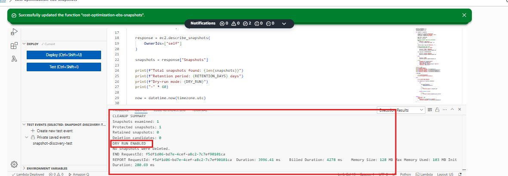


---

### Step 9.5 - Test the Stale Snapshot

Now we need to test other branch
```text
Old snapshot
     ↓
Not protected
     ↓
DELETE CANDIDATE
```

But our snapshot is a brand new.

This is the point where we'll temporarily change the retention period.

Change the retention from `RETENTION_DAYS = 30` to `RETENTION_DAYS = 0`.

Do not change `DRY_RUN` to **False**.

Deploy and test again.

Because snapshot is alreayd at least 0 days old, it should become:
```text
Decision: DELETE CANDIDATE
```

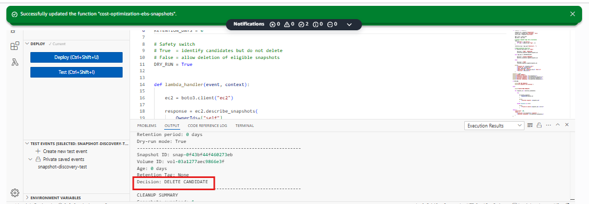


But because `DRY_RUN = True`, the snapshot will NOT be deleted.

This is exactly thr test we want.

> Please make the rentention back to 30 days again after the test.

The workflow will be:

```text
Snapshot
    ↓
Check Protection Tag
    ↓
Check Snapshot Age
    ↓
Eligible?
    ↓
DRY RUN
    ↓
Report Candidate
    ↓
Do NOT Delete
```

---

## Step 10 - Enable Safe Snapshot Deletion

Our final decision flow will be:

```text
EBS Snapshot
     │
     ▼
Is it protected?
     │
   Yes ──────────────► KEEP
     │
    No
     │
     ▼
Is it older than 30 days?
     │
   No ──────────────► KEEP
     │
    Yes
     │
     ▼
DELETE CANDIDATE
     │
     ▼
DRY RUN?
  ┌──┴──┐
 Yes    No
  │      │
 KEEP   DELETE
```

---

### Step 10.1 - One Important Improvement

before enabling deletion, we are going to add **one more safety condition**

**Only delete the snapshots created by this project**

We will use tag: `ManagedBy = LambdaCostOptimization`

This is an important improvement.

Imagine your AWS account contains:
```text
Snapshot A → Production backup
Snapshot B → Database backup
Snapshot C → Developer backup
Snapshot D → Our cost-optimization demo
```

We don't want our Lambda accidentally touching A,B or C.

Our Lambda should manage only snapshots explicitly marked: `ManagedBy = LambdaCostOptimization`

Sp our final rule becomes:
```text
Is ManagedBy = LambdaCostOptimization?
       │
   ┌───┴────┐
  No       Yes
  ↓         ↓
IGNORE   Continue
            ↓
       Check Retention
            ↓
         Check Age
            ↓
          Delete
```

---

### Step 10.2 - Add the Management tag

Go to EC2 → Snapshots -> Select the snapshot -> Click on Actions -> manage tags.

Add **KEY: ManagedBy** and **VALUE: LambdaCostOptimization**
Add **KEY: Retention** and **VALUE: Keep**

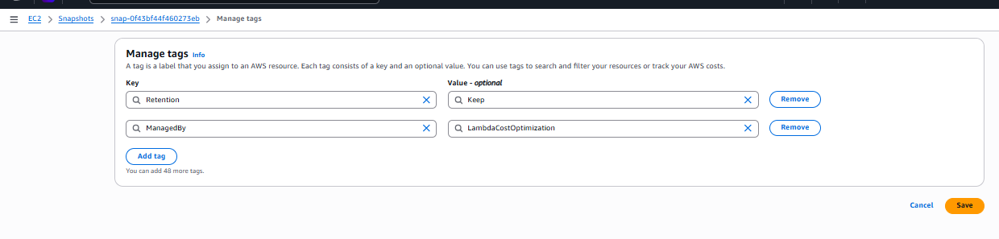

---

### Step 10.3 - Update the Lambda Code

Now replace the code with this version:

```Python
import boto3
from datetime import datetime, timezone


# Snapshots older than this number of days can be considered stale
RETENTION_DAYS = 30

# Safety switch
# True  = identify candidates but do not delete
# False = allow deletion of eligible snapshots
DRY_RUN = True

# Only snapshots with this tag are managed by this Lambda
MANAGED_BY_VALUE = "LambdaCostOptimization"


def lambda_handler(event, context):

    ec2 = boto3.client("ec2")

    response = ec2.describe_snapshots(
        OwnerIds=["self"]
    )

    snapshots = response["Snapshots"]

    print(f"Total snapshots found: {len(snapshots)}")
    print(f"Retention period: {RETENTION_DAYS} days")
    print(f"Dry-run mode: {DRY_RUN}")
    print(f"ManagedBy value: {MANAGED_BY_VALUE}")
    print("-" * 60)

    now = datetime.now(timezone.utc)

    managed_snapshots = 0
    protected_snapshots = 0
    retained_snapshots = 0
    deletion_candidates = 0
    deleted_snapshots = 0

    for snapshot in snapshots:

        snapshot_id = snapshot["SnapshotId"]
        volume_id = snapshot.get("VolumeId", "N/A")
        start_time = snapshot["StartTime"]

        # Convert tags into a dictionary
        tags = {
            tag["Key"]: tag["Value"]
            for tag in snapshot.get("Tags", [])
        }

        managed_by = tags.get("ManagedBy", "")
        retention_tag = tags.get("Retention", "")

        # Ignore snapshots not managed by this automation
        if managed_by != MANAGED_BY_VALUE:

            print(
                f"Snapshot {snapshot_id} ignored - "
                f"not managed by this Lambda."
            )

            continue

        managed_snapshots += 1

        # Calculate snapshot age
        age = now - start_time
        age_days = age.days

        # Protection rule
        if retention_tag.lower() == "keep":

            decision = "KEEP - PROTECTED"
            protected_snapshots += 1

        # Age rule
        elif age_days >= RETENTION_DAYS:

            decision = "DELETE CANDIDATE"
            deletion_candidates += 1

            # Actual deletion only happens when dry-run is disabled
            if not DRY_RUN:

                try:

                    ec2.delete_snapshot(
                        SnapshotId=snapshot_id
                    )

                    deleted_snapshots += 1

                    print(
                        f"DELETED: {snapshot_id}"
                    )

                except Exception as error:

                    print(
                        f"FAILED TO DELETE {snapshot_id}: {error}"
                    )

        else:

            decision = "KEEP"
            retained_snapshots += 1

        print(
            f"Snapshot ID: {snapshot_id}\n"
            f"Volume ID: {volume_id}\n"
            f"Age: {age_days} days\n"
            f"ManagedBy: {managed_by}\n"
            f"Retention: {retention_tag or 'None'}\n"
            f"Decision: {decision}\n"
        )

    print("-" * 60)
    print("CLEANUP SUMMARY")
    print(f"Snapshots examined: {len(snapshots)}")
    print(f"Managed snapshots: {managed_snapshots}")
    print(f"Protected snapshots: {protected_snapshots}")
    print(f"Retained snapshots: {retained_snapshots}")
    print(f"Deletion candidates: {deletion_candidates}")
    print(f"Deleted snapshots: {deleted_snapshots}")

    if DRY_RUN:

        print("DRY RUN ENABLED")
        print("No snapshots were deleted.")

    else:

        print("DELETE MODE ENABLED")

    return {
        "statusCode": 200,
        "body": (
            f"Analyzed {len(snapshots)} snapshots. "
            f"Deletion candidates: {deletion_candidates}. "
            f"Deleted: {deleted_snapshots}."
        )
    }
```

---

### Step 10.4 - Deploy and test

Click on **Deploy** and **Test**

Because the snapshot currently has:
```text
ManagedBy = LambdaCostOptimization
Retention = Keep
```

We expect: **Decision: KEEP - PROTECTED**

And
```text
DRY RUN ENABLED
No snapshots were deleted.
```

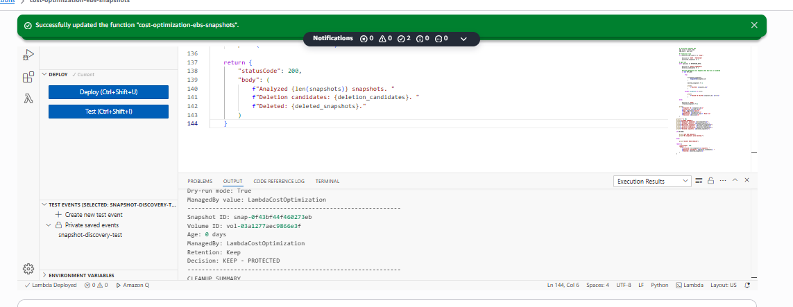

---

### Step 10.5 - Now We're Going to Perform a Controlled Deletion Test

This is where will deliberately delete our test snapshot.

We are going to use **RETENTION_DAYS = 0** temporarily.

But before that, we will remove: **Retention = Keep** from the snapshot.

### Change the rentention period

Change 
- **RETENTION_DAYS = 0**
- **DRY_RUN = False**

Now Click on **deploy** and **Test**

You should see something like this:

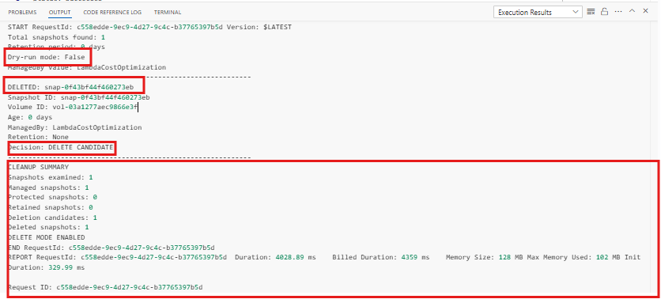

---

### Step 10.6 - Verify the Snapshot was actually Deleted

Don't just trust the Lambda's output.

Go to EC2 → Snapshots -> Refresh the page

The snapshot should no longer appear under your owned snapshots.

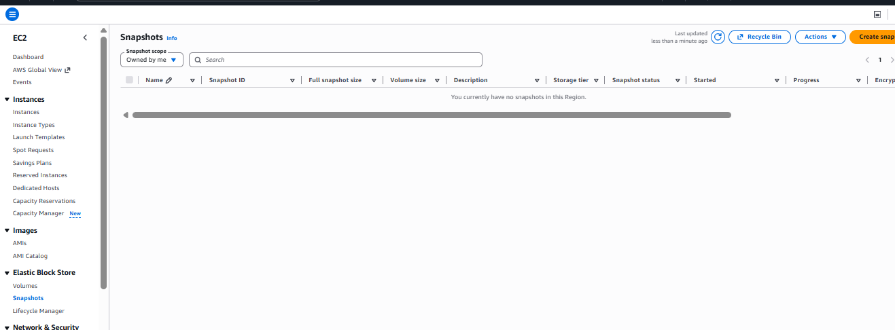

---

## 🚨 VERY IMPORTANT — Restore the Project

Since the deletion is done, so lets restore the project to original one.

Change the following to:

- RETENTION_DAYS = 30
- DRY_RUN = True

**Deploy** it again

We don't want our Lambda accidentally deleting future snapshots while we are still developing the project.

The final decision Logic will be:

```text
Snapshot
    ↓
ManagedBy = LambdaCostOptimization?
    ↓
 ┌──┴───┐
 No     Yes
 ↓       ↓
Ignore  Protected?
          ↓
       ┌──┴──┐
      Yes    No
       ↓      ↓
     KEEP   Check Age
               ↓
          Age >= Retention?
             ↓       ↓
           Yes       No
            ↓         ↓
        Candidate    KEEP
            ↓
        Dry Run?
        ↓       ↓
      True     False
       ↓         ↓
     KEEP     DELETE
```

---

## Step 11 - Add EventBridge Scheduling

Now we can turn this from a manual Lambda project into an actual automation used in organizations.

Workflow will be:

```text
                 EventBridge
                     │
              Scheduled trigger
                     │
                     ▼
                  Lambda
                     │
                   Boto3
                     │
                     ▼
              EBS Snapshots
                     │
             ┌───────┴───────┐
             ▼               ▼
          Analyze          Protect
             │               │
             └───────┬───────┘
                     ▼
               Cleanup logic
```

### What EventBridge does

Instead if we manually clicking on **test** everyday, **EventBridge** can invoke the Lambda automatically on a schedule.

For example:
```text
Every day at 02:00 UTC
        ↓
EventBridge
        ↓
Lambda
        ↓
Check snapshots
```

### Step 11-1. - Create the EventBridge Rule

1. Go to **AWS Console → Amazon EventBridge**

2. In the left navigation find **Rules**

3. Click on **Create rule**

4. Name the Rule: **ebs-snapshot-cost-optimization-daily**

5. Add Description: **Daily trigger for EBS snapshot cost optimization Lambda**

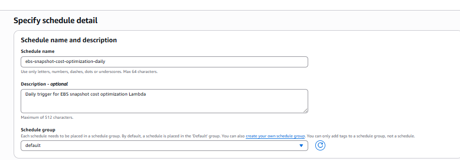


6. For the **schedule pattern**, choose: **A recurring schedule**

7. For now use **Rate-based schedule** -> Set **1 day**

8. For the **Target** select: **AWS Service** -> Then choose **Lambda Function** -> Select `cost-optimization-ebs-snapshots`

> EventBridge will invoke this Lambda according to the schedule

9. Continue through the remaining options and create the rule.


After creation, you should see something like this:

```text
Rule:
ebs-snapshot-cost-optimization-daily

Status:
Enabled

Target:
cost-optimization-ebs-snapshots

Schedule:
Every 1 day
```

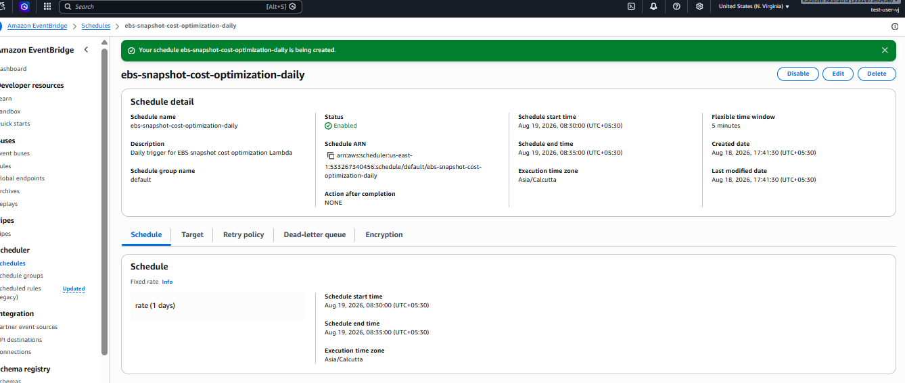

Now wait till the schduled is done.

Then we will check the CloudWatch logs, Lmabda Monitor tab to see the result.

1. Lambda — Invocations

Now go to **AWS Console → Lambda** → `cost-optimization-ebs-snapshots` → Monitor

Look at **Invocations.**

You should see the invocation count increase.

You can also look at **Metrics** and see:

- Invocations
- Errors
- Duration

This proves that EventBridge actually triggered your Lambda.

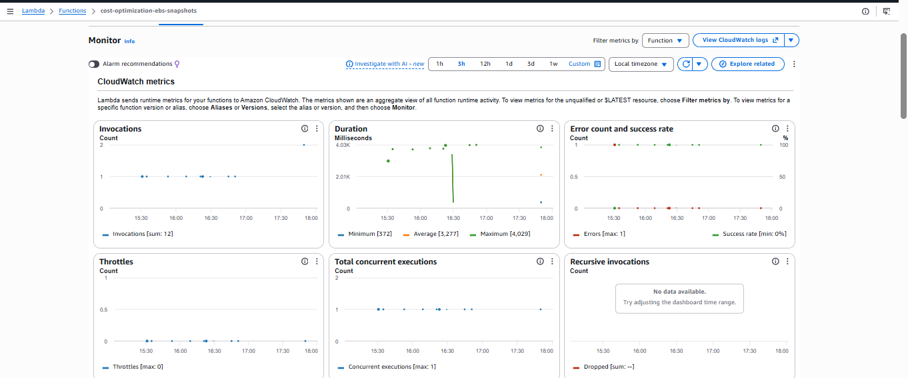


2. CloudWatch — Logs ⭐

Go to:

CloudWatch → Logs → Log groups

Open: **/aws/lambda/cost-optimization-ebs-snapshots**

Then open the newest log stream.

You should see something similar to:

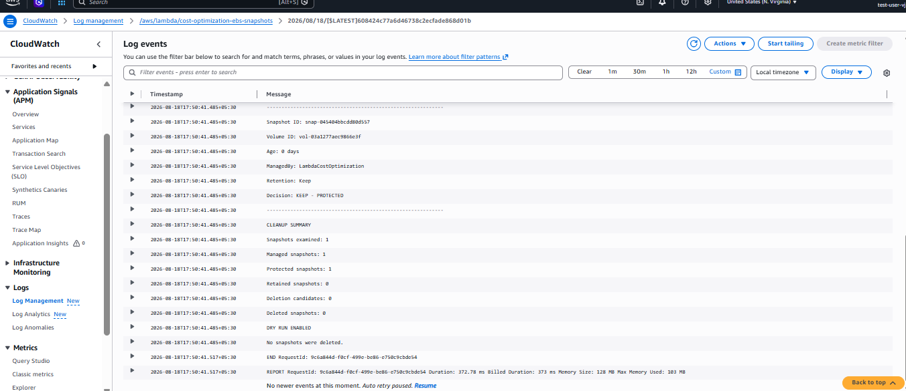


The Worflow is now:

```text
EventBridge Scheduler
        ↓
      Lambda
        ↓
      Boto3
        ↓
   EBS Snapshots
        ↓
 ┌──────┴────────┐
 │               │
Protected      Stale
 │               │
KEEP           Candidate
                 │
             Dry Run
                 │
            CloudWatch
```

---

## Step 12 - Final Real Deletion Test

Before changing anything, go to **EC2 -> Snapshots**
Make sure the snapshot has `ManagedBy = LambdaCostOptimization` and this key-value: `Retention = Keep` is removed.

### Step 12.1 - Change Lambda to deletion mode

Open Lambda → `cost-optimization-ebs-snapshots`

Change python:
```Python
RETENTION_DAYS = 30
DRY_RUN = True
```

TO:

```Python
RETENTION_DAYS = 0
DRY_RUN = False
```

And then **deploy** it.

Wait for the Scheduler to start and then after that process is done, we will check if the snapshot is deleted or not.

---

### Step 12.2 - Verify the Deletion of Snapshot

We will verify in 3 places.

1. **Lambda**

Go to **Lambda -> Monitor **

Confirm the invocation occurred.

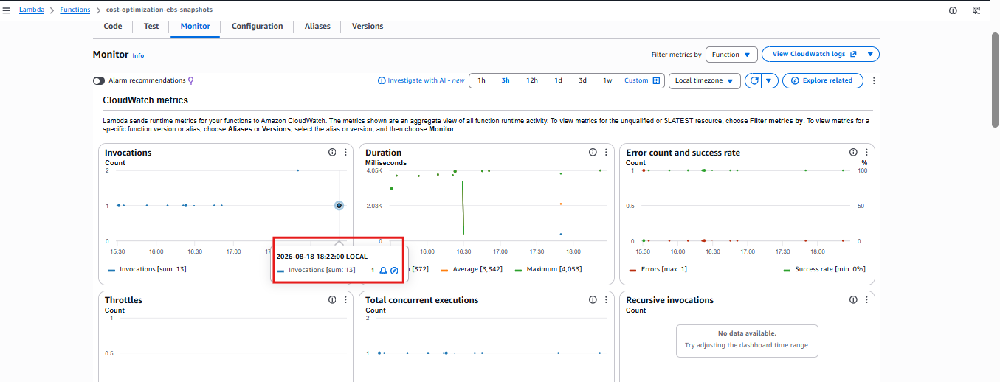


2. **CloudWatch Logs ⭐**

Go to:

**CloudWatch → Log Management → Log groups**

Open: **/aws/lambda/cost-optimization-ebs-snapshots**

The newest execution should contain something similar to this:

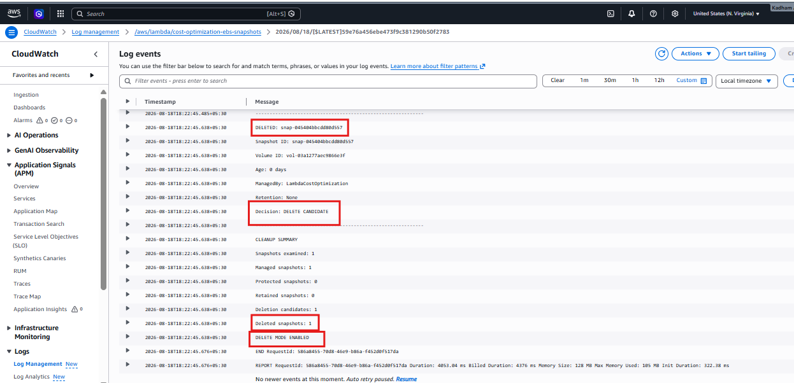


3. **EC2 -> Snapshots**

Finally go to Snapshots page in EC2 and refresh the page.

That confirms the deletion actually happened rather than merely reporting it.

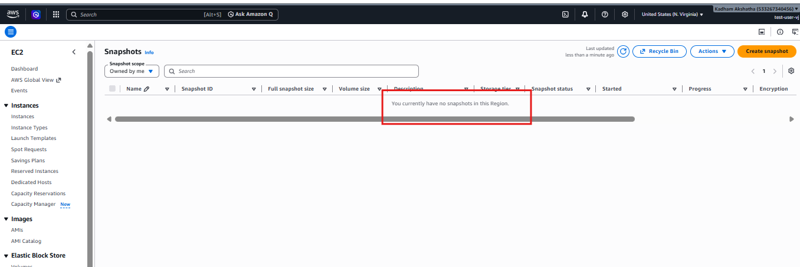


### Immediately Restore the Safe Configuration

After you see the deletion succeed, immediately change Lambda back:
```python
RETENTION_DAYS = 30
DRY_RUN = True
```

Click **Deploy.**

This is important because we don't want the Lambda sitting in: **DRY_RUN = False**

while we're working on cleanup.

---

## Step 13 - The Final Architecture of the Project

This will be our final Architecture for the project.

```text
                         ┌─────────────────────┐
                         │   EventBridge        │
                         │     Scheduler        │
                         │                      │
                         │   Daily Schedule     │
                         └──────────┬──────────┘
                                    │
                                    │ Invoke
                                    ▼
                         ┌─────────────────────┐
                         │   AWS Lambda        │
                         │                     │
                         │ Python + Boto3      │
                         └──────────┬──────────┘
                                    │
                         AWS API Calls
                                    │
                                    ▼
                         ┌─────────────────────┐
                         │   Amazon EC2        │
                         │   EBS Snapshots     │
                         └──────────┬──────────┘
                                    │
                         Discover snapshots
                                    │
                                    ▼
                    ┌────────────────────────────┐
                    │      Lambda Logic           │
                    │                            │
                    │  1. Find snapshots         │
                    │  2. Check ManagedBy tag    │
                    │  3. Check Retention tag    │
                    │  4. Calculate snapshot age │
                    │  5. Identify stale ones    │
                    │  6. Delete eligible ones  │
                    └──────────────┬─────────────┘
                                   │
                                   ▼
                         ┌─────────────────────┐
                         │     CloudWatch      │
                         │                     │
                         │ Logs + Metrics      │
                         └─────────────────────┘
```

**IAM** sites underneath the lambda**

So, this will be the IAM in the architecture:

```text
                         EventBridge
                              │
                              ▼
                    ┌──────────────────┐
                    │      Lambda      │
                    │  Python / Boto3  │
                    └────────┬─────────┘
                             │
                    IAM Execution Role
                             │
              ┌──────────────┴──────────────┐
              │                             │
              ▼                             ▼
       EBS Snapshot APIs              CloudWatch Logs
              │
              ▼
      DescribeSnapshots
      DescribeVolumes
      DescribeInstances
      DeleteSnapshots
```

Overall Architecture with the IAM involved be:

```text
## Final Architecture

```text
                 EventBridge Scheduler
                         │
                    Scheduled Trigger
                         │
                         ▼
                  AWS Lambda Function
                   Python + Boto3
                         │
                    IAM Role
                         │
                         ▼
                  EBS Snapshot APIs
                         │
              ┌──────────┴──────────┐
              │                     │
        Discover Snapshots      Apply Rules
                                    │
                         ┌──────────┴──────────┐
                         │                     │
                    Protected              Stale
                         │                     │
                        KEEP                 DELETE
                                              │
                                              ▼
                                      Cost Optimization
                                             
                         Lambda Logs / Metrics
                                  │
                                  ▼
                            CloudWatch
```

---

# Step 14 - AWS Resource Cleanup

Our goal is to remove the reosurces we created for this project to keep the cost considerations in mind.

Since we have completed the project and also we have the screenshots, now we will proceed further with the clean-up.

Lets do the cleanup in order

1. **Delete EventBridge Scheduler**

Go to **AWS Console → EventBridge → Scheduler → Schedules**
Find **ebs-snapshot-cost-optimization-daily** Select it and Choose **DELETE** -> Confirm the deletion.

2. **Delete the Lambda Function**

Go to **AWS Console → Lambda → Functions**
Find **cost-optimization-ebs-snapshots** -> Click on **Actions -> Delete**

3. **Delete the IAM Policy**

We created a custom policy for the project. 
**Go to: IAM → Policies**

Search for: **Cost-optimization-test**
Open the policy choose **Delete** -> Confirm.


## Technologies used in this Project

AWS Lambda
Python
Boto3
Amazon EC2
Amazon EBS
EventBridge Scheduler
IAM
CloudWatch
Cost Optimization
Resource Tagging
Dry-run safety
Automated resource cleanup

And importantly, you demonstrated the lifecycle: