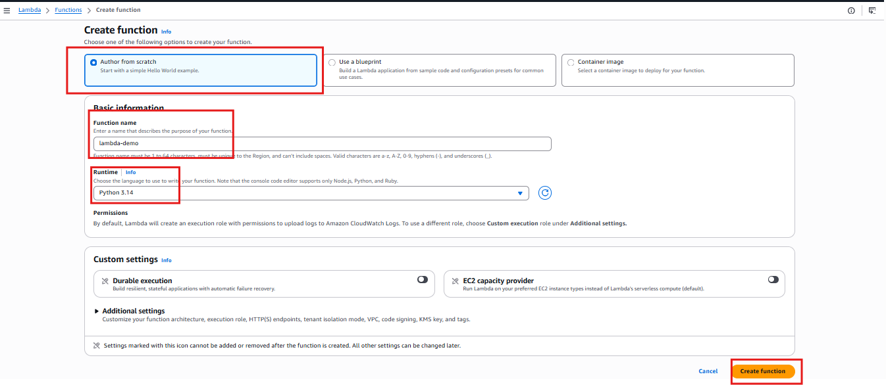
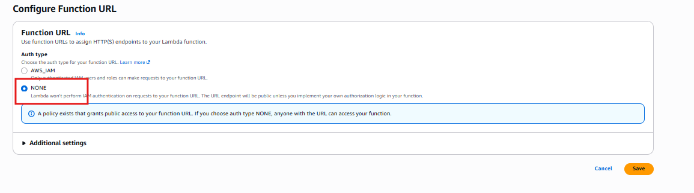
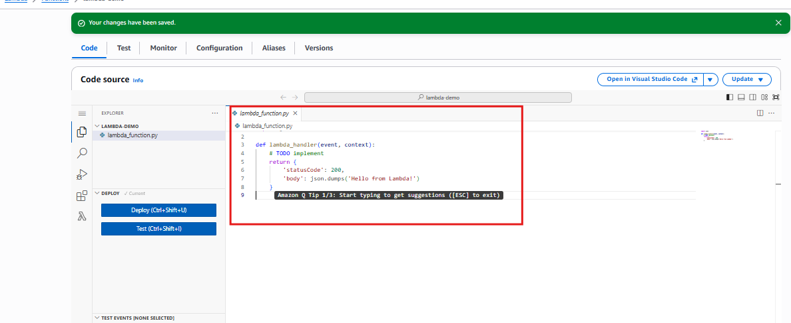
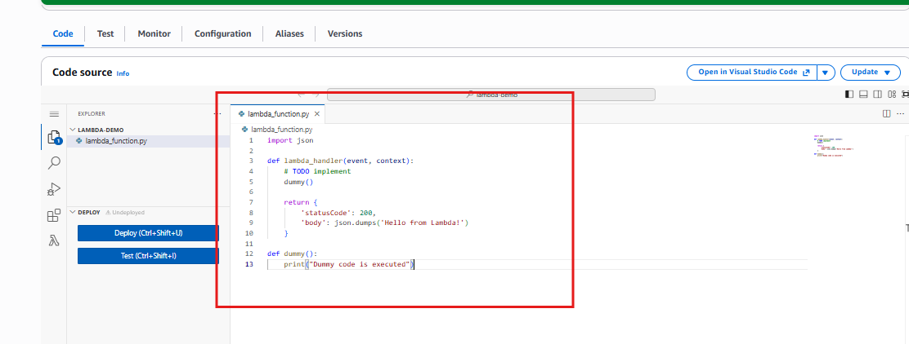
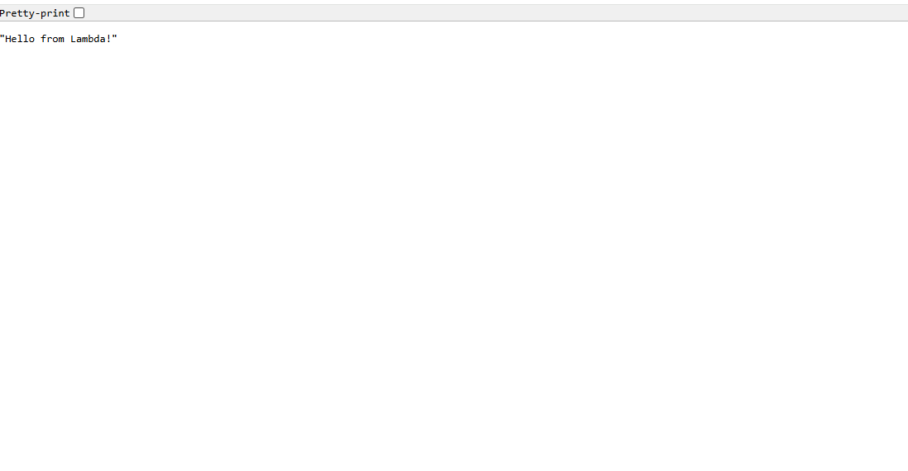

# AWS Lambda - Explained for Beginners

## Introduction

In this article, we will learn about **AWS Lambda**, one of the most important services in AWS.

AWS Lambda belongs to the **Compute** category, just like Amazon EC2.

At a high level, both EC2 and Lambda provide compute power to run application and code.

However, the way they provide that compute is very different.

In this article, we will understand:

- What is Lambda
- What problem does it solve?
- What is serverless architecture?
- Lambda vs EC2
- Important Lambda fundamentals
- Features of AWS Lambda
- When to use Lambda and when to use EC2
- How Lambda functions are triggered
- How to create a simple Python Lambda function
- What is `lambda_handler`?
- What are `event` and `context`?
- How a Lambda function URL works
- How to call another function from the main Lambda handler

---

## What is AWS Lambda?

> AWS Lambda is a serverless compute service provided by AWS.

It allows us to run code without managing the underlying servers.

With traditional server-based apps, we normally have to think about:
- Servers
- Operating Systems
- CPU and memory
- Patching
- Scaling
- Server availability
- Infrastructure management

With Lambda, AWS manages the underlying infrastructure for us.

We mainly need to provide:
1. Our code
2. Runtime
3. Required Configuration
4. The event that should trigger the function

AWS then takes care of the running that code.

---

## What Problem does Lambda Solve?

Let's first understand the problem.

Suppose we have a small piece of code that needs to run whenever something happens.

For example:

- A file is uploaded to Amazon S3
- An HTTP request is received
- A message arrives in a queue
- A scheduled time is reached
- A database event occurs

Do we really need to keep the server running 24/7 just to execute a small piece of code occasionally?

With EC2, we generally need to keep a server running 24/7 just to execute a small piece of code occasionally?

With Lambda, we can simply create a function and configure what should trigger it.

The function runs when required.

This is one of the major problems lambda solves:

> Run code without havng to manage servers.

---

## What is Serverless Architecture?

The word **serverless** doesn;t mean that there is no servers.

There are still servers running behind the scenes.

The difference is that **AWS manages those servers for us.**

We don't have to directly manage:
- Operating systems
- Server provisioning
- Hardware
- Server patching
- Capacity planning
- Infrastructure scaling

We focus mainly on our application code.

### Traditional Server-Based Architecture

```text
User 
  ↓ 
Application 
  ↓ 
EC2 Instance 
  ↓ 
Operating System 
  ↓ 
Server Infrastructure
```

Here, we are responsible for managing the EC2 instance and its Operating environment.

### Serverless Architecture

```text
User / Event
    ↓
AWS Lambda
    ↓
Our Code
```

AWS manages the infrastructure required to excute the code.

---

## Lambda vs EC2

Lambda and EC2 are both **AWS compute services**, but they solve different problems.

| Feature                   | Amazon EC2             | AWS Lambda                     |
| ------------------------- | ---------------------- | ------------------------------ |
| Compute                   | Yes                    | Yes                            |
| Server management         | You manage it          | AWS manages it                 |
| Operating system          | You manage it          | AWS manages it                 |
| Serverless                | No                     | Yes                            |
| Scaling                   | Configure/manage it    | AWS handles scaling            |
| Billing model             | Instance/runtime based | Invocation and execution based |
| Long-running applications | Good                   | Not designed for this          |
| Event-driven workloads    | Possible               | Excellent                      |
| Infrastructure control    | High                   | Lower                          |
| Maintenance               | Higher                 | Lower                          |


The main difference is:

> EC2 gives you servers. Lambda gives you serverless compute.

---

## When should we use EC2?

EC2 is a good choice when you need more control over the infrastrucutre.

For example:

- Long-running applications
- Applications that requiring Operating-system access.
- Custom server configurations
- Applications that needs persistent process.
- Workloads requiring more control over networking and infrastructure
- Applications that are not suitable for Lambda's execution model.

For example:

```text
Internet
   ↓
Load Balancer
   ↓
EC2 Instance
   ↓
Application
```

EC2 gives much more control over the underlying environment.

---

## When should we use Lambda?

Lambda is especially useful for **event-driven applications.**

examples include:

- Processing S3 uploads
- Running scheduled tasks
- Processing messages
- Creating APIs
- Backend functions
- Automation tasks
- Lightweight data processing
- Running regular routine activities.

For example:

```text
S3 Upload
   ↓
Lambda
   ↓
Process File
   ↓
```

Another example:
```text
API Request
    ↓
Lambda
    ↓
Return Response
```

---

## Important Lambda Fundamentals

Before creating our 1st function, lets understand a few important concepts.

### 1. Lambda Function

A Lambda function is the piece of code that AWS executes.

For example:

```Python
def lambda_handler(event, context): 
    return { 
        "statusCode": 200, 
        "body": "Hello from Lambda!" 
    }
```

This is our application logic.

---

### 2. Runtime

A runtime determines the programming environment in which our Lambda code runs.

AWS Lambda supports several runtimes.

Examples includes:
- Python
- Node.js
- Java
- .NET
- Ruby
- Custom runtimes

For our first example, we will use **Python**

---

### 3. Handler

The **handler** tells Lambda which function it should execute when the function is invoked.

The common Python format is:

```text
filename.function_name
```

For example:

```text
lambda_function.lambda_handler
```
This means:
- `lambda_function` → Python file
- `lambda_handler` → function inside that file

The handler is the entry point for our Lambda function.

---

## Understanding `lambda_handler`

The default Python Lambda function looks similar to this:

```Python
def lambda_handler(event, context): 
    return { 
        'statusCode': 200, 
        'body': json.dumps('Hello from Lambda!') 
    }
```

The important part is:

```Python
def lambda_handler(event, context):
```

Lambda invokes this function when the function is triggered.

---

## What is `event`?

The `event` parameter contains information about the event that triggered the Lambda function.

For example, if Lambda is triggered through an API request, the event can contain information about that request.

Conceptually:

```text
Event
  ↓
Lambda
  ↓
lambda_handler()
```

The Lambda function can read the event information and process it.

---

## What is `context`?

The `context` parameter contians information about the current lambda execution.

It can provide information related to the execution environment, such as:
- Function name
- Request ID
- Remaining execution time

For a simple application, we may not need to use it directly.

However, lambda still provides it to the handler.

---

## Lambda Triggers

One of the most important concepts in Lambda is the **trigger.**

A trigger determines **what causes the lambda function to execute.**

For example:

```text
S3 event
↓
Lambda
```
OR
```text
API Request
↓
Lambda
```

Lambda can be integrated withmany AWS services and event sources.

Examples include:
- Amazon S3
- Amazon API Gateway
- Amazon EventBridge
- Amazon SQL
- Amazon SNS
- Amazon DynamoDB
- Amazon CloudWatch Events/EventBridge Scheduler

The trigger is essentiallly the event that causes our function to run.

---

## Lambda Destinations

Lambda also supports **Destinations.**

Destinations allows us to send the result of an asynchronous Lambda invocation somewhere else.

For example:

```text
Lambda
  ↓
Success
  ↓
Destination
```

```text
Lambda
  ↓
Failure
  ↓
Destination
```

Destinations are useful when building event-driven workflows.

For beginners, the most important concept to remember first is:

> Trigger start lambda execution

---

## Lambda Function URL

AWS Lambda also provides a feature called a **Function URL.**

A function URL provides an HTTPS endpoint that can be used to invoke a Lambda function directly.

For example:
```text
user
↓
HTTPS Function URL
↓
Lambda Function
↓
Response
```

This is useful for simple HTTP-based demonstrations and applications.

Important clarification

A Function URL does **not** provide a public IP address for the Lambda function.

Instead, AWS provides an HTTPS URL that can be used to invoke the function.

For example, conceptually: https://xxxxxxxx.lambda-url.region.on.aws/

The actual URL is generated by AWS.

---

## Function URL Authentication

When creating a Function URL, AWS provides authentication options.

For a simple public demo we can choose:
`Auth type: NONE`

This means the URL can be accessed without AWS Authentication.

> IMPORTANT: USING `NONE` MAKES THE ENDPOINT PUBLICLY ACCESSIBLE.

Therefore, it should be used carefully and mainly for demos or applications where public access is intentionally required.

For a production apps, we should consider proper authentication and authorization.

---

## Important Features of AWS Lambda

Lambda provides several important capabilities.

### 1. Serverless

We don't manage the underlying servers. AWS manages the infrastructure required to run our functions.

---

### 2. Automatic Scaling

Lambda can automatically scale executions based on incoming requests and events.

For example:

```text
1 Request
   ↓
1 Lambda Execution
```

If many requests arrive:

```text
100 Requests
↓
Multiple lambda Executions
```

AWS manages the underlying scaling.

---

### 3. Event-Driven

Lambda is designed to work extremey well with event-driven architectures.

For example:

```text
File Uploaded
↓
S3 event
↓
Lambda
↓
Process File
```

---

## 4. Pay for Usage

With Lambda, we don't need to keep a traditional server running continuously just to wait for work.

The pricing model is based primarily on the number of requests and the compute duration used.

This can make Lambda cost-effective for workloads that run periodically or only when events occur.

---

### 5. Multiple Programming Languages

Lambda supports several programming languages and runtimes.

For example we are suing `python`.

---

### 6. Built-in AWS Integration

Lambda integrates with many AWS services.

For example:

```text
S3
↓
Lambda

OR

SQL
↓
Lambda

OR

EventBridge
↓
Lambda

OR

API Gateway
↓
Lambda
```

This makes Lambda an important block for serveless architectures.

---

## Cost Optimization

One of the benefits of Lambda is that we don't have to maintain a dedicated server for ever small task.

Imagine a task that runs only a few times every hour.

With traditional EC2 approach, the instance could remain running while waiting for the next task.

With Lambda:
```text
Event Occurs
↓
Lambda runs
↓
Work completed
```

We pay for the execution rather than maintaining a dedicated server for that task.

However, Lambda is not automatically cheaper for every workload.

For continously running, predicatable workloads, EC2 can sometimes be more appropriate.

Therefore

> Choose the compute model based on the workload, not cimply because one server is cheaper.

---

## Security and Compliance

Lambda can also help reduce some infrastructure-management responsibilities.

Since AWS manages the underlying servers, we don't have to manage the Operating system or perform traditional server patching.

Lambda also integrates with AWS security services such as:

- IAM
- VPC
- AWS KMS
- CloudWatch
- CloudTrail

IAM permissions are especially important because a Lambda function can be given permissions to access other AWS resources.

For example:

```text
Lambda
↓
IAM Role
↓
S3
```

The Lambda uses its IAM execution role to access the AWS resources it needs.

---

## Performing Regular Routine Activites

Lambda is also useful for automation.

For example, we could create a scheduled Lambda function that performs a task every day.

Conceptually:
```text
EventBridge Scheduler
        ↓
      Lambda
        ↓
    Run Task
```

Possible tasks could include:

- Checking resources
- Processing data
- Sending notifications
- Performing maintenance automation
- Generating reports

---

## Creating Our First Lambda Function

Now lets create a simple Lambda function.

Go to AWS Console → Search for Lambda → Click Create function.

### Step 1 - Choose How to create the function

AWs provides different options for creating a Lambda function.

Common options include:
- Author from scratch
- Use a blueprint
- Container image

For our 1st Lambda function, select `Author from Scratch`

This gives a clean function so that we can understand the fundamenta;s ourselves.

---

### Step 2 - Enter Function Name

Enter a function name. For this demo lets use: test-demo

---

### Step 3 - Select Runtime

Select `Python` runtime available in our AWS Console.




---

### Step 4 - Enable Function URL

Open `Advanced settings` → Enable `Enable function URL`

For this simple demo, choose `Auth type: NONE`




This creates a publcily accessible HTTPS endpoint for the function.

> Be careful when using this option because anyone who can access URL may be able to invoke the function.

Click on `Create Function`.

AWS will create the lambda function. You should now see the lambda function page.

---

## Understanding the Lambda Console

After creating the function, you will see several important sections.

Once of the most important concepts is `Triggers`

A trigger determines how the Lambda fucntion is invoked.

You may also see `destination`

Which can be used to route the results of asynchronous invocations.

For our beginner demo, focus mainly on the **trigger** concept.

---

## Lambda Python Code

Scroll down to the code section.

AWS provides a sample Python function to:

```Python
import json 
def lambda_handler(event, context): 
    return { 'statusCode': 200, 
    'body': json.dumps('Hello from Lambda!') 
}
```




---

## Understanding the Code

### Importing JSON

```Python
import json
```

The `json` module allows python to work with JSON data.

---

### Lambda Handler

```Python
def lambda_handler(event, context):
```

This is the main entry point of our Lambda function.

Lambda knows that this is the function needs to invoke because the handler configuration points to it.

---

### Returning a Response

```python
return { 
    'statusCode': 200, 
    'body': json.dumps('Hello from Lambda!') 
}
```

Here we return a response.

The status code `200` generally means the request was successful.

The body contains our message.

---

### Calling Another Function

We can also create our own Python function.

For example:

```python
def dummy():
    print("Dummy function executed")
```

However, simply defining the fucntion doesn't execute it.

We need to call it.

For example

```python
def lambda_handler(event, context): 
    dummy() 
    return { 
        "statusCode": 200, 
        "body": json.dumps("Hello this is a dummy page for practice") 
    }

def dummy():
    print("Dummy function executed")
```




The execution flow becomes:

```text
Lambda Trigger
↓
lambda_handler()
↓
dummy()
↓
Return Response
```

This is an important Python concept as well as a useful Lambda concept.

The Lambda Handler is the entry point and from there we can call other functions containing our app logic.

---

## Calling Lambda through the function URL

Because we enabled the function URL, AWS provides an HTTPS endpoint.

The flow becomes:

```text
Browser
↓
Lambda Function URL
↓
Lambda
↓
lambda_handler
↓
Response
```

We can open the function URL in a browser and invoke our Lambda function.




---

## Overall Lambda Architecture

```text
User
↓
Lambda Function URL
↓
AWS Lambda Function
↓
lambda_handler()
↓
dummy()
↓
Response
```

---

## Lambda Execution Flow

```text
Event / HTTP Request
↓
Lambda Trigger
↓
Lambda Function
↓
lambda_handler(event, context)
↓
Application logic
↓
Response
```

---

## Key Takeaways

After completing this introduction, we should understand that:

- AWS Lambda is a **serverless compute service**
- Lambda belongs to the AWS **Compute** family.
- EC2, and lambda both provide compute, but they operate differently.
- With EC2, we can manage the server.
- With Lambda, AWS manages the underlying infrastructure.
- Lambda is especially useful for **event-driven applications**
- A **trigger** causes the Lambda function to execute.
- The Python **handler** is the entry point of the lambda function.
- `event` contains information about the what triggered the function.
- `context` contains information about the current execution
- Lambda can automatically scaler based on demand.
- Lambda can be integrated with many AWS services.
- A **Function URL** provides an HTTPS endpoint for invoking a Lambda function.
- A Function URL is **not a public IP address**
- Lambda can be useful for automation and regular routine tasks.
- Lambda can ehlp reduce infrastructure-manaegment overhead.
