# AWS VPC Project for Resume | Build a Production-Style Multi-AZ Architecture on AWS

In the previous articles, we learned about:

- VPC
- subnets
- Internet Gateway
- Route Tables
- Security Groups
- Network ACLs
- DNS and Route 53

Until now, we have learned individual AWS networking components separately.

But in real world projects, these services work together to build secure and highly available applications.

# What We Will Build

In this project, we will create:

- A custom VPC
- Public and Private Subnets
- Two Availability Zones
- NAT Gateways
- Bastion Host
- Auto Scaling Group
- Application Load Balancer
- Target Group
- EC2 Instances running inside Private Subnets

By the end of this project, you will understand how traffic flows inside AWS and how different networking components work together.

---

# Why Are We Using Two Availability Zones?

In production environments, applications are usually deployed across multiple Availability Zones (AZs).

This improves **High Availability**.

For example, if one AZ experiences a failure, the application can continue serving users from the second AZ.

This helps reduce downtime and improves reliability.

Therefore, in this project, we will use:

- 2 Availability Zones (AZs)
- 2 Public Subnets
- 2 Private Subnets

---

# Architecture Overview

Each Availability Zone (AZ) will contain:

## Public Subnet

- NAT Gateway
- Application Load Balancer

## Private Subnet

- EC2 Instances launched using an Auto Scaling Group

The EC2 instances will remain private and will not have public IP addresses.

We will access them securely using a **Bastion Host**.

---

## What You Will Learn

We will also understand:

- How internet traffic reaches the application.
- How private servers access the internet using a NAT Gateway.
- How the Load Balancer distributes traffic.
- How Auto Scaling Groups help applications handle increased traffic.

---

## Before We Start

Before starting the implementation, let's first understand some of the concepts that we will use throughout this project.

Don't worry if these concepts seem new right now — we will see them in action during the implementation.

---

## What is NAT Gateway?

A **NAT (Network Address Translation) Gateway** allows resources inside a private subnet to access the internet without exposing them directly to the internet.

In our project, the application servers will be running inside private subnets and will not have public IP addresses.

However, there may be situations where these servers need internet access, such as:

- Downloading software packages
- Installing updates
- Accessing public APIs

This is where the **NAT Gateway** helps.

### Example

```text
Private EC2
     ↓
NAT Gateway
     ↓
  Internet
```

The private EC2 instance can access the internet, but internet users cannot directly access the EC2 instance.

This improves security while still allowing outbound internet connectivity.

---

## What is Auto Scaling Group?

An **Auto Scaling Group (ASG)** helps automatically manage EC2 instances based on application demand.

Imagine your application normally runs on **2 EC2 instances**.

Suddenly, a large number of users start accessing the application.

The existing servers may not be enough to handle the traffic.

In such situations, an **Auto Scaling Group** can automatically launch additional EC2 instances.

Similarly, when traffic decreases, it can terminate unnecessary instances.

### Example

```text
Normal Traffic
      ↓
2 EC2 Instances
      ↓
 High Traffic
      ↓
4 EC2 Instances
      ↓
 Low Traffic
      ↓
2 EC2 Instances
```

### Benefits of Auto Scaling Groups

Auto Scaling Groups help to:

- Improve availability
- Handle traffic spikes
- Optimize infrastructure costs

---

## What is Load Balancer?

A **Load Balancer** distributes incoming traffic across multiple servers.

Instead of sending all requests to a single server, it spreads the traffic across multiple EC2 instances.

### Example

```text
Users
   ↓
Load Balancer
   ↓
├── EC2 Instance 1
├── EC2 Instance 2
└── EC2 Instance 3
```

### Benefits of Load Balancer

A Load Balancer helps to:

- Improve performance
- Prevent server overload
- Increase application availability

In this project, users will access the application through the **Load Balancer**.

---

## What is Target Group?

A **Target Group** is a collection of servers that receive traffic from a Load Balancer.

Think of a Target Group as a list of backend servers.

When the Load Balancer receives a request, it forwards that request to one of the healthy servers registered inside the Target Group.

### Example

```text
Load Balancer
      ↓
Target Group
      ↓
├── EC2 Instance 1
├── EC2 Instance 2
└── EC2 Instance 3
```

### How Target Groups Work

The Load Balancer does not directly send traffic to EC2 instances.

Instead, it sends traffic through the **Target Group**, which then routes requests to healthy EC2 instances.

This helps:

- Route traffic efficiently
- Perform health checks on backend servers
- Improve application availability
- Ensure requests are sent only to healthy instances

---

## What is a Bastion Host?

A **Bastion Host**, also called a **Jump Server**, is an EC2 instance placed inside a public subnet that is used to securely access resources inside private subnets.

In our project, the application servers will be running in private subnets and will not have public IP addresses.

This means we cannot directly SSH into them.

To solve this problem, we create a **Bastion Host**.

### Example

```text
Developer Laptop
       ↓
   Bastion Host
       ↓
   Private EC2
```

Instead of exposing private servers to the internet, we first connect to the Bastion Host and then access the private servers.

## Benefits of Using a Bastion Host

This approach provides:

- Better security
- Centralized access control
- Better auditing and monitoring

Now that we understand the components used in this project, let's start building the architecture step by step.

---

# Hands-On Implementation of the Project

Before starting, we will build the following architecture:

```text
                    Internet
                        │
                       ▼
                Application Load Balancer
                        │
        ┌───────────────┴───────────────┐
        │                               │
 Availability Zone A             Availability Zone B
        │                               │
 Public Subnet A                 Public Subnet B
 ├── NAT Gateway A               ├── NAT Gateway B
 └── Bastion Host

        │                               │

 Private Subnet A               Private Subnet B
 └── EC2 Instance (ASG)         └── EC2 Instance (ASG)
```

## Architecture Diagram


The above architecture diagram may look confusing at first, but don't worry.

Once we follow the implementation steps below and revisit the diagram, the overall flow and the relationship between the AWS components will become much easier to understand.

## Step 1: Create the VPC

Go to **AWS Console → VPC**.

Click on **Create VPC**.


Select **VPC and more**.

## Why?

Because AWS automatically creates:

- VPC
- Public Subnets
- Private Subnets
- Route Tables
- Internet Gateway

This saves time and simplifies the setup process.

---

Now, give your VPC a name, for example:

```text
aws-prod-proj
```

For the **IPv4 CIDR Block**, use:

```text
10.0.0.0/16
```

This provides approximately **65,536 IP addresses**, which is more than enough for our project.

For **IPv6 CIDR Block**, choose:

```text
No IPv6 CIDR block
```

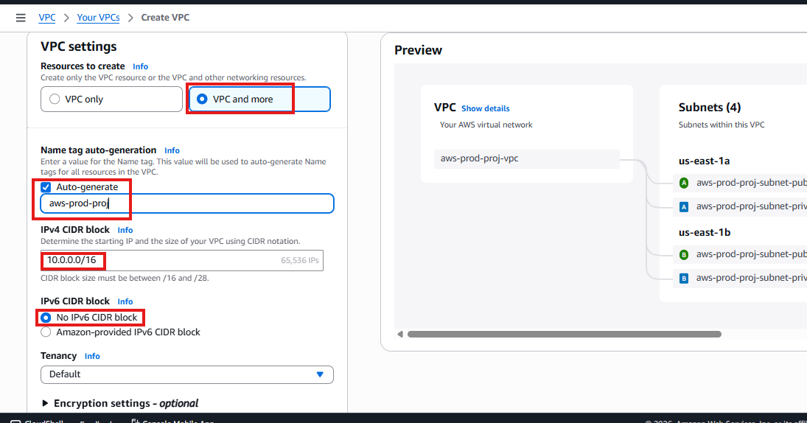

### Why?

To keep the project simple.

---

Configure the following:

- **Number of Availability Zones (AZs):** 2
- **Public Subnets:** 2
- **Private Subnets:** 2

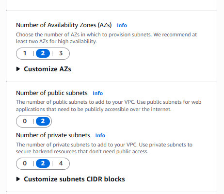

So the architecture becomes:

```text
AZ-1
├── Public Subnet
└── Private Subnet

AZ-2
├── Public Subnet
└── Private Subnet
```

---

## Configure NAT Gateway

For **NAT Gateway**, choose:

```text
Zonal → 1 per AZ
```

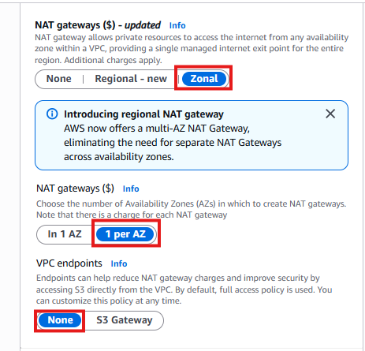

### Why?

Private EC2 instances need internet access for:

- Installing updates
- Downloading software packages
- Accessing public APIs

However, we do not want to assign public IP addresses to those instances.

The **NAT Gateway** solves this problem by providing outbound internet access while keeping the instances private.

---

## Configure VPC Endpoints

For **VPC Endpoints**, choose:

```text
None
```

### Why?

We are not using VPC Endpoints in this project.

---

Finally, click **Create VPC**.

Wait for AWS to finish creating all the required resources.

## Step 2: Verify the Resource Map

After the VPC creation is complete, navigate to:

```text
VPC → Your VPC → Select Your VPC → Resource Map
```

You should see the following resources:

- ✅ VPC
- ✅ Internet Gateway
- ✅ Public Subnet A
- ✅ Public Subnet B
- ✅ Private Subnet A
- ✅ Private Subnet B
- ✅ NAT Gateway A
- ✅ NAT Gateway B
- ✅ Route Tables

---

## Understanding What AWS Created

### Public Subnets

Public Subnets are:

- Accessible from the internet
- Used for internet-facing resources

Examples include:

- Load Balancers
- Bastion Hosts
- NAT Gateways

### Private Subnets

Private Subnets are:

- Hidden from the internet
- Used for application servers

Examples include:

- EC2 Instances
- Backend Services
- Databases

## Step 3: Create Launch Template

Before creating the Auto Scaling Group, we first need a **Launch Template**.

### Why Do We Need a Launch Template?

Think of a Launch Template as a blueprint for EC2 instances.

It tells AWS:

- Which operating system (AMI) to use
- Which instance type to launch
- Which key pair to use
- Which Security Group to attach
- Which VPC to use

Later, whenever the Auto Scaling Group needs to create new servers, it simply uses this template.

---

## Navigate to Launch Templates

Go to:

```text
AWS Console → EC2 → Launch Templates
```

Click on **Create Launch Template**.

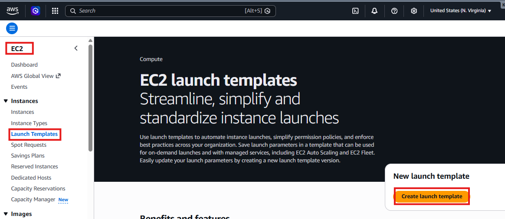

## Configure the Launch Template

Give your Launch Template a name:

```text
aws-prod-proj
```

In the description field, enter:

```text
Launch template for application servers running in private subnets
```

### Choose an AMI

For the AMI (Operating System), choose:

- The **Recently Launched** option, or
- Any AMI you are comfortable with

---

### Choose the Instance Type

Select:

```text
t3.micro (Free Tier)
```

---

### Select the Key Pair

Choose your key pair, for example:

```text
test_app.pem
```

### Configure Network Settings

Under **Firewall (Security Groups)**, select:

```text
Create Security Group
```

### Security Group Name

```text
aws-prod-proj
```

### Description

```text
Security Group for private application servers
```

# Configure Inbound Rules

### Rule 1

| Type | Port | Source |
|--------|------|---------|
| SSH | 22 | My IP |

### Why?

Initially, we will keep SSH access simple while building the project.

Later, we will tighten security so that only the **Bastion Host** can access these servers.

### Rule 2

| Type | Port | Source |
|--------|------|---------|
| Custom TCP | 8000 | Anywhere IPv4 |

### Why?

Our Python application will run on **Port 8000**.

Later, once the Load Balancer is configured, we will improve this rule further.

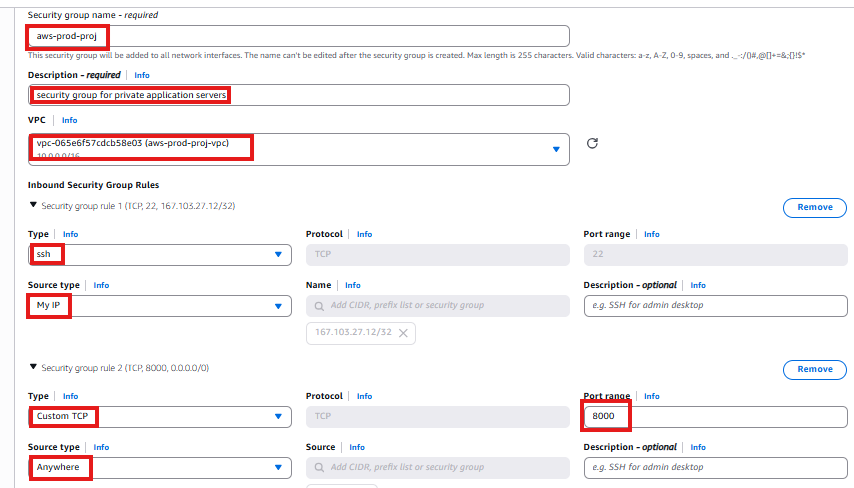

For now, leave everything else as default.

Click on **Create Launch Template**.

---

### What Have We Created?

We haven't created EC2 instances yet.

We have only created a blueprint.

```text
Launch Template
        ↓
Auto Scaling Group
        ↓
EC2 Instances
```

---

## Step 4: Creating Auto Scaling Group

Until now, we have only created the blueprint (**Launch Template**).

Now we need AWS to actually launch EC2 instances from that blueprint.

### Why Do We Need Auto Scaling Groups?

Auto Scaling Groups (ASGs) help:

- Automatically create EC2 instances
- Replace unhealthy instances
- Scale up during high traffic
- Scale down during low traffic

---

## Navigate to Auto Scaling Groups

Go to:

```text
AWS Console → EC2 → Auto Scaling Groups
```

Click on **Create Auto Scaling Group**.

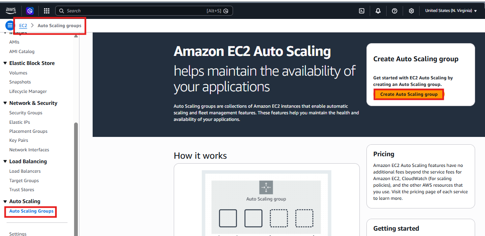

## Configure the Auto Scaling Group

Give your Auto Scaling Group a name, for example:

```text
aws-prod-proj
```

Select the Launch Template we created earlier:

```text
aws-prod-proj
```

Click **Next**.

---

## Choose the Network

Select the VPC we created earlier:

```text
aws-prod-proj
```

Under **Availability Zones and Subnets**, choose the two private subnets created during VPC creation:

- Private Subnet 1a
- Private Subnet 1b

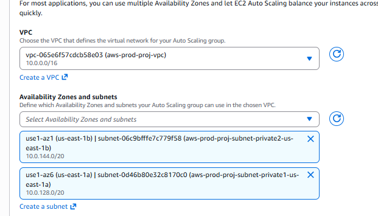

### Why Are We Using Private Subnets?

Application servers should not be directly exposed to the internet.

This improves security.

The architecture becomes:

```text
Public Subnets
      ↓
Load Balancer
      ↓
Private EC2 Instances
```

Click **Next**.

Leave the remaining settings as default and click **Next** again.

---

## Configure Group Size

Set the following values:

### Desired Capacity

```text
2
```

Meaning AWS should maintain **2 EC2 instances**.

### Minimum Capacity

```text
1
```

At least one instance should always remain running.

### Maximum Capacity

```text
4
```

In the future, AWS can scale up to four servers if required.

### Scaling Policies

Choose:

```text
None
```

Skip the remaining sections and keep the default settings.

Click **Next** → **Create Auto Scaling Group**.

---

## Step 5: Verify EC2 Instances

Now navigate to:

```text
EC2 → Instances
```

Wait for a few minutes.

You should see:

```text
Instance 1 → Running
Instance 2 → Running
```
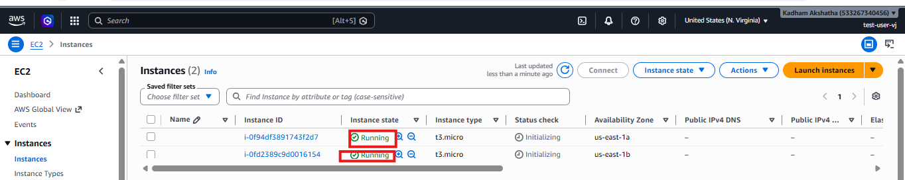

Click on any instance ID and inspect its details.

If you look carefully, you will notice:

```text
Public IPv4 Address = None
```

This is expected.

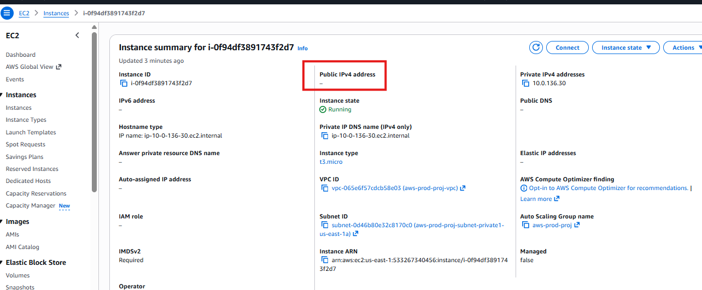

### Why?

Because:

- The instances are inside private subnets.
- Private subnets should not have public IP addresses.

---

# Current Architecture

At this stage, the architecture looks like this:

```text
                VPC
                  │
      ┌───────────┴───────────┐
      │                       │
Availability Zone A   Availability Zone B
      │                       │
Private Subnet A      Private Subnet B
      │                       │
EC2 Instance 1        EC2 Instance 2
```

---

# Step 6: Create Bastion Host

## Why Do We Need a Bastion Host?

Imagine your company has hundreds of servers running inside private subnets.

Giving public IP addresses to all servers would be dangerous.

Instead, we create one secure entry point called a **Bastion Host**.

The architecture becomes:

```text
Developer Laptop
        ↓
Bastion Host (Public Subnet)
        ↓
Private EC2 Instances
```

---

## Create Bastion Host

Go to:

```text
AWS Console → EC2 → Launch Instance
```

Give your instance a name:

```text
bastion-host
```

### AMI

Choose:

```text
Ubuntu Server
```

### Instance Type

Choose:

```text
t3.micro (Free Tier)
```

### Key Pair

Select the same key pair used earlier:

```text
test_app.pem
```

---

# Configure Network Settings

Click **Edit**.

Select the VPC:

```text
aws-prod-proj
```

### IMPORTANT: Choose a Public Subnet

Select either:

- Public Subnet A, or
- Public Subnet B

### Why?

Because the Bastion Host must be reachable from your laptop.

---

## Auto Assign Public IP

Choose:

```text
Enable
```

### Why?

Without a public IP address, you won't be able to SSH into the Bastion Host.

---

# Configure Security Group

Choose:

```text
Create Security Group
```

Security Group Name:

```text
bastion-sg
```

---

# Configure Inbound Rules

Instead of:

```text
❌ Anywhere (0.0.0.0/0)
```

Choose:

```text
✅ My IP
```

| Type | Port | Source |
|--------|------|---------|
| SSH | 22 | My IP |

### Why?

This is much safer.

Only your laptop can access the Bastion Host.

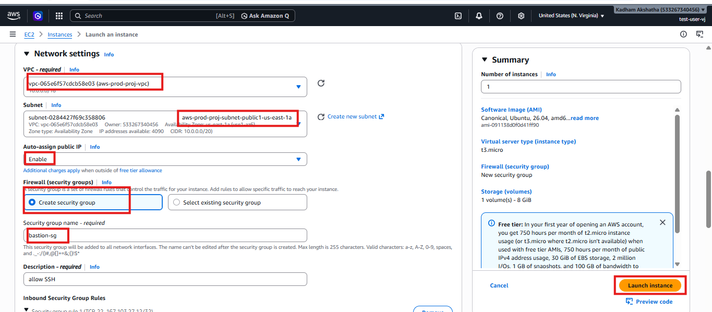


---

## Step 7: Verify Bastion Host

After the instance starts, navigate to:

```text
EC2 → Instances
```

Verify that:

- The instance state is **Running**
- A **Public IPv4 Address** is present

Current architecture:

```text
                Internet
                     │
                     ▼
               Bastion Host
                     │
      ┌──────────────┴──────────────┐
      │                             │
 Private EC2-1                Private EC2-2
```

---

# Bastion Host Status

- ✅ Running
- ✅ Has Public IP
- ✅ Security Group allows SSH from My IP

---

## Step 8: Improve Security Group Configuration (Production Best Practice)

Right now, when we created the Launch Template earlier, we allowed:

```text
SSH (22) → My IP
```

for the private EC2 instances.

Although this works, it is not ideal because application servers should only accept SSH connections from the Bastion Host.

# Current Situation

```text
Laptop
   ↓
Private EC2
```

# Better Architecture

```text
Laptop
   ↓
Bastion Host
   ↓
Private EC2
```

## Step 8.1: Find the Security Group Attached to Private EC2

Go to:

```text
EC2 → Instances
```

Open one of your private instances.

Go to the **Security** tab.

Click on the attached **Security Group**.

## Step 8.2: Remove SSH Access from "My IP"

Inside the Security Group:

Click **Edit Inbound Rules**.

It should currently have:

| Type | Port | Source |
|--------|------|---------|
| SSH | 22 | My IP |
| Custom TCP | 8000 | Anywhere |

Delete the **SSH** rule.

Keep **Port 8000** for now.

Click **Save Rules**.

---

## Step 8.3: Allow SSH Only from Bastion Host

Click **Add Rule**.

Configure:

- **Type:** SSH
- **Port:** 22
- **Source:** Custom

In the search bar next to **Source**, select:

```text
bastion-sg
```

This is the Security Group attached to the Bastion Host.

Click **Save Rules**.

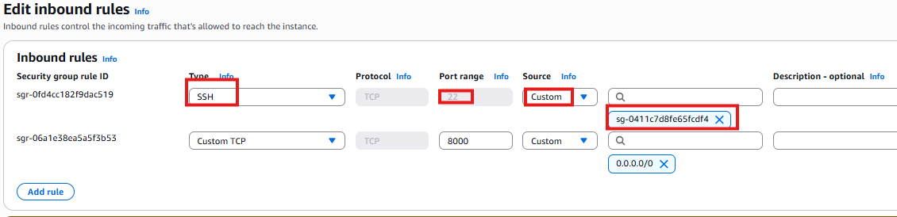

---

## What We Achieved

Instead of:

```text
My Laptop
      ↓
Private EC2
```

we now have:

```text
My Laptop
      ↓
Bastion Host
      ↓
Private EC2
```

Only the **Bastion Host** can SSH into the private servers.

---

## Step 9: Connect to Bastion Host

Copy the **Bastion Host Public IP Address**.

On your local machine, run:

```bash
ssh -i test_app.pem ubuntu@<BASTION_PUBLIC_IP>
```

### Connection Issue Encountered

When running the above command, I received the following error:

```text
ssh: connect to host <PUBLIC_IP> port 22: Connection timed out
```

To verify whether the issue was related to the Security Group, I temporarily modified the inbound rule:

From:

```text
Source: My IP
```

To:

```text
Anywhere IPv4 (0.0.0.0/0)
```

After saving the rule, I was able to successfully SSH into the Bastion Host.

> **Note:** Allowing SSH from Anywhere IPv4 was done only for troubleshooting purposes. In production environments, it is recommended to restrict SSH access to trusted IP addresses.

---

## Step 10: Enable SSH Agent Forwarding (Best Practice)

Instead of copying the `.pem` file into the Bastion Host, we'll use **SSH Agent Forwarding**.

---

## 1. Start SSH Agent

On your local machine, run:

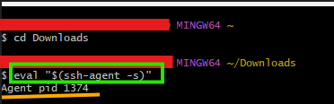

```bash
eval "$(ssh-agent -s)"
```

### What Does This Do?

It starts a background process called **SSH Agent**.

Think of SSH Agent as a temporary secure locker that can hold your SSH keys.

After running:

```bash
eval "$(ssh-agent -s)"
```

You should see output similar to:

```text
Agent pid 12345
```

---

## 2. Add the Private Key

Run:

```bash
ssh-add test_app.pem
```

### What Does This Do?

This command loads your `.pem` file into the SSH Agent.

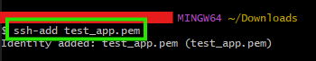

Now the SSH Agent can use this key whenever authentication is required.

---

## 3. Verify Loaded Keys

Run:

```bash
ssh-add -l
```

### What Does This Do?

This command displays the keys currently loaded inside the SSH Agent.

Example output:

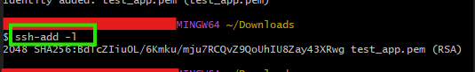

---

## Step 11: Connect to Bastion Using Agent Forwarding

From your laptop, run:

```bash
ssh -A -i test_app.pem ubuntu@<BASTION_PUBLIC_IP>
```

Notice the important option:

```text
-A
```

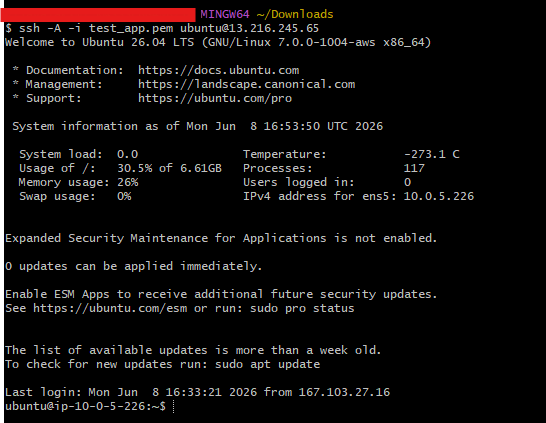

### Why Are We Using `-A`?

The `-A` option enables **SSH Agent Forwarding**.

This securely forwards your local SSH key to the Bastion Host without copying the `.pem` file to the server.

This is considered a best practice because:

- The private key never leaves your laptop.
- No sensitive files are stored on the Bastion Host.
- Access to private EC2 instances becomes more secure.

---

## Step 12: Find the Private IP of One Application Server

Go to:

```text
EC2 → Instances
```

Choose one of the private EC2 instances.

Copy its:

```text
Private IPv4 Address
```

Example:

```text
10.0.131.24
```

---

## Step 13: SSH From Bastion Host to Private EC2

From inside the Bastion Host, run:

```bash
ssh ubuntu@10.0.x.x
```

Replace `10.0.x.x` with the private IP address of your EC2 instance.

The connection should now be successful, and you will be inside the private server.

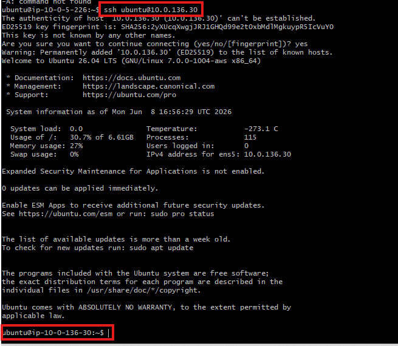

### Current Architecture

```text
Laptop
   ↓
SSH Agent Forwarding
   ↓
Bastion Host
   ↓
Private EC2
```

---

## Step 14: Prepare the Private EC2 Instance

At this point, you should be logged into the private EC2 instance.

Verify this by running:

```bash
hostname
```

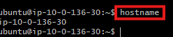

---

## Update Package Information

Run:

```bash
sudo apt update
```

### Why?

This updates the package repository information.

It also verifies that the following path is working correctly:

```text
Private EC2
      ↓
NAT Gateway
      ↓
Internet
```

If the update completes successfully, your **NAT Gateway** is functioning correctly.

---

## Step 15: Verify Python Installation

Check the installed Python version:

```bash
python3 --version
```

Expected output:

```text
Python 3.x.x
```

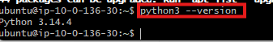

If Python is not installed, run:

```bash
sudo apt install python3 -y
```

---

## Step 16: Create a Simple HTML Page

Create a new file:

```bash
vim index.html
```

Press:

```text
i
```

to enter **Insert Mode**.

Paste the following HTML:

```html
<!DOCTYPE html>
<html>
<head>
    <title>AWS Production Project</title>
</head>
<body>
    <h1>AWS VPC Production Project</h1>
    <p>Application running successfully inside Private Subnet.</p>
</body>
</html>
```

Save the file:

```text
ESC
:wq!
```

---

# Step 17: Start Python Web Server

Run:

```bash
python3 -m http.server 8000
```

Expected output:

```text
Serving HTTP on 0.0.0.0 port 8000 (http://0.0.0.0:8000/) ...
```

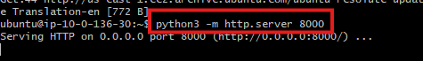

Leave this terminal running.

The web server is now serving the application on **Port 8000**.

---

## Step 18: Verify Security Group for Application

Before creating the Load Balancer, verify the Security Group attached to your application servers.

Go to:

```text
EC2 → Security Groups
```

Open the private EC2 Security Group created earlier.

Example:

```text
aws-prod-proj
```

Verify that the following inbound rules exist:

| Type | Port | Source |
|--------|------|---------|
| SSH | 22 | bastion-sg |
| Custom TCP | 8000 | Anywhere IPv4 |

If Port **8000** is missing, add it click **Save Rules**.

---

## Why Are We Allowing Port 8000?

Because later the traffic flow will be:

```text
Load Balancer
      ↓
Port 8000
      ↓
Application Server
```

The Load Balancer must be able to reach the application.

We'll improve this later by allowing access only from the **Load Balancer Security Group**.

---

## Step 19: Verify the Application Is Running

On the private EC2 instance, open another SSH session if needed and run:

```bash
curl localhost:8000
```

Expected output:

```html
<!DOCTYPE html>
<html>
...
```

If you see the HTML page, your application is running successfully.

---

## Step 20: Create a Target Group

## What is a Target Group?

Before creating a Load Balancer, AWS needs to know:

> "Which servers should receive the traffic?"

A Target Group is simply a collection of backend servers.

Example:

```text
Load Balancer
      ↓
Target Group
      ↓
├── EC2 Instance 1
└── EC2 Instance 2
```

---

## Navigate to Target Groups

Go to:

```text
EC2 → Target Groups
```

Click:

```text
Create Target Group
```

---

## Basic Configuration

### Target Type

Choose:

```text
Instances
```

### Why?

Because we want traffic to be routed directly to EC2 instances.

### Target Group Name

Example:

```text
aws-prod-proj
```

### Protocol

Choose:

```text
HTTP
```

### Port

Enter:

```text
8000
```

### Why?

Our Python application is listening on:

```bash
python3 -m http.server 8000
```

### VPC

Select:

```text
aws-prod-proj
```

---

## Health Check Protocol

Keep:

```text
HTTP
```

---

## Health Check Path

Keep:

```text
/
```

This means AWS will periodically check:

```text
http://instance-ip:8000/
```

to verify that the application is healthy.

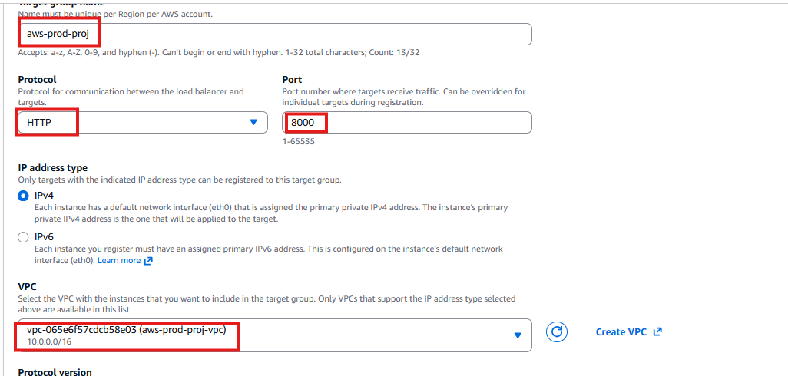

Click **Next**.

---

# Register Targets

You should see your Auto Scaling instances.

Select:

- Instance 1
- Instance 2

Click:

```text
Include as Pending Below
```

Then click:

```text
Create Target Group
```

---

## Step 21: Create Application Load Balancer

Now let's create the public entry point for users.

---

# Navigate to Load Balancers

Go to:

```text
EC2 → Load Balancers
```

Click:

```text
Create Load Balancer
```

Choose:

```text
Application Load Balancer
```

Then click:

```text
Create
```

---

## Configure the Load Balancer

### Name

Example:

```text
aws-prod-proj
```

### Scheme

Select:

```text
Internet-facing
```

### Why?

Users will access the application from the internet.

### IP Address Type

Choose:

```text
IPv4
```

### Network Mapping

Select the VPC created earlier:

```text
aws-prod-proj
```

### Availability Zones

Choose:

- Public Subnet A
- Public Subnet B

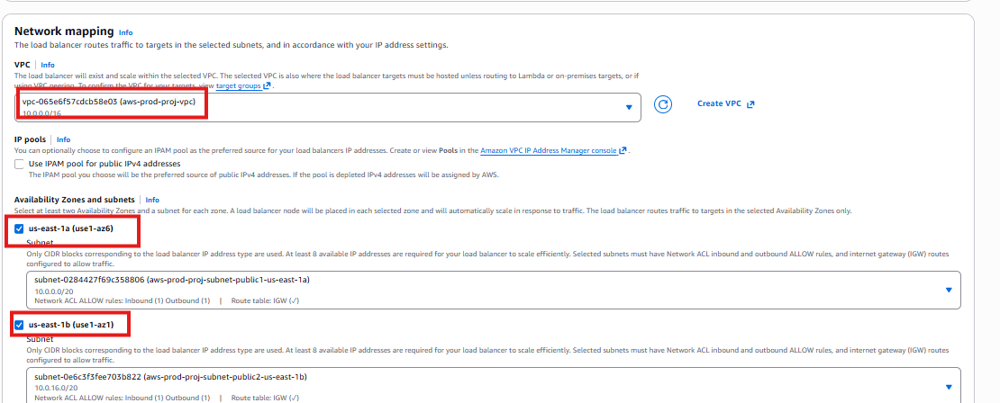

### Why?

Load Balancers must be deployed inside public subnets.

---

### Security Group

For now, choose:

```text
default
```

This is the cleaner option.

---

# Listener and Routing

### Listener

```text
HTTP
```

### Port

```text
80
```

### Default Action

Select:

```text
Forward to Target Groups
```

Choose the Target Group created earlier:

```text
aws-prod-proj
```

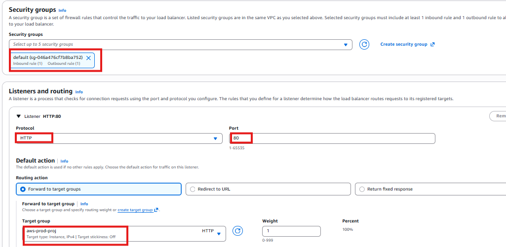

Click:

```text
Create Load Balancer
```

Wait a few minutes for AWS to provision the Load Balancer.

---

## Step 22: Check Target Health

Go to:

```text
EC2 → Target Groups
```

Open:

```text
aws-prod-proj
```

Click:

```text
Targets
```

Verify that your targets are healthy.

---

## Step 23: Access the Application

Go to:

```text
EC2 → Load Balancers
```

Open your Application Load Balancer.

Copy the:

```text
DNS Name
```

Example:

```text
aws-prod-proj-123456.ap-south-1.elb.amazonaws.com
```

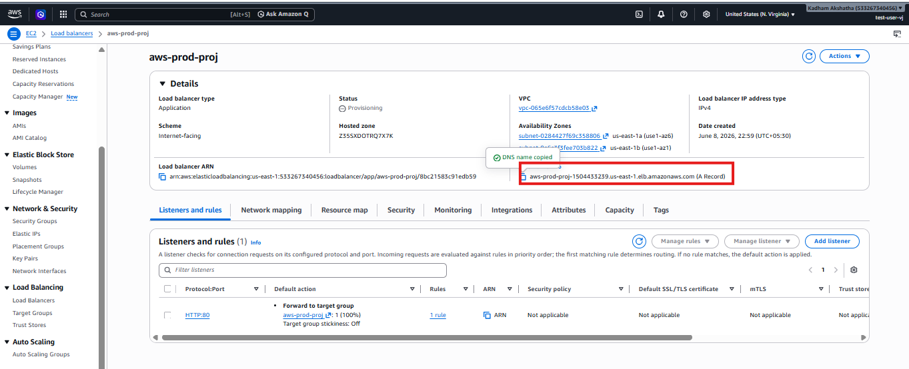


Open the url in your browser.

---

# Troubleshooting

When I initially tried to access the application, the page was not loading.

To troubleshoot the issue, I verified the following.

### 1. Private EC2 Security Group

Go to:

```text
EC2 → Instances → Private Instance → Security
```

Open the attached Security Group.

Verify the rules:

| Type | Port | Source |
|--------|------|---------|
| SSH | 22 | bastion-sg |
| Custom TCP | 8000 | Anywhere IPv4 |

---

### 2. Load Balancer Security Group

Go to:

```text
EC2 → Load Balancers → Select the Load Balancer
```

Under **Security**, open the attached Security Group.

My rules were incorrect, so I updated them to:

| Type | Port | Source |
|--------|------|---------|
| HTTP | 80 | 0.0.0.0/0 |

After saving the changes, the application loaded successfully.

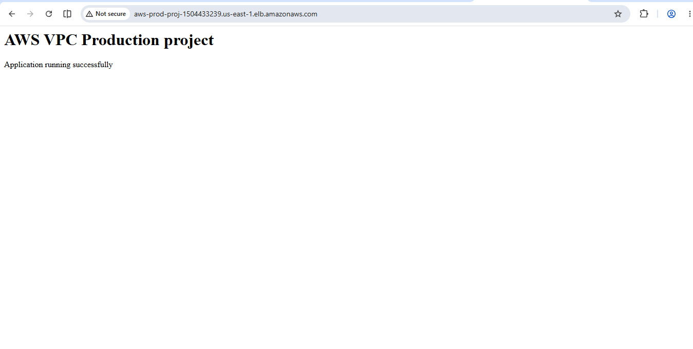

---

# Conclusion

In this project, we built a production-style AWS VPC architecture from scratch and understood how different AWS networking components work together.

We implemented:

- Custom VPC
- Public and Private Subnets across two Availability Zones
- Internet Gateway and Route Tables
- NAT Gateways for secure outbound internet access
- Auto Scaling Group with EC2 instances in private subnets
- Bastion Host for secure administration
- Application Load Balancer and Target Group
- A sample Python web application running inside private EC2 instances

One of the most important learnings from this project was understanding how traffic flows inside a production environment:

```text
Internet
    ↓
Application Load Balancer
    ↓
Private EC2 Instances
```

and how administrators securely access private servers using:

```text
Developer Laptop
    ↓
Bastion Host
    ↓
Private EC2 Instances
```

This project helped me understand how real-world applications are deployed securely and with high availability across multiple Availability Zones.

Let's meet in the next article with a new AWS service 🚀👋