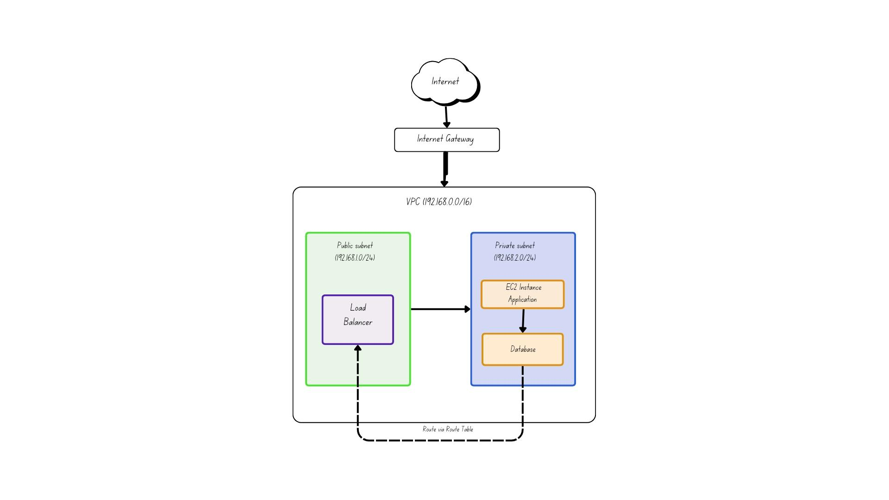

# AWS VPC (Virtual Private Cloud)

## Introduction

If you are starting your AWS and Cloud journey, one of the most important concepts you will come across is **VPC (Virtual Private Cloud)**.

When I first heard the term VPC, I was confused because AWS networking looked very complicated.

Terms like:

- Subnets
- CIDR Blocks
- Public Networks
- Private Networks

all sounded overwhelming.

But once I understood **why VPC actually exists**, things started making much more sense.

In this article, let us try to understand VPC in the simplest way possible.

---

# Why Does VPC Exist?

Before understanding VPC, let us first understand the problem AWS was trying to solve.

In traditional environments, companies used to host their applications in their own physical data centers.

This required:

- Buying Servers
- Managing Networking
- Handling Security
- Maintaining Infrastructure
- Monitoring Hardware Failures

This became difficult and expensive, especially when the application started growing.

Then cloud providers like AWS came into the picture and started providing infrastructure over the internet.

AWS built massive data centers across different regions around the world.

Inside these data centers, AWS provides virtual servers (**EC2 Instances**) to multiple companies to host their applications.

Now imagine:

- Company A
- Company B
- Company C

all running applications on AWS infrastructure.

If everything existed in the same shared network, there would be:

- Security Risks
- No Isolation
- No Proper Control Over Traffic

Companies need:

- Their own private network
- Controlled communication
- Better security
- Isolation from other companies

To solve this problem, AWS introduced **VPC (Virtual Private Cloud)**.

---

# What is VPC in AWS?

**VPC** stands for **Virtual Private Cloud**.

A VPC is your own isolated private network inside AWS where you can launch and manage your AWS resources securely.

## Simple Analogy

Think of it like this:

```text
AWS Cloud = A large apartment city

Your VPC = Your private apartment complex
````

Inside your apartment complex:

* You decide who can enter
* You decide how rooms are divided
* You control security
* You manage networking rules

Similarly in AWS:

* VPC gives you control over networking
* Isolates your application
* Helps secure your infrastructure

Every company can create its own private network inside AWS without interfering with others.

---

# Understanding Isolation in VPC

Let us imagine there are 3 companies using AWS infrastructure.

Without proper isolation:

```text
Company A ➡️ Same Network ⬅️ Company B ⬅️ Company C
```

If one application gets compromised, there is a risk that others may also get affected.

To solve this problem, AWS creates isolated private networks called **VPCs**.

Now each company gets its own secure environment.


This isolation is one of the biggest reasons why VPC is important in AWS.

---

# What is CIDR in VPC?

Whenever we create a VPC, we must define an IP address range for it.

This IP range is called a **CIDR Block**.

## Example

```text
192.168.0.0/16
```

This defines the range of IP addresses available inside the VPC.

Think of CIDR as defining the total land area available for your network.

Inside that range, we can create smaller sections called **Subnets**.

---

# What are Subnets?

A subnet is a smaller network created inside a VPC.

Instead of putting all applications in one area, we divide the VPC into smaller sections for better organization and security.

## Example

```text
VPC
│
├── Subnet A
├── Subnet B
└── Subnet C
```

Each subnet gets a portion of the VPC IP address range.

This helps:

* Organize applications
* Separate workloads
* Improve security
* Control traffic flow


---

# Public vs Private Subnets

Subnets are mainly divided into 2 types:

* Public Subnet
* Private Subnet

Let us understand both.

---

# Public Subnet

A public subnet is a subnet that can communicate with the internet.

Resources inside public subnet usually include:

* Load Balancers
* Bastion Hosts
* Public-facing applications

## Example

```text
Internet
   ⬇️
Internet Gateway
   ⬇️
Public Subnet
```

Public subnets are connected to the internet through something called an **Internet Gateway**.

---

# Private Subnet

A private subnet does **NOT** allow direct internet access.

Resources inside private subnet usually include:

* Databases
* Internal Applications
* Backend Services

## Example

```text
Private Subnet
      ⬇️
Database / Application
```

Private subnets are more secure because they are not directly exposed to the internet.

This is one of the most important security practices in cloud environments.



Here route table controls how the traffic moves between subnets and gateways.

---

# Simple Real World Architecture

Here is a basic flow of how applications are commonly structured inside a VPC:

```text
Internet
   ⬇️
Internet Gateway
   ⬇️
Load Balancer
   ⬇️
Private Subnet
   ⬇️
Application Server / Database
```

This architecture helps:

* Keep applications secure
* Control traffic properly
* Isolate backend systems from direct internet access

---

# Key Benefits of VPC

Some major benefits of VPC are:

* Isolation between companies and applications
* Better security
* Full control over networking
* Ability to create public/private networks
* Improved scalability
* Better traffic management

---

# Conclusion

VPC is the foundation of AWS networking.

It allows organizations to create their own isolated and secure network inside AWS where they can safely run applications and services.

In this article, we understood:

* Why VPC exists
* Isolation in AWS
* CIDR Blocks
* Subnets
* Public vs Private Subnet concepts

In the upcoming articles, we will dive deeper into:

* Route Tables
* Internet Gateway
* Security Groups
* NAT Gateway
* NACLs
and understand how networking works inside AWS in more detail.