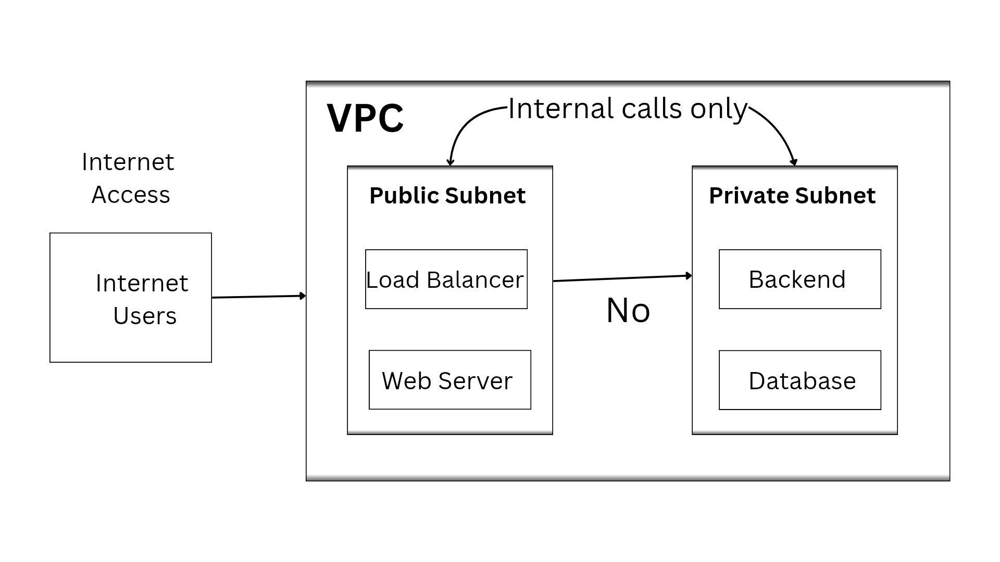
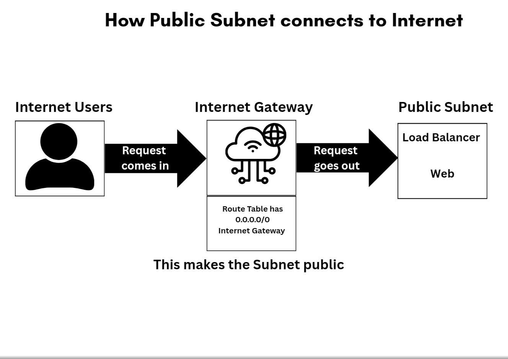

# Public vs Private Subnets in AWS Explained for Beginners

When learning AWS networking, one of the most important concepts to understand is the difference between:

- **Public Subnet**
- **Private Subnet**

At first these terms may sound confusing. But once you understand how internet access works inside a VPC, the concept becomes very simple.

In this article, we will understand:

- What a subnet is
- What public and private subnets are
- How internet access works in AWS
- What a Load Balancer does
- How routing works
- Real-world architecture examples

## What is a Subnet?

A subnet is a smaller network created inside a VPC.

When we create a VPC, AWS gives us a large IP address range called a **CIDR Block**.

**Example:** `192.168.0.0/16`

Instead of using the entire IP block, we divide it into smaller sections called **Subnets**. This helps organize resources properly and improves security.

We mainly have two types of subnets:
- Public Subnet
- Private Subnet

## Why Do We Need Different Subnets?

Think of a company office building:
```text
Office Building
├── Reception Area (Public)
└── Server Room (Private)
```


- **Reception Area** → Anyone can enter (customers, visitors, delivery people) → **Similar to Public Subnet**
- **Server Room** → Only authorized employees can enter → **Similar to Private Subnet**

This is how AWS works. **Not every application component should be exposed to the internet.**

For example:
- Users should access frontend applications
- Databases should remain private
- Backend services should stay protected



## What is a Public Subnet?

A **Public Subnet** is a subnet that allows internet access. 
Resources inside this subnet can communicate directly with the internet.

**Examples:**
- Web Servers
- Load Balancers

### What is a Load Balancer?

A Load Balancer is a service that distributes user traffic across multiple servers.

Think of it like a traffic manager.

```text
Users
↓
Load Balancer
↓
├── Server 1
├── Server 2
└── Server 3
```


This improves **Performance**, **Availability**, and **Reliability**.

In AWS, Load Balancers are placed inside a **public subnet** because users from the internet need to access them.

## Real World Example of Public Subnet

Imagine you are hosting a shopping website: `www.shopworld.com`

Internet Users → Load Balancers → Web Servers

These resources need internet access to receive requests and send responses back to users.

## How Public Subnets Get Internet Access?

AWS uses an **Internet Gateway** to connect resources to the internet.

Think of Internet Gateway as a gate between AWS Network and the Internet.

**Flow:**
Internet → Internet Gateway → Public Subnet



### Understanding Route Tables

A **Route Table** decides where network traffic should go.

**Public Subnet Route Example:**
- Destination: `0.0.0.0/0`
- Target: Internet Gateway

This route makes the subnet **Public**.

## What is a Private Subnet?

A **Private Subnet** does not allow direct internet access. Resources inside it are hidden from the internet.

**Examples:**
- Databases
- Backend APIs

### Why Private Subnets are Important?

Sensitive data should never be exposed publicly.

Examples: MySQL databases, Banking systems, Payment services.

Keeping them private improves security significantly.

## Real World Example of Private Subnet

In a banking application `bank.com`, customers should **never** directly access:
- Database servers
- Account systems
- Transaction services

So these are placed in **Private Subnets**.

```
Internet User
↓
Website
↓
Backend Application
↓
Database
```

### Private Subnet Routing

Private subnet route tables usually don't contain a Route to internet gateway.

Example: No Route to Internet Gateway

Meaning: Internet access is blocked.

This prevents from direct communication from the internet.

## Public vs Private Subnet Comparison

| Feature | Public Subnet | Private Subnet |
|----------|----------|----------|
| Internet Access | Yes | No |
| Directly Reachable | Yes | No |
| Used For | Web Applications, Load Balancers | Databases, Backend Applications |
| Security Level | Lower | Higher |

# Complete Real-World AWS Architecture

This is the most common architecture used in real AWS projects. It combines both Public and Private Subnets to create a secure and scalable application.


## Conclusion

Public and Private Subnets are fundamental building blocks of secure and scalable AWS architecture.

- **Public Subnets** allow resources to be accessed from the internet (like web servers and load balancers).
- **Private Subnets** keep sensitive resources safe and hidden from the internet (like databases and backend applications).

By properly using **Internet Gateway**, **Route Tables**, and separating your resources into public and private subnets, you can build applications that are both **highly available** and **secure**.

### Key Takeaways:

- Always place internet-facing components in **Public Subnets**.
- Keep databases and backend logic in **Private Subnets**.
- Use **Load Balancers** in public subnets to distribute traffic efficiently.
- This **3-Tier Architecture** (Web → Application → Database) is one of the most commonly used patterns in real-world AWS projects.

Mastering Public and Private Subnets is a big step toward becoming confident in AWS networking.

In the next articles, we will learn about **NAT Gateway** (how private subnets can access the internet for updates), **Security Groups**, and **Network ACLs**.