# Hands-On: Understanding Security Groups and NACLs in AWS

In the previous article, we learned the theory behind:

- Security Groups
- Network Access Control Lists (NACLs)

Now it is time to see them in action.

In this hands-on lab, we will:

- Create a VPC
- Launch an EC2 instance
- Run a simple Python web server
- Allow traffic using Security Groups
- Block traffic using NACLs
- Understand how both security layers work together

By the end of this lab, you will clearly understand the difference between Security Groups and NACLs.

Let's dive into the hands-on.

---

## Step 1: Create a VPC

Login to the AWS Console using your credentials.

Search for:

```text
VPC
```
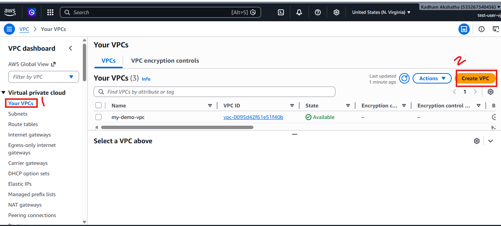

Click:

```text
Create VPC
```

Select:

```text
VPC and More
```

This automatically creates:

- VPC
- Public Subnet
- Private Subnet
- Route Tables
- Internet Gateway

Give your VPC a name:

```text
vpc-test
```

For the IPv4 CIDR block, choose the IP range you want.

Example:

```text
10.0.0.0/16
```

Click **Create VPC**.

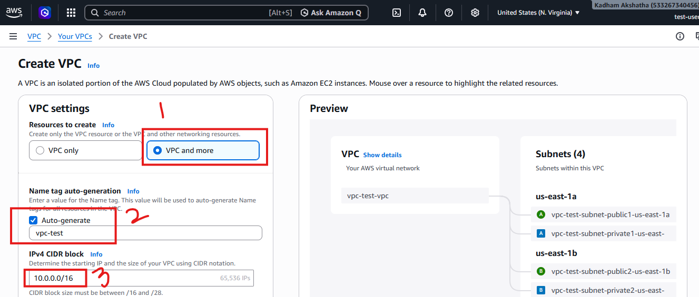

After creating the VPC, click **View VPC** and open the **Resource Map**.

This helps you understand how all networking components are connected.

---

## Step 2: Launch an EC2 Instance

Navigate to:

```text
EC2 → Instances → Launch Instance
```

Provide:

- EC2 Instance Name
- Operating System
- Key Pair

Under **Network Settings**:

- Select the VPC you created: `vpc-test`
- Select the **Public Subnet**

> **Note:** In production environments, applications should preferably use private subnets. However, for learning purposes, we will use a public subnet.

Enable:

```text
Auto Assign Public IP
```

Under **Firewall (Security Groups)** choose:

```text
Create New Security Group
```

Click **Launch Instance**.

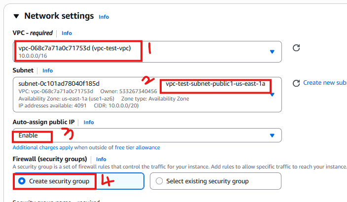
---

## Step 3: Connect to the EC2 Instance

Copy the Public IP address of the instance.

Open Terminal and connect using SSH.

Example:

```bash
ssh -i test_app.pem ubuntu@<PUBLIC_IP>
```

Replace:

```text
<PUBLIC_IP>
```

with your EC2 Public IP.

---

## Step 4: Update Packages

Whenever you launch a Linux server, updating packages is considered a good practice.

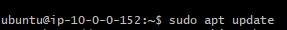

Run:

```bash
sudo apt update
```

---

## Step 5: Verify Python Installation

Check whether Python is installed.

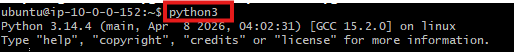

Run:

```bash
python3
```

---

## Step 6: Start a Simple Python Web Server

Python provides a built-in HTTP server.

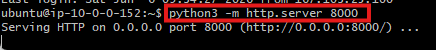

Run:

```bash
python3 -m http.server 8000
```

Your application is now running on:

```text
Port 8000
```

---

## Step 7: Try Accessing the Application

Open your browser and type:

```text
http://<PUBLIC_IP>:8000
```

Example:

```text
http://54.xx.xx.xx:8000
```

You will notice that the application does **not** open.

## Why?

Let's investigate what is blocking the application.

---

## Step 8: Check the NACL

Navigate to:

```text
AWS Console → VPC → Network ACLs
```

Open the NACL associated with your subnet.

Check the **Inbound Rules**.

Here you will notice something interesting.

AWS already allows traffic through the NACL.

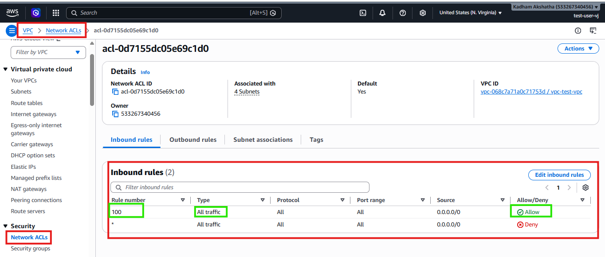

Example:

```text
Rule 100 → Allow All Traffic
```

This means the NACL is **not** blocking us.

So why can't we access the application?

Because there is another security layer:

- Security Group

Now, you may have noticed rule number `100`, and `*` in the above screenshot of NACL Rules.

Let's understand what they mean.

---

## Understanding NACL Rule Priority

NACL rules are evaluated in order.

Smaller numbers have higher priority.

Example:

```text
100 → Checked First
200 → Checked Second
300 → Checked Third
...
*   → Checked Last
```

AWS evaluates rules from top to bottom until a match is found.

---

## Step 9: Allow Port 8000 in Security Group

Navigate to:

```text
EC2 → Instance → Security
```

Open the attached Security Group.

Click:

```text
Edit Inbound Rules
```

By default, Security Groups block most incoming traffic and only allow SSH access.

Now add a new rule:

- Type: Custom TCP
- Port: 8000
- Source: Anywhere IPv4

Save the rule.

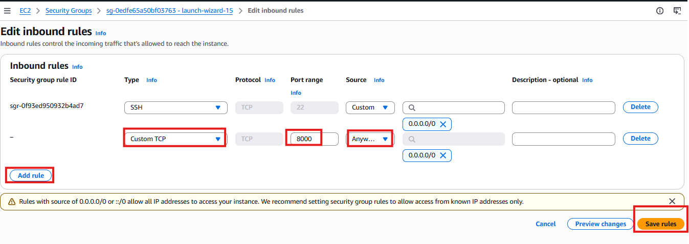

---

## Step 10: Test Again

Return to your browser and refresh:

```text
http://<PUBLIC_IP>:8000
```

This time the application loads successfully.

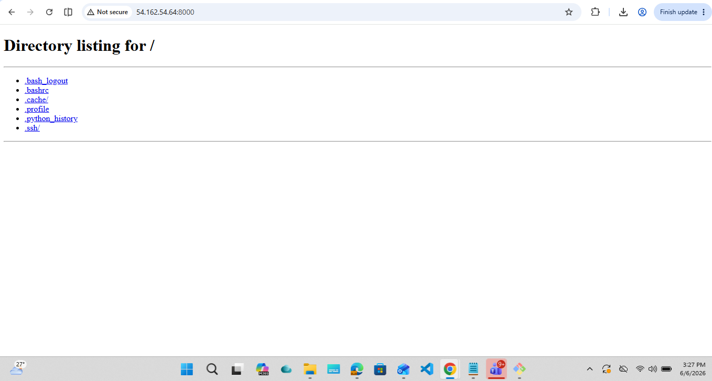

### What changed?

The Security Group now allows traffic on Port 8000.

Flow:

```text
Internet
   ↓
NACL (Allowed)
   ↓
Security Group (Allowed)
   ↓
EC2 Instance
```

Now that we understand how Security Groups and NACLs work together, let's perform one more experiment.

---

## Step 11: Block Traffic Using NACL

Navigate to:

```text
VPC → Network ACLs
```

Click:

```text
Edit Inbound Rules
```

Create the following rule:

- Rule Number: 100
- Type: Custom TCP
- Port Range: 8000
- Source: 0.0.0.0/0
- Action: Deny

Save the changes.

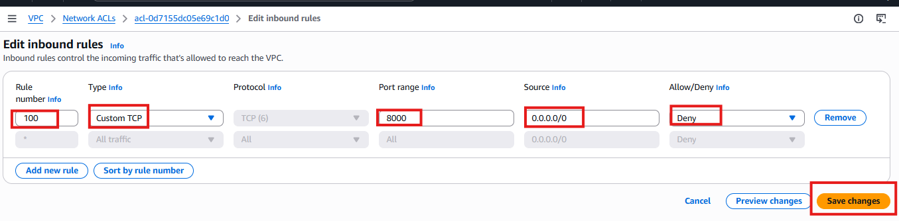

---

## Step 12: Test Again

Refresh:

```text
http://<PUBLIC_IP>:8000
```

The application is no longer accessible.

### Why?

Because traffic is blocked at the subnet level before reaching the Security Group.

Flow:

```text
Internet
   ↓
NACL (Denied)
   ❌
Security Group
   ❌
EC2 Instance
```

Even though the Security Group allows Port 8000, the NACL blocks the request first.

---

## Step 13: Understanding Rule Priority

Now let's restore access.

Navigate to:

```text
VPC → Network ACLs
```

Click:

```text
Edit Inbound Rules
```

Create:

### Rule 100

```text
Allow All Traffic
```

Create another rule:

### Rule 200

- Type: Custom TCP
- Port Range: 8000
- Source: 0.0.0.0/0
- Action: Deny

Save the changes.

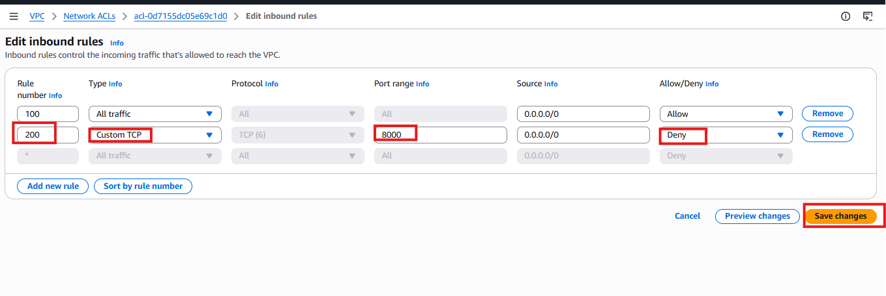

---

# What Happens Now?

Try accessing:

```text
http://<PUBLIC_IP>:8000
```

The application works successfully.

### Why?

Because AWS checks:

```text
Rule 100
```

first.

Since Rule 100 allows all traffic, AWS never evaluates Rule 200.

Flow:

```text
Rule 100 → Match Found → Allow

Rule 200 → Ignored
```

This demonstrates one of the most important NACL concepts:

> Lower numbered rules have higher priority.

---

## Key Takeaways

### Security Groups

- Work at Instance Level
- Stateful
- Allow Traffic

### Network ACLs

- Work at Subnet Level
- Stateless
- Allow and Deny Traffic
- Use Rule Priority

### Request Flow

```text
Internet
   ↓
NACL
   ↓
Security Group
   ↓
EC2 Instance
```

> If either layer blocks the traffic, the request never reaches the server.

---

## Conclusion

In this hands-on lab, we:

- Created a VPC
- Launched an EC2 instance
- Deployed a simple Python web server
- Allowed traffic using Security Groups
- Blocked traffic using NACLs
- Observed how multiple security layers work together

We also learned that:

- Security Groups control traffic at the instance level.
- NACLs control traffic at the subnet level.
- NACL rule priority affects traffic flow.
- Multiple security layers improve AWS network security.

Understanding these concepts is essential for AWS networking and cloud security.