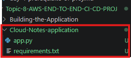

# AWS End-to-End CI/CD Project

## Step 1: Create the Project Folder Structure

Inside my existing Github repo, I created a new folder:

**AWS-END-TO-END-CI-CD-PROJ**

Inside this folder, I created the following structure:

AWS END-TOEND-CI-CD-PROJ/

│
├── 01-Building-the-Application/
│      README.md
│
├── 02-Continuous-Integration/
│      README.md
│
├── 03-Continuous-Deployment/
│      README.md
│
└── Cloud-Notes-application/


Purpose of each folder:
01-Building-the-Application/
- This folder contains the article for building the flask application and learning Docker.

02-Continuous-Integration/
- This folder contains article for configuring AWS CodeBuild and creating CI process

03-Continuous-Deployment/
- This contains article for AWS CodeDeploy and CodePipeline.

Cloud-Notes-application/
- This contains the actual project source code and deployment files used throughout the project.
- New files will ve added here as we progress.

Note:
Do not create all application files now.
We will add them step by step to understand why each file is needed.

## Step 2: Set up Docker

Before writing the Flask application, we'll:

- Install Docker Desktop (if it's not already installed).
- Sign in with your Docker Hub account.
- Create a Docker Hub repository named cloud-notes-app.
- Verify Docker is working on your computer.
- Learn what Docker Images and Containers are.

---

# Next Step: Build the Flask Application

Before creating `app.py`, we will spend some 5 to 10 mins understanding what we are building. This makes the code much easier to understand.

## Why are we building a Flask Application?

- AWS CI/CD is desgined to automate the process of building and deploying the applications.

- That means we first need an application.

- For this project, we will use **Flask**, a light weight python we framework that's simple enough for beginners but widely used for learning CI/CD concepts.

- Our Flask application won't be complex, it just needs to give us something real to build, package with docker and deploy using AWS.

## What happens in this project?

```text
Write Flask Application
          │
          ▼
Package it using Docker
          │
          ▼
Push source code to GitHub
          │
          ▼
AWS CodeBuild builds the Docker image
          │
          ▼
Docker Hub stores the image
          │
          ▼
AWS CodeDeploy deploys it to EC2
          │
          ▼
Access the application in a browser
```

This is the complete journey we will follow.

---

## Next task

Go to your project folder:

```text
AWS-END-TO-END-CI-CD-PROJ/
└── Cloud-Notes-application/
```

Inside `Clud-Notes-Application`, create these two files:

```text
app.py
requirements.txt
```

> Don't write anything in them yet.

Just create the empty files.

## Why only these two files?

Every file in this project will be introduced **when it is needed.**

Right now we only need:
- `app.py` → The flask application
- `reuirements.txt` → Lists the python packages the application needs.

Later we will add:
- Dockerfile
- Buildspec.yml
- appspec.yml
scripts/
- Other deployment files

This keeps the project easy to follow instead of creating everything at once.

---

## Step 3: Prepare the Flask Application

Objective: Create the initial files required for our python application.

Navigate to:

```text
AWS-END-TO-END-CI-CD-PROJ/
└── Cloud-Notes-application/
```

Create the following files:
- app.py
- requirements.txt



Purpose:

**app.py** → Contains flask application.

**requirements.txt** → Lists all python required to run the application.

> Note: Don't add any notes yet. We will build the application step by step.

---

## Step 4: Build the Flask Application

### Objective

- Create a simple python web application using Flask that will later be packaged into a docker image and deployed automatically using AWS CI/CD services.

- Instead of creating a complex application, we will build a small web page that allows us to focus on learning the CI/CD pipleine rather than web development.

## Why Flask?

It is lightweighr python web framework used to build web applications.

We are using Flask because:
- It is simple and beginner friendly.
- It requires very little code to create web application.
- It is widely used in tutorials and DevOps demonstrations
- It works well with Docker and AWS services.

## Files Used

app.py

Purpose: Contains the python code that creates and runs our web application.

---

Now create this code in `app.py`

```code
from flask import Flask

app = Flask(__name__)


@app.route("/")
def home():
    return """
    <h1>☁️ Cloud Notes Application</h1>

    <p>Congratulations!</p>

    <p>Your Flask application is running successfully.</p>

    <p>This application will later be deployed using:</p>

    <ul>
        <li>GitHub</li>
        <li>AWS CodeBuild</li>
        <li>Docker Hub</li>
        <li>AWS CodeDeploy</li>
        <li>AWS CodePipeline</li>
        <li>Amazon EC2</li>
    </ul>

    <p><b>AWS End-to-End CI/CD Project</b></p>
    """


if __name__ == "__main__":
    app.run(host="0.0.0.0", port=5000)
```

### Exaplaination of the Code:

1. Import Flask
```code
from flask import Flask
```
---

This imports the Flask framework so we can create a web application..

2. Create the Flask Application
```code
app = Flask(__name__)
```

---

Creates a Flask application object.

This object manages the application and handles incoming web requests.

---

3. Create a Route
```code
@app.route("/")
```

A route tell Flask which function should run when a user visits a spefic URL.

The `/` route represents the application's home page.

---

4. Create a Home page
```code
def home():
```

Defines the function that runs when someone opens the home page.
It returns HTML that is displayed in the browser.

---

5. Run the Application
```code
app.run(host="0.0.0.0", port=5000)
```

Starts the Flask web browser.
- `host="0.0.0.0"` allows the application to accept connections from outside the local machine(important later when running inside docker)
- `port=5000` specfies the port where the application will be available.

---

## Step 5: Create requirements.txt file

### Objective

Create a `reuirements.txt` file to list the python packages required by our applicatio.

This file ensures that anyone running the project-including Docker and AWS CodeBuild-installs the exact dependencies needed.

### Why do we need `requirements.txt`?

Imagine sharing your project with another developer.

They receive only your source code.

How will they know which Python libraries to install?

Instead of manually telling everyone which packages are needed, python projects use a `requirements.txt` file.

Whenever someone wants to run the application, they can simply install all required packages using this file.

This provides consistency across different environments, whether you are running the application locally, inside Docker, or in AWS CodeBuild.

## File Content

Open `requirements.txt` and add:

```text
Flask==3.1.1
```

> **Note:** You can also use just `Flask`, but specifying a version helps ensure everyone uses the same package version, making builds more consistent and predictable.

---

## Step 6: Understanding Docker

### Objective

Before creating our Dockerfile, it's important to understand what Docker is and why it is used.

Docker is one of the most widely used tools in DevOps because it allows application to run consistently across different environments.

In this project, Docker will package our Flask application into a portable container that can be built by AWS CodeBuild, stored in Docker Hub, and deployed to an EC2 instance using AWS CodeDeploy.

---

## What is Docker?

Docker is an open-source platform that packages an application together with everything it needs to run, such as:

- Application source code
- Required Libraries
- Dependencies
- Runtme environment
- Configuration

This package is called a **Docker Image**.

Since everything is packaged tigether, the application behaves the same way reagrdless of where it is run.

---

## Why do we Need Docker?

Imagine you build a python application on your computer.

It works perfectly.

You send the same project to another developer.

They receive an error because:

- Different Python version is installed.
Flask is missing
- Another library is outdated.

Docker solves this problem by packaging the application and all its dependencies into a single image.

Instead of installing software manually on every server, we simply run the docker image.

This ensures the application behaves consistently across development, testing and production envrionments.

---

## How Docker fits into our Project

In this project, Docker sits between our application and AWS.

project flow:

Python Flask Application
        │
        ▼
Docker Image
        │
        ▼
Docker Hub
        │
        ▼
AWS CodeDeploy
        │
        ▼
Amazon EC2

Instaed of deploying our python directly to EC2, we will deploy a Docker container that already contains everything the application needs.

---

## Docker Image Vs Docker Container

Understanding these 2 terms is very template.

### Docker Image

A Docker image is a blueprint or template.

It contains:
- Application code
- python 
- Flask
- required libraries
- Configuration

An image cannot be modified while it is running.

Think of it like a receipe.

---

### Docker Container

A Docker container is a running instance of Docker Image.

When the image starts running, it becomes a container.

Think of it like baking a cake.

Recipe = Docker Image
Cake = Docker Container

One image can create multiple containers.

---

## What is Docker Hub?

Docker Hub is online repository used to store docker image.

It works similar to Github.

Docker Hub stores Docker images.

In this project:
- AWS CodeBuild will build the Docker image.
- The image will be pushed to Docker Hub.
- AWS CodeDeploy will download the latest image from docker hub and run it on AWS EC2.

---

## Step 7: Create the Dockerfile

### Objective

- Now that we understand what Docker is and why it is used, the next step is to create a **Dockerfile**.

- A Dockerfile is a text file that contains a set of instructions telling the Docker how to build an image for our application.

- Later in this project, AWS CodeBuild will read this Dockerfile to automatically build our Docker image.

---

## Create the Dockerfile

Inside the `Cloud-Notes-Application` folder, create a new file names:
```text
Dockerfile
```

> **Important:** The file name must be exactly `Dockerfile` with no file extension.

---

## Add the following Code

```dockerfile
FROM python:3.11-slim

WORKDIR /app

COPY requirements.txt .

RUN pip install --no-cache-dir -r requirements.txt

COPY . .

EXPOSE 5000

CMD ["python", "app.py"]
```

---

## Understanding Each Instruction

### 1. `FROM python:3.11-slim`

Every Docker image starts with a base image.

Here we are using official Python 3.11 image. The `slim` version is smaller in size while still containing everything needed to run our application.

---

### 2. `WORKDIR /app`

Creates and swtiches to the `/app` directory inside the Docker image.

All the following commands will run from this location.

---

### 3. `COPY requirements.txt`

Copies the `requirements.txt` file from our project into the Docker image.

We copy this file first because it allows Docker to reuse previously installed dependencies if the file hasn't changed, making future builds faster.

---

### 4. `RUN pip install --no-cache--dir -r requirements.txt`

Installs all python packages listed in `requirements.txt` file.

The `--no--dir` options prevents pip from storing unnecessary cache files, helping keep the Docker image smaller.

---

### 5.  `COPY . .`

Copies the remaining project files, including the `app.py`, into the Docker image.

---

### 6. `EXPOSE 5000`

Documents that our application will listen on port **5000**.

This doesn't publish the port itself-it simply tell anyone using the image which port the application uses.

---

### 7. `CMD ["python", "app.py"]`

Specifies the command Docker should run when a container starts.

In our case, it starts the Flask application.

---

## Project Structure

At this stage, our application folder should look like this:


```text
Cloud-Notes-application/

├── app.py
├── requirements.txt
└── Dockerfile
```

---

## Step 8: Review the Application

Before moving to AWS, let's review everything we have prepared.

Our application now contains:

- `app.py` -> The Flask web application
- `requirements.txt` -> Lists the python packages required by application.
- `Dockerfile` -> Defines how Docker should build the application image.

---

## STep 9: Push the Project to GitHub

Now that the application files are ready, the next step is to upload the project to GitHub.

Keeping the project in GitHub provides several benefits:

- Stores the source code in central location.
- Tracks changes using version control.
- Allows AWS CodeBuild to access the application during the CI process.
- Makes it easier to collaborate and maintain the project.

At this stage, our application folder should contains:

Cloud-Notes-Application/

- app.py
- requirements.txt
- Dockerfile

Commit the changes and push them to your GitHub repository.

After pushing, verify that all files appear correctly in the repository.