# AWS CloudWatch – Monitoring, Metrics, Alarms & Custom Metrics with Default Metrics Demo.

## Introduction

**Amazon CloudWatch** is an Amazon monitoring and observability service that helps us to collect, visualize, monitor and respond to information generated by AWS Resources, applications and services.

In simple terms:

> CloudWatch helps us understand what is happening inside our AWS environment and alerts us when something requires attention.

For exmaple, imagine we have an EC2 instance runnign an application.

If the server's CPU becomes very high, we don't have to wait until the users start complaining.

Instead:

```text
EC2 Instance
     |
     | CPU Utilization
     ↓
CloudWatch
     |
     | Threshold exceeded
     ↓
CloudWatch Alarm
     |
     ↓
Amazon SNS
     |
     ↓
Email Notification
```

CloudWatch can monitor AWS provided metrics as well as that we publish ourselves as custom metrics.

---

## What Problem does CloudWatch Solve?

Without monitoring, we might have to manually log into servers and check their health.

For example:
```text
Server
  ↓
Is CPU high?
  ↓
Is memory high?
  ↓
Are requests increasing?
  ↓
Are errors occurring?
```

This doesn't scale well.

CloudWatch provides a centralized place to monitor AWS resources and applications.

**Without CloudWatch**
```text
EC2
 ↓
No monitoring
 ↓
Problem occurs
 ↓
Users report problem
 ↓
Engineer investigates
```

**Without CloudWatch**

```text
EC2
 ↓
CloudWatch Metrics
 ↓
Threshold exceeded
 ↓
CloudWatch Alarm
 ↓
SNS Notification
 ↓
Engineer gets alert
```

This allows problems to be detected earlier.

---

## Major CloudWatch Features

***1. Metrics**: Metrics are numerical measurements collected over time.

For example:
```text
CPUUtilization = 72%
```

```text
NetworkIn = 10 MB
```

A metric is essentially a time series of values.

For an EC2 instance, CloudWatch can provide metrics such as CPU utiliation, network traffic and status checks.

**2. Alarms**: CloudWatch alarms monitor metrics and compare them against conditions that we define.

For example:

```text
CPUUtilization >= 50%
```

If the condition is met, the alarm can enter the `ALARM` state and trigger an action suuch as an SNS notification. AWS supports alarms based on individual metrics and other CloudWatch data sources.


**3. Logs**: CloudWatch log allows application and AWS reosources to send log information to CloudWatch.

Think of a:

> Log Group = Folder of realted logs

and

> Logstream = Individual stream of log events inside that group.

For example:

```text
CloudWatch Logs
     |
     └── /application/my-app
            |
            ├── Instance-1
            ├── Instance-2
            └── Instance-3
```

The current CloudWatech console may show this functionality under **Log -> Log Management**, rather than the exact "Log Groups" menu.

---

## CloudWatch Metrics Concepts

efore doing the hands-on, it is important to understand a few terms.

1. Metric: A metric is the measurement we want to monitor.

Example:

```text
CPUUtilization
```

2. Data Point: A data point is an individual value recorded for a metric at a particular time.

For example:

```text
10:00 → 15%
10:05 → 18%
10:10 → 42%
10:15 → 63%
```

These values form a time series.

3. Namespace: A namespace groups related metrics.

For EC2, the namespace is:

AWS/EC2

For example:

```text
AWS/EC2
   |
   ├── CPUUtilization
   ├── NetworkIn
   ├── NetworkOut
   └── StatusCheckFailed
```


4. Dimension

A dimension helps identify what a metric belongs to.

For example:

```text
Metric:
CPUUtilization

Dimension:
InstanceId = i-0123456789abcdef
```

This is why CloudWatch may display your EC2 instance ID rather than the friendly EC2 Name tag.

5. Statistic: Statistics tell CloudWatch how to summarize metric values.

Common statistics include:

- Average
- Minimum
- Maximum
- Sum
- Sample count

For CPU utilization, Average is usually an intuitive choice for a basic monitoring alarm.

6. Period

The period defines the amount of time represented by each data point used for evaluation.

For example:

```text
Period = 5 minutes
```

means CloudWatch evaluates the metric over five-minute periods.

---

## CloudWatch Architecture for the Project

Our project will ave 2 demonstrations.

### Demo 1 - AWS Default Metric

We will monitor

```text
EC2 CPUUtilization
```

Architecture:

```text
                AWS
                 |
        +--------+--------+
        |                 |
       EC2            CloudWatch
        |                 |
        | CPU metric      |
        +---------------->|
                          |
                    CPUUtilization
                          |
                          ↓
                   CloudWatch Alarm
                          |
                          ↓
                         SNS
                          |
                          ↓
                    Email Alert
```

---

## Demo 1 - Monitor EC2 CPU Utilization

### Objective

In this demo we will:
1. Create an EC2 instance
2. View its default CloudWatch metrics
3. Understand CPU Utilization
4. Create a CLoudWatch alarm.
5. Configure the SNS email notification.
6. Generate controlled CPU activity on the EC2 instance.
7. Trigger the alarm.
Receive the alarm.
8. Receive an email notification

---

## Step 1: Create the EC2 Instance

Go to:

**AWS Console -> EC2 -> Instances -> launch Instance**

Use a name such as:

```text
cloudwatch-demo
```

Configure the required keypair and networking.

Alo make sure we have public IP enabled for IPv4 so that we can SSH directly to the instance.

Then click on **Launch Instance**

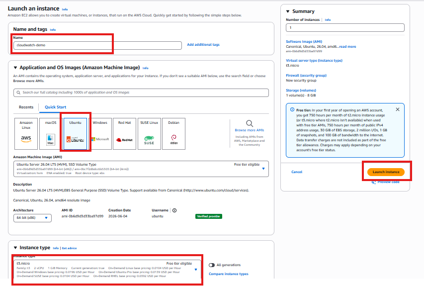

Wait until all the checks are completed and it is in running state.

---

## step 2 - Open CloudWatch

Go to:
**AWS Console → CloudWatch**

On the left hand side select **Metrics -> Classic Metrics**

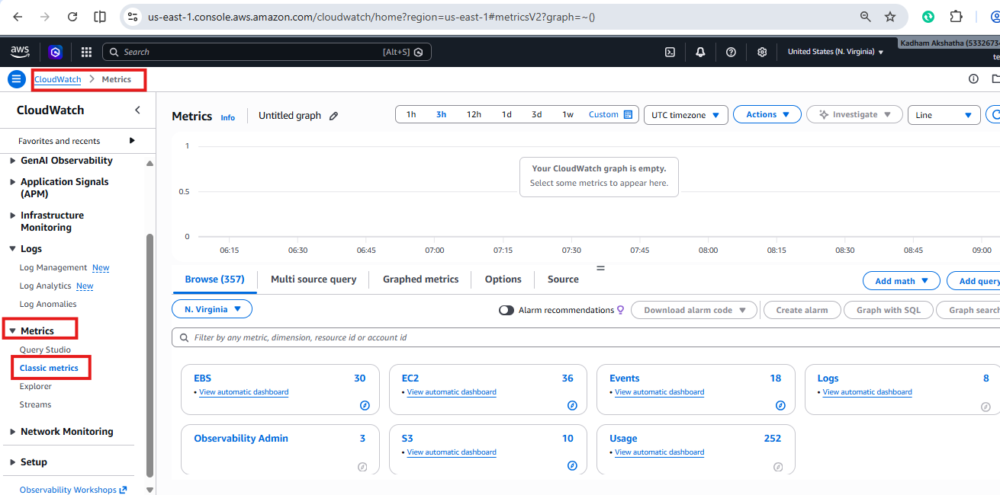

---

## Step 3 - Find EC2 Metrics

Inside:

**CloudWatch → Metrics → Classic metrics**

look for **EC2**

Then select the EC2 metric category such as per-instance metrics(Because for now I have only one EC2 instance, usually in production we should select the overall Instance metrics).

Select your instance by checking the Instance Id.

Select **CPUUtilization**

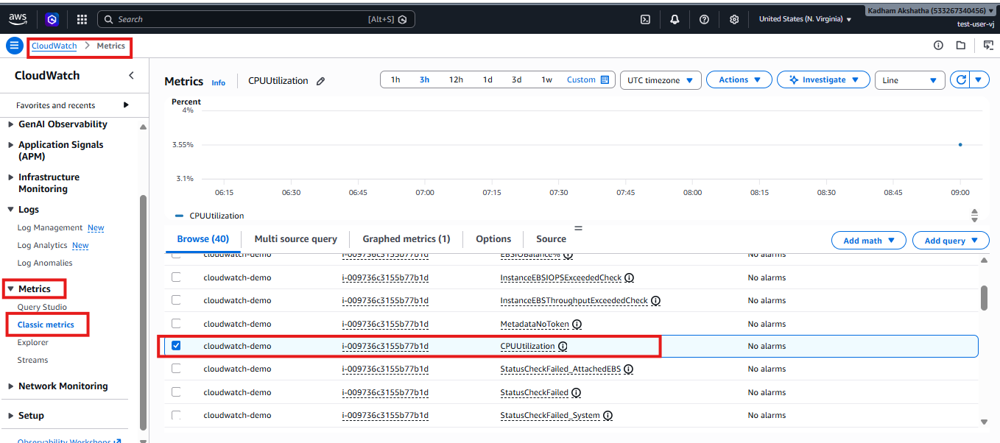

---
## Understanding CPU Utilization

It represents the percentage of compute capacity being used by the EC2 Instance.

For example:

```text
CPUUtilization = 10%
```

means the instance is lightly loaded.

Whereas:
```text
CPUUtilization = 90%
```
indiciates that the instance is under significantly heavier CPU load.

A high CPU value isn't automatically a problem.

For example:

```text
CPU = 90%
```
could be perfectly normal if we intentionally have a batch job running.

That's why monitoring usually involves:

```text
Metric
+
Threshold
+
Time period
```

rather than simply saying:
> CPU is high, therefore something is wrong.

---

## Step 4 - Create the CloudWatch Alarm

From the CPU metric, choose **Create Alarm**

Select Metric: **CPUUtilization**

Use static: **Average**

for a learning exmaple, we can use:
```text
Period: 1 minute
```

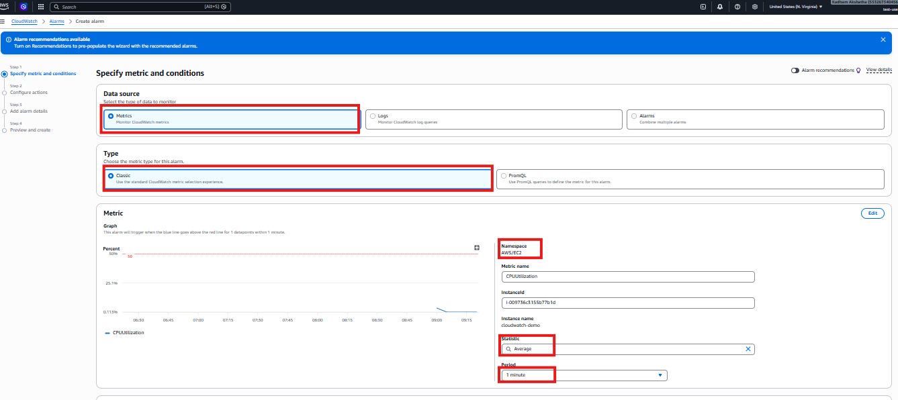

and

```text
Threshold: >=50%
```

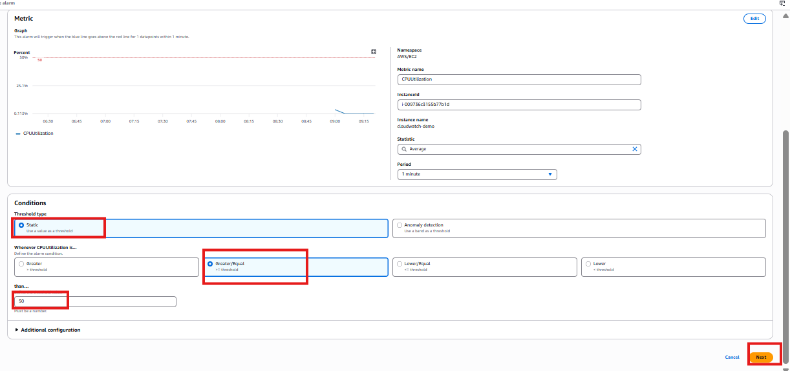


The logic becomes:

```text
IF 
Average CPUUtilization >= 50%

THEN

Alarm -> ALARM state
```
Click on **Next**

---

## Step 5 – Configure SNS Notification

For the alarm action, choose:
```text
Alarm State Trigger = In Alarm
```

Then configure an SNS notification.

Create a new topic:
```text
cloudwatch-demo-alerts
```

Click on **Create Topic** -> Click on **Next**

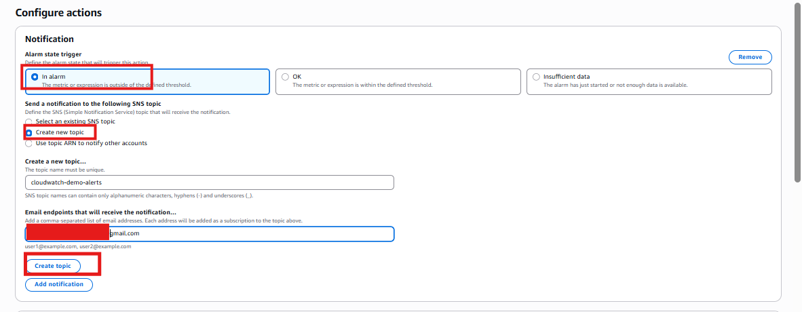

AWS will send an SNS subscription confirmation email.

Check:

- Inbox
- Spam
- Junk
- Promotions/Other folders

Then click:

Confirm subscription

Why is this required?

SNS needs to verify that the email address actually wants to receive notifications.

---

## Step 6 – Name the Alarm

Use a descriptive name:
```text
cloudwatch-demo-high-cpu
```

Description:
```text
# ALERT
Hello Team,

CPU Utilization is **25% or more**

**PLEASE CHECK AND ACT ON IT**
```

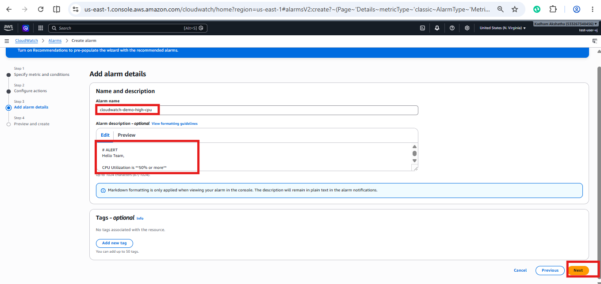

Then Click on Next -> Create Alarm.

Now we need to test whether our alarm actually works.

For that purpose we have a CPU-spike script in python language it will spike the CPU for a certain amount of time then it will bring back to the normal stage.

Before going to the next step, we will first enable to monitor in the EC2 instance.

Go to AWS Console -> EC2 -> Select the EC2 you created.

Here scroll down you will find the **Monitoring** tab click on it.

Select the **Managed Deatailed Monitoring** option -> Click on **ENABLE** -> Confirm.

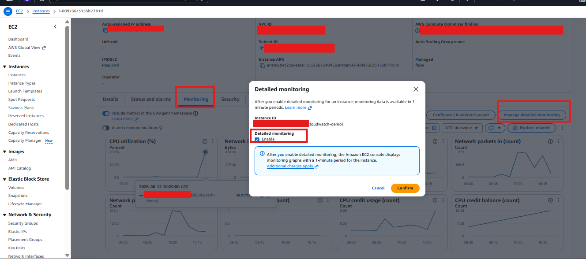


---

## Step 7 - Connect to the EC2 Instance

The architecture is:

```text
Company Laptop 
| 
| 
SSH 
↓ 
AWS EC2 Instance 
| 
| 
Python workload 
↓ 
CPU utilization increases 
| ↓ CloudWatch 
| 
↓ CloudWatch Alarm 
| 
↓ 
SNS 
| 
↓ 
Email Notification
```

Connect to the EC2 instance using SSH:

```text
ssh -i your-key.pem ubuntu@YOUR_PUBLIC_IP
```
Replace:

- your-key.pem with the name/path of your key pair
- YOUR_PUBLIC_IP with the public IPv4 address of your EC2 instance

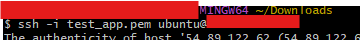

---

## Step 8 – Check Python

Before creating our program, verify that Python 3 is available.

Run:
```text
python3 --version
```

You should see something similar to:

```text
Python 3.x.x
```

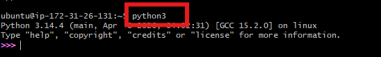

If Python 3 is available, we can continue or install the python3.

---

## Step 9 – Create the Python File

Create a new file called:

```text
cpu_load_demo.py
```

Create the file:

```text
vim cpu_load_demo.py
```

This opens the Vim editor.

When Vim opens, press:**i**

The i key puts Vim into Insert Mode, which allows us to type or paste the Python code.

Add the following code:

```text
import time

DURATION = 120

print("Starting CPU load test...")
print("CPU workload will run for 2 minutes.")

start_time = time.time()

try:
    while time.time() - start_time < DURATION:
        result = 0

        for number in range(1, 1_000_000):
            result += number * number

    print("CPU load test completed.")

except KeyboardInterrupt:
    print("\nCPU load test stopped manually.")
```

---

## Understanding the Python Code

### 1. Import the Time Module
import time

The time module allows the program to keep track of how long it has been running.

### 2. Set the Duration
DURATION = 120

The value 120 represents:

120 seconds = 2 minutes

This means the CPU test is designed to stop automatically after approximately two minutes.

### 3. Record the Starting Time
start_time = time.time()

This records the time when the program starts.

The program can then compare the current time against the starting time.

### 4. Run the CPU Workload
while time.time() - start_time < DURATION:

This keeps the program running while the elapsed time is less than 120 seconds.

In simple terms:
```text
Start
  ↓
Has 2 minutes passed?
  ↓
No → Continue CPU workload
  ↓
Check again
```

Once two minutes have passed:

2 minutes reached
       ↓
Stop CPU workload


### 5. Perform Calculations
for number in range(1, 1_000_000):
    result += number * number

This repeatedly performs calculations.

The purpose isn't to perform a useful business calculation.

The purpose of this learning exercise is to create temporary CPU activity so that we can observe the change in the EC2 `CPUUtilization` metric in CloudWatch.

### 6. Handle Manual Interruption

except KeyboardInterrupt:
    print("\nCPU load test stopped manually.")

If we press:

Ctrl + C

the program can stop gracefully.

---

## Step 10 - Save the File in Vim

After entering the code, press:

Esc

This exits Insert Mode.

Then type:

:wq

and press:

Enter
Vim commands used
i       → Enter Insert Mode
Esc     → Exit Insert Mode
:wq     → Save and quit

The terminal should return after the file is saved.

Run **ls**

You should see: `cpu_load_demo.py`
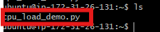

---

## Step 11 - Run the CPU Load Test

Now execute the Python program:

`python3 cpu_load_demo.py`

You should see:

Starting CPU load test...
CPU workload will run for 2 minutes.

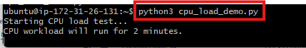

The Python program is now generating CPU activity on the EC2 instance.

> NOTE: MAKE SURE YOU ARE RUNNING THIS FILE INSIDE THE EC2 INSTANCE AND NOT IN YOUR COMPUTER.


>> Important: The CPU activity is happening on the AWS EC2 instance. It is not consuming the CPU of the company laptop or your personal laptop.

---

## Step 12 - Check CloudWatch CPUUtilization

Now return to the AWS Console:

Go to CloudWatch -> Metrics -> Classic Metrics -> EC2 -> Per-Instance Metrics

Select the CPUUtilization metric for the EC2 instance.

You should eventually see the CPU utlization increases on the CloudWatch graph.

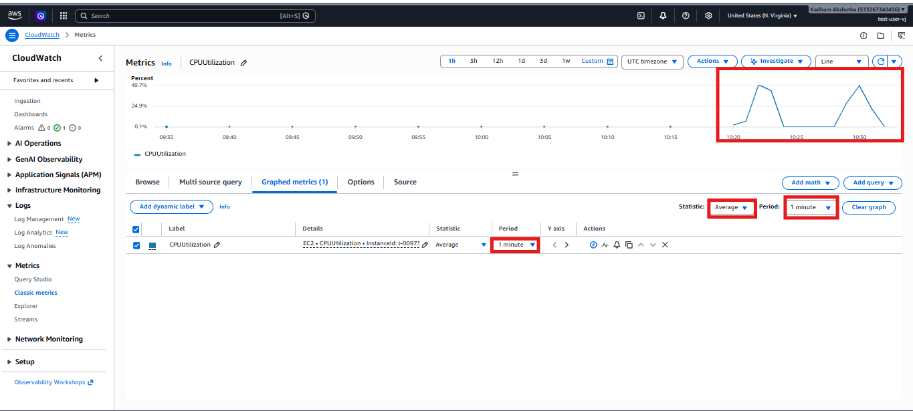

You can also check the Monitoring in EC2.

Go the EC2 **Instance** -> Click on **Monitoring tab**

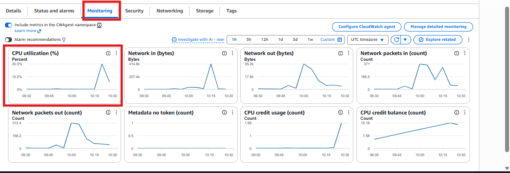

---

## Step 13 - Check the SNS Email

The alarm enters in the `ALARM` state, and Amazon SNS should sned the notification to the email address that was subscribed to the SNS topic.

Check your:

- Inbox
- Spam/Junk folder
- Promotions/other folder

The notification confirms that the CloudWatch alarm changed state.

You will get the message like below:

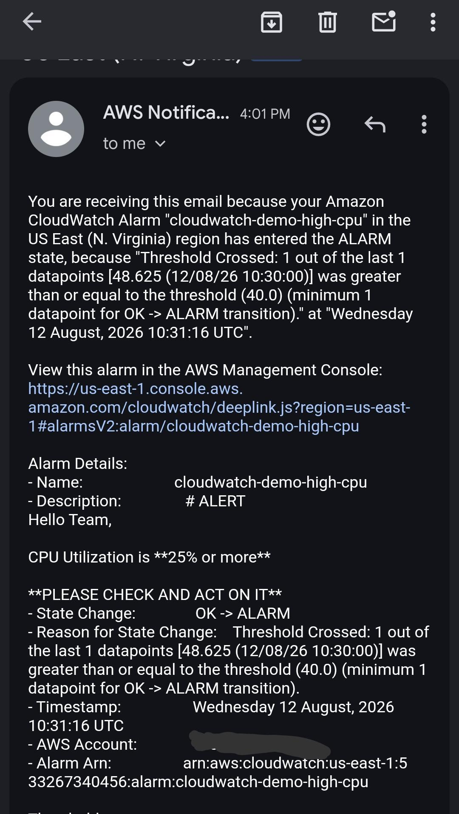

This demonstrates how CloudWatch can automatically notify an administrator when a monitored resource exceeds a configured threshold.

>> NOTE: I TRIED TO MAKE IT FOR 50% OR MORE BUT MY EC2 CPU CONSUMPTION WASN'T GOING THAT HIGH, SO I EDITED THE CPUUtilization TO >=25% IN ALARMS.

---

## Complete Project Workflow

```text
                    AWS CLOUD
                        |
                        v
                +---------------+
                |      EC2      |
                | cloudwatch-   |
                |     demo      |
                +-------+-------+
                        |
                        | CPUUtilization
                        v
                +---------------+
                |  CloudWatch   |
                |    Metrics    |
                +-------+-------+
                        |
                        | CPU >= 25%
                        v
                +---------------+
                |  CloudWatch   |
                |     Alarm     |
                +-------+-------+
                        |
                        | ALARM State
                        v
                +---------------+
                |      SNS      |
                |     Topic     |
                +-------+-------+
                        |
                        | Email
                        v
                +---------------+
                | Email Alert   |
                | Notification  |
                +---------------+


              CPU LOAD TESTING FLOW

                EC2 Instance
                     |
                     v
            cpu_load_demo.py
                     |
                     | Runs for ~2 minutes
                     v
              CPU Usage Rises
                     |
                     v
             CloudWatch Metric
                     |
                     v
              Alarm Threshold
                  >= 25%
                     |
                     v
              Alarm = ALARM
                     |
                     v
                    SNS
                     |
                     v
              Email Received
                     |
                     v
            Python Script Stops
                     |
                     v
              CPU Decreases
                     |
                     v
              Alarm = OK
```

## Final Flow
```text
EC2
 ↓
CPUUtilization
 ↓
CloudWatch Metrics
 ↓
CloudWatch Alarm (>= 25%)
 ↓
SNS
 ↓
Email Notification
```

---

## What's Next?

In this article, we learned how to monitor an **AWS-provided metric** using Amazon CloudWatch.

We monitored:

```text
EC2 → CPUUtilization → CloudWatch Alarm → SNS → Email
```

In the next article, we will take this a step further and learn about **CloudWatch Custom Metrics**.

Instead of relying only on metrics automatically provided by AWS, we will learn how to create and publish our **own application-specific metrics** to CloudWatch.

### Next Article

**AWS CloudWatch Custom Metrics – Creating and Monitoring Your Own Metrics**

We will learn how to:

* Create a custom metric
* Publish custom metric data to CloudWatch
* Understand custom namespaces and dimensions
* View custom metrics in CloudWatch
* Create an alarm based on a custom metric
* Understand how custom metrics can be useful for application monitoring

```text
AWS Application
      |
      | Custom Metric
      v
CloudWatch Custom Metrics
      |
      v
CloudWatch Alarm
      |
      v
SNS
      |
      v
Email Notification
```

> In the next article, we will build this workflow hands-on and understand how applications can send their own monitoring data to Amazon CloudWatch.
